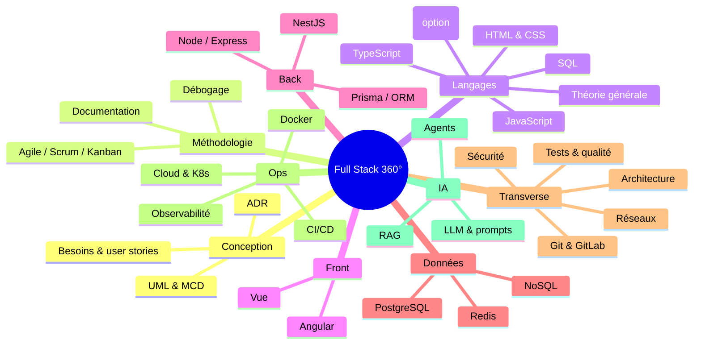

# 🏠 Accueil — Apprentissage Full Stack

> [!abstract] Ce coffre
> Mon parcours pour devenir **développeur full stack expérimenté avec une vision 360°** : front (TypeScript, **Angular**, **Vue**), back (**NestJS**, PostgreSQL), et tout ce qui les relie (réseaux, sécurité, tests, architecture, DevOps, IA).

## 🚀 Commencer ici
1. [[Roadmap-12-mois|Roadmap 12 mois]] — le plan mois par mois, avec livrables et points de contrôle
2. [[Tableau-de-bord|Tableau de bord]] — progression (notes par statut, par mois), tâches en cours
3. [[Methode-d-apprentissage|Méthode d'apprentissage]] — comment étudier une note, réviser, pratiquer
4. [[Conventions-du-coffre|Conventions du coffre]] — format des notes, statuts, tags, modèles
5. [[Corrections-apportees|Corrections apportées]] — ce qui a été corrigé / harmonisé dans les notes existantes

## 🧭 Carte des domaines

## 📚 Index des domaines

| # | Domaine | Index |
|---|---|---|
| 00 | Conception | [[Conception]] |
| 01 | Méthodologie | [[Méthodologie]] |
| 02 | Algorithmes & structures de données | [[Algorithmes]] |
| 03 | Langages | [[HTML-CSS]] · [[JavaScript]] · [[TypeScript]] · [[SQL]] · [[Théorie Générale]] · [[Python]] |
| 04 | Versionning | [[Git]] · [[GitLab]] |
| 05 | Outils | [[Outils]] · [[IntelliJ IDEA]] |
| 06 | Bases de données | [[Bases de Données]] |
| 07 | Frameworks | [[Angular]] · [[Vue]] · [[Frameworks]] · [[Backend]] · [[NestJS]] · [[ORM]] |
| 08 | Architecture | [[Architecture Logicielle]] |
| 09 | Sécurité | [[Sécurité]] |
| 10 | Tests & qualité | [[Tests et Qualité]] |
| 11 | Réseaux | [[Réseaux]] |
| 12 | Infrastructure | [[Infrastructure]] · [[Docker]] |
| 13 | Intelligence artificielle | [[Intelligence Artificielle]] |

## 🛠️ Projets fil rouge
| Projet | Mois | Stack |
|---|---|---|
| [[02_Projects/Portfolio\|Portfolio]] | M1–M3 | Vue 3 + TypeScript, PrimeVue, Lucide, Tailwind (HTML/CSS assistés par l'IA) |
| [[02_Projects/CinéTrack\|CinéTrack]] | M4–M5 | Angular, API TMDB, signals, RxJS, PrimeNG |
| [[02_Projects/CinéTrack-Vue\|CinéTrack-Vue]] | M6 | Vue 3, Pinia, Vue Router |
| [[02_Projects/CinéTrack-API\|CinéTrack-API]] | M7–M9 | NestJS, Prisma, PostgreSQL, Redis |
| [[02_Projects/CinéTrack-Fullstack\|CinéTrack-Fullstack]] | M10–M11 | Monorepo, Docker, GitLab CI, déploiement |
| [[02_Projects/Capstone\|Capstone]] | M12 | IA, temps réel, projet vitrine |

## 🗂️ Espaces de travail
- `01_Daily/` — notes quotidiennes (modèle `TPL_Daily-Note`, créées via le plugin Calendar/Daily notes)
- `02_Projects/` — un fichier par projet + tableau Kanban
- `04_Snippets/` — extraits de code : cliquer sur un lien « Extrait de code » d'une note crée le fichier avec le modèle `TPL_Snippet`
- `_Templates/` — modèles
