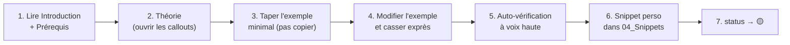

# 🧠 Méthode d'apprentissage

> [!abstract] En une phrase
> On n'apprend pas en lisant : on apprend en **se testant**, en **pratiquant** et en **expliquant** — les notes servent de support, les projets de preuve.

## Étudier une note (45 à 60 min)

1. **Lire** l'introduction et vérifier les prérequis (liens `[!warning]-`)
2. **Théorie** : ouvrir chaque callout, reformuler avec ses mots dans « Notes brutes »
3. **Taper** l'exemple minimal à la main (jamais de copier-coller) dans un vrai projet
4. **Casser** : provoquer volontairement chaque « Piège courant » pour voir l'erreur
5. **S'auto-évaluer** : répondre à voix haute à l'auto-vérification et aux questions d'entretien (méthode Feynman : expliquer à un enfant de 12 ans)
6. **Créer le snippet** (clic sur le lien « Extrait de code ») avec TA version commentée
7. **Mettre `status: 🟡 In Progress`** ; passer à `🟢 Done` seulement après l'avoir utilisé dans un projet ET réussi l'auto-vérification une semaine plus tard

## Révision espacée
| Quand | Quoi |
|---|---|
| J+1 | Relire les points clés, refaire l'auto-vérification |
| J+7 | Auto-vérification sans regarder la note + 1 piège de mémoire |
| J+30 | Questions d'entretien à voix haute |
| Fin de phase | Quiz généré par l'IA sur toutes les notes de la phase (voir [[IA-07-IA-Assistee-Dev\|IA Assistée au Développement]]) |

> [!tip] Astuce Obsidian
> Ajouter une tâche de révision dans la daily note : `- [ ] #task Réviser [[JS-06-Event-Loop|Event Loop JavaScript]] [due:: 2026-11-12]` (commande QuickAdd `add_task`).

## Pratiquer
- **Projet du mois** (voir [[Roadmap-12-mois|Roadmap 12 mois]]) : c'est là que les notes deviennent des compétences
- **Algorithmes** dès M2 : 2 à 3 problèmes par semaine (LeetCode/NeetCode), annoncer la complexité avant de coder
- **Au travail** : relier chaque concept au code réel de l'équipe ; lire une MR de senior par semaine

## Règles d'or
1. Comprendre avant de commiter (surtout le code généré par IA)
2. Documentation officielle d'abord, vérifier la version
3. Petites étapes, commits fréquents, MR petites
4. Un bug corrigé = un test ajouté
5. Régularité > intensité : 1 h par jour vaut mieux que 7 h le dimanche
6. Demander de l'aide après 30-60 min bloqué, avec un résumé clair de ce qui a été essayé

## Bilan hebdomadaire (dimanche, dans la daily note)
- Qu'ai-je appris ? (3 points)
- Qu'est-ce qui reste flou ? → questions dans « Notes brutes »
- Qu'ai-je livré dans le projet ?
- Objectif de la semaine prochaine
