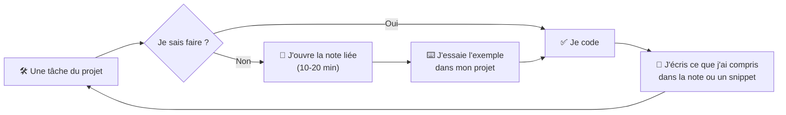

# 🧠 Méthode d'apprentissage

> [!abstract] Le principe
> **On apprend en construisant des projets.** Les notes ne se lisent pas de A à Z : on ouvre une note **au moment où le projet en a besoin**, on comprend l'essentiel, on l'applique tout de suite.

## La boucle

1. **Pars du projet.** Chaque projet de `02_Projects` liste ses tâches et, pour chacune, les notes utiles.
2. **Lis juste ce qu'il faut.** Le « En bref » + l'exemple suffisent souvent. Le reste sert quand tu bloques.
3. **Tape le code toi-même** dans ton projet (jamais de copier-coller aveugle, y compris depuis l'IA).
4. **Écris avec tes mots** ce que tu as compris : une ligne dans la note ou un snippet dans `04_Snippets`.
5. **Statut** : `🟡 In Progress` quand tu as commencé, `🟢 Done` quand tu l'as **utilisé dans un projet** et que tu sais l'expliquer sans la note.

## Quand une note ne suffit pas

- Relis l'exemple et **casse-le exprès** : change une ligne, observe l'erreur.
- Demande à l'IA de t'expliquer **ton** code, pas de l'écrire à ta place (voir [[IA-07-IA-Assistee-Dev|IA Assistée au Développement]]).
- Bloqué plus de 30-60 min : demande à un collègue avec un résumé de ce que tu as essayé.

## Retenir sur la durée

| Quand | Quoi |
|---|---|
| Fin de tâche | 1 phrase : « ce que j'ai appris » dans la daily note |
| Fin de semaine | Relire les notes passées en 🟡 et les expliquer à voix haute |
| Fin de projet | Rédiger l'étude de cas du projet (ce qui sert aussi au Portfolio) |

## Règles d'or

1. **Comprendre avant de commiter**, surtout le code généré par l'IA.
2. **La documentation officielle d'abord** (lien `source` en haut de chaque note).
3. **Petits pas** : petites tâches, commits fréquents.
4. **Un bug corrigé = un test ajouté.**
5. **Régularité > intensité** : 1 h par jour vaut mieux que 7 h le dimanche.

## Au travail

Chaque semaine : repère dans le code de l'équipe un concept que tu viens d'utiliser dans ton projet, et lis une merge request d'un collègue plus expérimenté.
