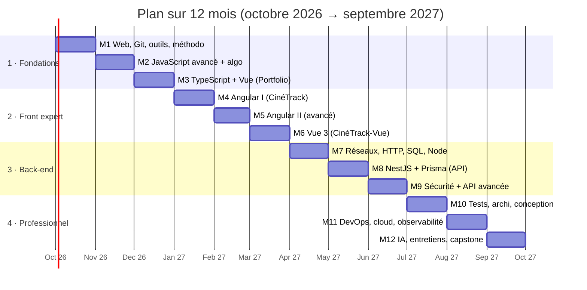
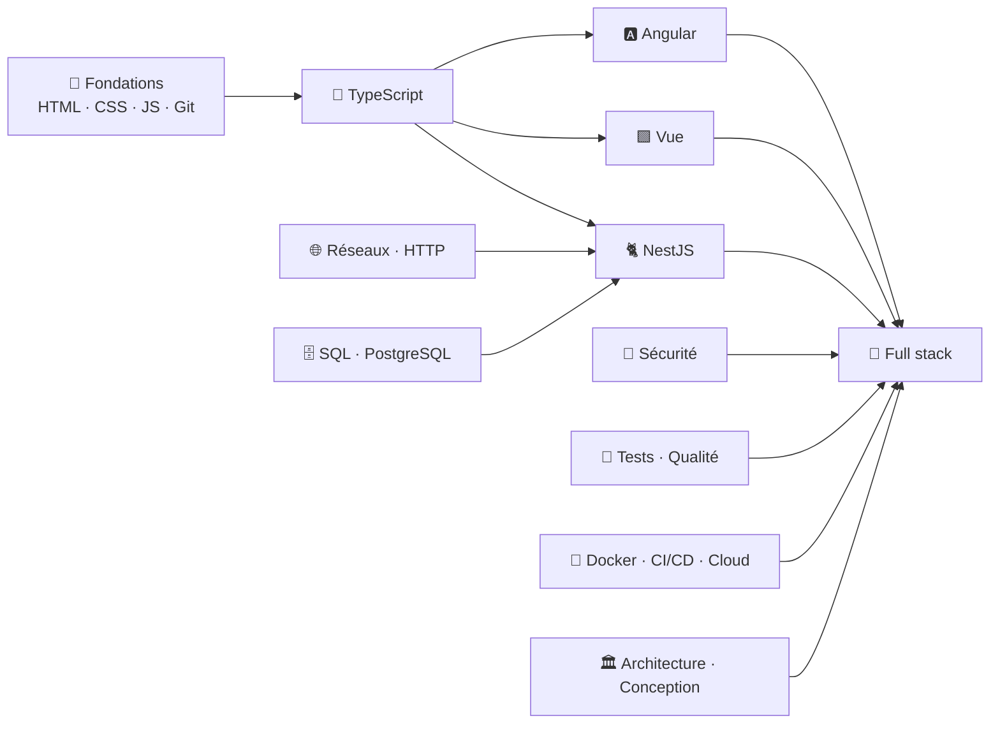

# 🗺️ Roadmap 12 mois — Développeur Full Stack TypeScript (Angular · Vue · NestJS)

> [!abstract] Objectif
> En 12 mois, passer de « je connais les bases » à **développeur full stack solide avec une vision 360°** : excellent en **TypeScript**, **Angular** et **Vue** (la stack de l'entreprise), capable de construire et déployer une **API NestJS + PostgreSQL**, et de raisonner en architecture, sécurité, tests et DevOps.

> [!tip] Le principe
> **On apprend en faisant des projets.** Chaque mois a un projet et un livrable ; les notes du mois sont celles dont le projet a besoin. On ouvre une note au moment où une tâche l'exige (voir [[Methode-d-apprentissage|Méthode d'apprentissage]]). On passe au mois suivant quand le livrable fonctionne, même en retard : la régularité compte plus que la vitesse.

---

## Vue d'ensemble

---

## Rythme hebdomadaire recommandé (≈ 8 à 10 h en plus du travail)

| Jour | Durée | Activité |
|---|---|---|
| Lundi | 1 h | Choisir les tâches de la semaine dans le projet, ouvrir les notes liées |
| Mardi | 1 h 30 | Projet : coder une tâche |
| Mercredi | 1 h | Projet + 1 exercice d'algo à partir de M02 |
| Jeudi | 1 h 30 | Projet : coder une tâche |
| Samedi | 3 h | Projet (bloc long) + commit propre |
| Dimanche | 30 min | Bilan : ce que j'ai appris, notes passées en 🟡 / 🟢 |

> [!warning] Au travail
> Chaque semaine, relier ce que tu apprends au code de l'entreprise : lire une MR d'un senior, repérer dans le projet réel le concept de la semaine, poser UNE bonne question à l'équipe. C'est l'accélérateur n°1.

---

## Phase 1 — Fondations (M1 → M3)

### M1 · Octobre — Le web, Git et l'environnement de travail
**Notes :**
- HTML/CSS — **l'essentiel pour lire et corriger ce que l'IA génère** (pas besoin de tout coder à la main) : [[HTML-01-Structure-Semantique|Structure HTML et Sémantique]], [[HTML-04-Aide-Memoire-Balises|Aide-mémoire des balises]], [[HTML-05-Attributs-Globaux-Data|Attributs HTML et data]], [[HTML-02-Formulaires|Formulaires HTML]], [[HTML-06-Head-Meta-Scripts|Head, meta et scripts]], [[HTML-07-Images-Medias|Images et médias]], [[HTML-08-Tableaux-HTML|Tableaux HTML]], [[CSS-01-Selecteurs-Cascade-Specificite|Sélecteurs Cascade et Spécificité CSS]], [[CSS-11-Aide-Memoire-Selecteurs|Aide-mémoire des sélecteurs CSS]], [[CSS-02-Box-Model|Box Model CSS]], [[CSS-03-Flexbox|Flexbox CSS]], [[CSS-04-Grid|Grid CSS]] (à survoler : responsive, positionnement, variables)
- JS de base : [[JS-01-Fondamentaux|Fondamentaux JavaScript]], [[JS-02-Types-Coercition-Egalite|Types et Coercition JavaScript]], [[JS-05-Objets-Tableaux-Methodes|Objets et Tableaux JavaScript]], [[JS-08-DOM-Evenements|DOM et Événements JavaScript]], [[JS-14-Selectionner-Elements-DOM|Sélectionner des éléments du DOM]], [[JS-15-Manipuler-le-DOM|Manipuler le DOM]]
- Théorie : [[TG-01-Comment-fonctionne-un-programme|Comment fonctionne un programme]], [[TG-02-Memoire-Valeur-Reference|Mémoire Valeur et Référence]], [[TG-03-Typage-Statique-Dynamique|Typage Statique et Dynamique]], [[TG-04-Synchrone-vs-Asynchrone|Synchrone vs Asynchrone]], [[TG-05-Paradigmes-POO|Programmation Orientée Objet]], [[TG-08-Lisibilite-Nommage|Lisibilité et Nommage du Code]]
- Git : [[GIT-01-Fondamentaux|Git Fondamentaux]], [[GIT-02-Branches-Merge-Rebase|Branches Merge et Rebase]], [[GIT-03-Depots-Distants|Dépôts Distants]], [[GIT-04-Conflits|Résoudre les Conflits Git]], [[GIT-07-Conventions-Commits-SemVer|Conventions de Commits et SemVer]], [[01-GitLab|Fondamentaux GitLab]], [[02-Merge-Requests|Merge Requests]], [[04-Issues-Boards|Issues et Boards GitLab]]
- Outils : [[OUT-01-Terminal-Bash|Terminal et Bash]], [[OUT-04-VSCode-Productivite|VS Code et Productivité]], [[IJ-01-Interface-Fondamentaux|Interface & Fondamentaux IntelliJ IDEA]], [[OUT-06-Recherche-Documentation|Chercher et Lire la Documentation]], [[IA-07-IA-Assistee-Dev|IA Assistée au Développement]]
- Méthodo : [[METH-01-Agile-Manifeste|Agile et Manifeste Agile]], [[METH-02-Scrum|Scrum]], [[METH-03-Kanban|Kanban]], [[METH-05-Resolution-Problemes-Debug|Résolution de Problèmes et Débogage]]

**Livrable :** démarrage du [[02_Projects/Portfolio|Portfolio]] en **Vue 3 + TypeScript + PrimeVue** : projet créé, structure comprise, layout généré avec l'IA puis relu, dépôt GitLab avec commits conventionnels. En parallèle, exercices de sélection/manipulation du DOM dans la console.
**Point de contrôle :** je sélectionne et modifie n'importe quel élément du DOM sans aide, je repère une balise mal choisie dans du HTML généré, et je résous un conflit Git seul.

### M2 · Novembre — JavaScript en profondeur + premiers algorithmes
**Notes :** [[JS-03-Fonctions-Scope-Closures|Fonctions Scope et Closures JavaScript]], [[JS-04-this-Prototypes-Classes|this et Prototypes JavaScript]], [[JS-06-Event-Loop|Event Loop JavaScript]], [[JS-07-Promises-Async-Await|Promises et Async Await JavaScript]], [[JS-09-Modules-ESM|Modules ES JavaScript]], [[JS-10-Fetch-JSON-HTTP|Fetch API et JSON]], [[JS-11-Stockage-Navigateur|Stockage Navigateur]], [[JS-12-Erreurs-Debug-DevTools|Gestion des Erreurs et DevTools]], [[JS-13-JavaScript-Moderne-ES2015-2025|JavaScript Moderne ES2015+]], [[TG-06-Programmation-Fonctionnelle|Programmation Fonctionnelle]], [[TG-07-Encodage-Unicode-Nombres|Encodage Unicode et Nombres]], [[GIT-05-Annuler-Corriger|Annuler et Corriger dans Git]], [[GIT-06-Workflows-Equipe|Workflows Git en Équipe]]
Algo : [[ALGO-01-Complexite-Big-O|Complexité Big O]], [[ALGO-02-Tableaux-Chaines|Tableaux et Chaînes]], [[ALGO-03-Piles-Files-Listes-Chainees|Piles Files et Listes Chaînées]], [[ALGO-04-Tables-de-Hachage-Map-Set|Tables de Hachage Map et Set]]

**Livrable :** Portfolio — composants typés (`ProjetCard`), filtre des projets avec `computed`, mode sombre persisté, composable d'appel API (fetch, annulation, états chargement/erreur), premiers tests. Notes Vue à lire en parallèle : VUE-01 → VUE-07.
**Point de contrôle :** je prédis l'ordre d'exécution d'un code mêlant `setTimeout`, Promises et `await` ; je code `debounce` de tête.

### M3 · Décembre — TypeScript expert + Vue appliqué au Portfolio
**Notes :** toute la section [[TypeScript]] (TS-01 → TS-19), [[OUT-02-Outillage-Build-Vite-Bundlers|Outils de Build et Bundlers]], [[OUT-03-ESLint-Prettier-Qualite|ESLint Prettier et Hooks]], [[NODE-01-Node-npm|Node.js et npm]] (bases), [[TEST-02-Tests-Unitaires-Vitest-Jest|Tests unitaires Vitest]] ; en survol : [[CSS-09-Architecture-BEM-Tailwind|Architecture CSS BEM et Tailwind]], [[HTML-03-Accessibilite-Web|Accessibilité Web]]

**Livrable :** Portfolio en TS strict (zéro `any`, `vue-tsc`), Vue Router (détail `/projets/:slug`), formulaire de contact VeeValidate + Zod, 15+ tests Vitest, déploiement GitLab Pages. Notes Vue : VUE-08, VUE-10, VUE-14 → VUE-16.
**Point de contrôle :** zéro `any` ; je sais expliquer generics, unions discriminées, narrowing, `unknown` vs `any`, `satisfies`, utility types.

---

## Phase 2 — Front-end expert (M4 → M6)

### M4 · Janvier — Angular I : les fondations modernes
**Notes :** ANG-01 → ANG-10, [[UI-Librairies-Interfaces-Rapides|Librairies UI pour interfaces rapides]], [[ANG-18-Cycle-de-Vie|Cycle de vie des composants Angular]], [[ANG-19-Communication-Composants|Communication parent-enfant Angular]], [[ANG-20-Pipes|Pipes Angular]]
**Livrable :** [[02_Projects/CinéTrack|CinéTrack]] (Angular + **API TMDB** + PrimeNG) : films populaires, recherche, fiche détail avec casting, filtre par genre, favoris en localStorage, formulaire réactif « ajouter une critique ».
**Point de contrôle :** composants standalone + signals + `@if/@for`, services injectés, routing avec paramètres, HttpClient + gestion d'erreurs, recherche avec `debounceTime` + `switchMap`.

### M5 · Février — Angular II : niveau confirmé
**Notes :** ANG-11 → ANG-17 et [[ANG-21-Guards-Resolvers-Intercepteurs|Guards Resolvers et Intercepteurs Angular]], [[ANG-22-Content-Projection-Queries|Content Projection et View Queries Angular]], [[ANG-23-Signals-Avances|Signals Avancés Angular]], [[ANG-24-RxJS-Avance|RxJS Avancé]], [[ANG-25-NgRx-Signal-Store|NgRx et Signal Store]], [[ANG-26-SSR-Hydratation|SSR et Hydratation Angular]], [[ANG-27-Defer-Vues-Differees|Vues différées @defer Angular]], [[ANG-28-Architecture-Projet-Angular|Architecture d'un Projet Angular]], [[ANG-29-Angular-Material-CDK|Angular Material et CDK]]
**Livrable :** CinéTrack refactoré : architecture par features, OnPush partout, store signals, lazy loading + `@defer`, intercepteurs, 20+ tests (Vitest/TestBed).
**Point de contrôle :** je choisis entre signals et RxJS en le justifiant ; je sais expliquer switchMap/mergeMap/concatMap/exhaustMap et OnPush.

### M6 · Mars — Vue 3 en profondeur (la 2e stack de l'entreprise)
**Notes :** toute la section [[Vue]] (VUE-01 → VUE-21) + [[Angular-vs-Vue|Angular vs Vue Correspondances]]
**Livrable :** [[02_Projects/CinéTrack-Vue|CinéTrack-Vue]] : mêmes fonctionnalités en Vue 3 + TS + Pinia + Vue Router + Vitest.
**Point de contrôle :** je passe d'Angular à Vue sans confusion (`.value` vs `()`, composable vs service) ; je sais expliquer `ref`/`reactive`, `computed`/`watch`, props/emits/slots, Pinia.

---

## Phase 3 — Back-end (M7 → M9)

### M7 · Avril — Réseaux, HTTP, SQL et Node
**Notes :** toute la section [[Réseaux]] (sauf NET-08, NET-09, NET-12 → M11), [[SEC-07-CORS-Same-Origin|CORS et Same-Origin Policy]], [[SEC-09-HTTPS-TLS|HTTPS et TLS]], [[BACK-00-Choisir-son-Backend|Choisir son Backend]], [[NODE-01-Node-npm|Node.js et npm]], [[NODE-02-Express-Middleware|Express et Middleware]], [[OUT-05-Clients-API-Postman-Bruno|Clients API Postman Bruno curl]], [[ARCH-04-API-REST-Design|API REST Design]], [[ARCH-05-Client-Serveur-Communication|Client-Serveur & Modes de Communication]], SQL-01 → SQL-07, [[BDD-01-Fondamentaux-SGBD|Fondamentaux des Bases de Données]], [[BDD-02-Modelisation-Normalisation|Modélisation Relationnelle et Normalisation]], [[CONC-07-Modelisation-Donnees-MCD-MLD|Modélisation des Données MCD MLD]]
**Livrable :** MCD/MLD de CinéTrack + base PostgreSQL en Docker + mini-API Express (CRUD films en mémoire) testée avec Bruno.
**Point de contrôle :** je décris le trajet complet d'une requête (DNS → TCP → TLS → HTTP → API → SQL) ; j'écris jointures, GROUP BY et sous-requêtes sans aide.

### M8 · Mai — NestJS + Prisma
**Notes :** NEST-01 → NEST-05, NEST-08, NEST-09, ORM-01 → ORM-03, [[BDD-03-Transactions-ACID|Transactions et ACID]], [[BDD-04-Indexation-Performance|Indexation et Performance SQL]], [[BDD-05-Migrations|Migrations de Base de Données]], [[BDD-08-ORM-Concepts-N-plus-1|ORM Concepts et Problème N+1]], [[BDD-06-NoSQL-MongoDB|NoSQL et MongoDB]], [[BDD-09-PostgreSQL-Pratique|PostgreSQL en Pratique]]
**Livrable :** [[02_Projects/CinéTrack-API|CinéTrack-API]] v1 : NestJS + Prisma + PostgreSQL, CRUD films/critiques/favoris, DTO validés, pagination, migrations, seed. Le front Angular consomme l'API.
**Point de contrôle :** controller/service/repository bien séparés ; aucune requête N+1 ; migrations propres.

### M9 · Juin — Sécurité et API avancée
**Notes :** toute la section [[Sécurité]], NEST-06, NEST-07, NEST-10 → NEST-14, [[BDD-07-Redis-Cle-Valeur|Redis Cache Clé-Valeur]], [[NET-10-WebSockets-SSE|WebSockets et Server-Sent Events]]
**Livrable :** authentification complète (argon2, JWT court + refresh en cookie HttpOnly), rôles, guards, rate limiting, Swagger, cache Redis, tests e2e ; fronts Angular ET Vue branchés sur l'auth.
**Point de contrôle :** je sais expliquer et prévenir XSS, CSRF, injection SQL, IDOR ; je sais justifier où stocker un token.

---

## Phase 4 — Niveau professionnel (M10 → M12)

### M10 · Juillet — Qualité, architecture et conception
**Notes :** toute la section [[Tests et Qualité]], [[ARCH-10-Clean-Code|Clean Code]], [[ARCH-11-SOLID|SOLID]], [[ARCH-12-Clean-Architecture-Hexagonale|Architecture Hexagonale et Clean Architecture]], [[ARCH-13-Domain-Driven-Design|Domain-Driven Design]], [[ARCH-14-Architecture-Frontend|Architecture Frontend]], ARCH-01 → ARCH-09, toute la section [[Conception]], [[METH-04-Documentation-Technique|Documentation Technique]], [[GIT-08-Git-Avance|Git Avancé]], [[SQL-08-Window-Functions|Window Functions SQL]], [[ALGO-05-Recursivite|Récursivité]], [[ALGO-06-Arbres-Graphes|Arbres et Graphes]], [[ALGO-07-Tri|Algorithmes de Tri]], [[ALGO-08-Recherche-Binaire|Recherche Binaire]]
**Livrable :** ADR, diagrammes (cas d'utilisation, classes, séquences), README complets, 3 tests E2E Playwright, module favoris de l'API refait en hexagonal, quality gate.
**Point de contrôle :** je sais défendre mes choix d'architecture à l'oral et écrire une user story avec critères d'acceptation testables.

### M11 · Août — DevOps, cloud et observabilité
**Notes :** section [[Docker]], [[LNX-01-Linux-Essentiels|Linux Essentiels]], [[LNX-02-Permissions-Processus-Services|Permissions Processus et Services Linux]], toute la sous-section CI/CD, Cloud, Monitoring de [[Infrastructure]], [[NET-08-Pare-feu-Securite-Reseau|Pare-feu et Sécurité Réseau]], [[NET-09-Proxy-Reverse-Proxy-Load-Balancer|Proxy Reverse Proxy et Load Balancer]], [[NET-12-Linux-et-Reseau|Linux et Réseau]], [[03-CI-CD|CI/CD GitLab]], [[05-GitLab-Avance|GitLab Avancé]], [[SEC-10-Gestion-des-Secrets|Gestion des Secrets]]
**Livrable :** [[02_Projects/CinéTrack-Fullstack|CinéTrack-Fullstack]] : monorepo, images Docker multi-stage, pipeline GitLab complet, déploiement HTTPS (VPS ou PaaS), logs structurés, Sentry, sauvegardes.
**Point de contrôle :** une MR mergée part en recette automatiquement ; je sais diagnostiquer un incident avec logs/métriques.

### M12 · Septembre — IA, entretiens et projet final
**Notes :** toute la section [[Intelligence Artificielle]], [[ALGO-09-Techniques-Resolution|Techniques de Résolution d'Algorithmes]], révision des notes « Questions d'entretien »
**Livrable :** [[02_Projects/Capstone|Capstone]] (fonctionnalité IA : résumé de critiques / recherche sémantique pgvector / temps réel), portfolio mis à jour avec tous les projets, CV technique, bilan des 12 mois.
**Point de contrôle :** simulation d'entretien technique (algo + conception + questions Angular/Vue/Nest) ; présentation de CinéTrack en 10 minutes.

---

## Après 12 mois (année 2 — pistes)
- **Spring Boot** si l'entreprise utilise Java côté back (les concepts NestJS se transfèrent presque 1:1)
- Kubernetes approfondi, Nx monorepo, micro-frontends
- Performance web avancée, design system partagé Angular/Vue
- Mentorat : relire les MR des nouveaux arrivants, animer un « lunch & learn »

## Suivi
- Progression détaillée : [[Tableau-de-bord|Tableau de bord]]
- Méthode et révisions : [[Methode-d-apprentissage|Méthode d'apprentissage]]
- Conventions du coffre : [[Conventions-du-coffre|Conventions du coffre]]
