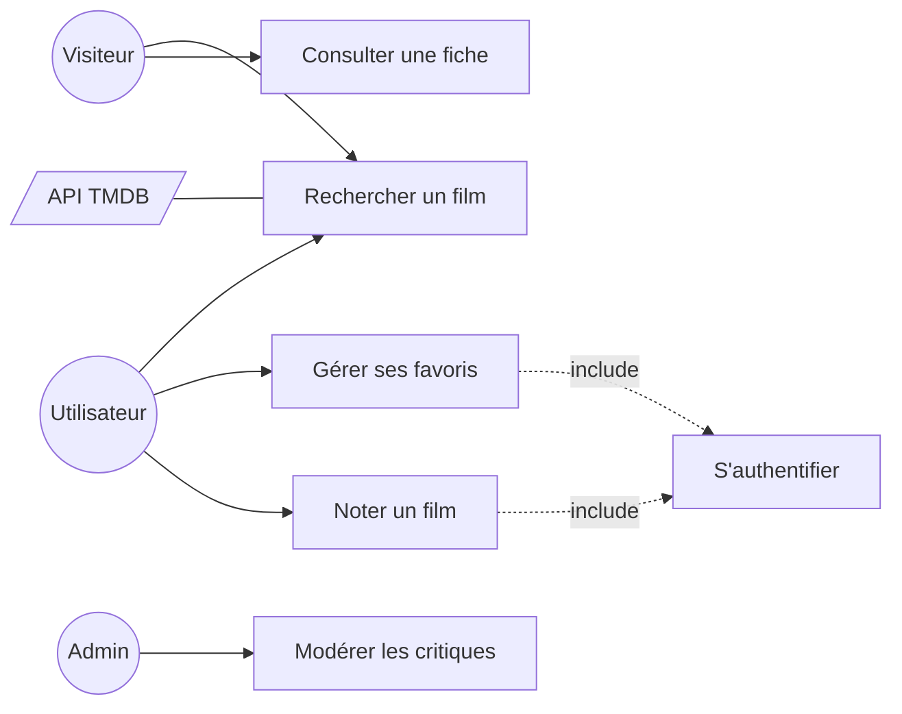

# UML Diagramme de Cas d'Utilisation

> [!abstract] En bref
> **UML** est un ensemble de schémas standard pour décrire un logiciel. Le **diagramme de cas d'utilisation** est le plus simple : il montre **qui** (les acteurs) peut faire **quoi** (les cas d'utilisation) avec l'application. C'est une vue d'ensemble du périmètre, idéale pour démarrer un projet.

## Exemple : CinéTrack

(Mermaid n'a pas de vrai diagramme de cas d'utilisation : on l'imite avec un `flowchart`. draw.io ou PlantUML le font nativement.)

## Les éléments

| Élément | Représentation | Sens |
|---|---|---|
| **Acteur** | bonhomme (ici un cercle) | un **rôle** : Visiteur, Utilisateur, Admin, ou un système externe (TMDB) |
| **Cas d'utilisation** | ovale (ici un rectangle) | un **objectif** de l'acteur : « noter un film » |
| **include** | flèche pointillée | toujours inclus : noter **exige** d'être authentifié |
| **extend** | flèche pointillée | optionnel, sous condition : « afficher la bande-annonce » si elle existe |

## Les règles

- Un acteur est un **rôle**, pas une personne : toi, tu peux être Visiteur puis Utilisateur.
- Un cas = un **objectif** de l'utilisateur, pas un écran ni un clic (« Gérer ses favoris », pas « Cliquer sur le cœur »).
- Rester simple : 5 à 15 cas pour une application.

## À quoi ça sert concrètement

- Les **acteurs** deviennent tes **rôles** dans l'API (`VISITOR`, `USER`, `ADMIN`) → voir [[NEST-06-Middleware-Guards-Interceptors|Guards NestJS]].
- Les **cas** deviennent tes **epics** et tes [[CONC-02-User-Stories-Criteres-Acceptation|user stories]].

## Pièges

- **Décrire des écrans** au lieu d'objectifs.
- **Vouloir y mettre l'ordre des actions** : ce diagramme ne le montre pas, c'est le rôle du [[CONC-05-UML-Sequence-Activite|diagramme de séquence]].
