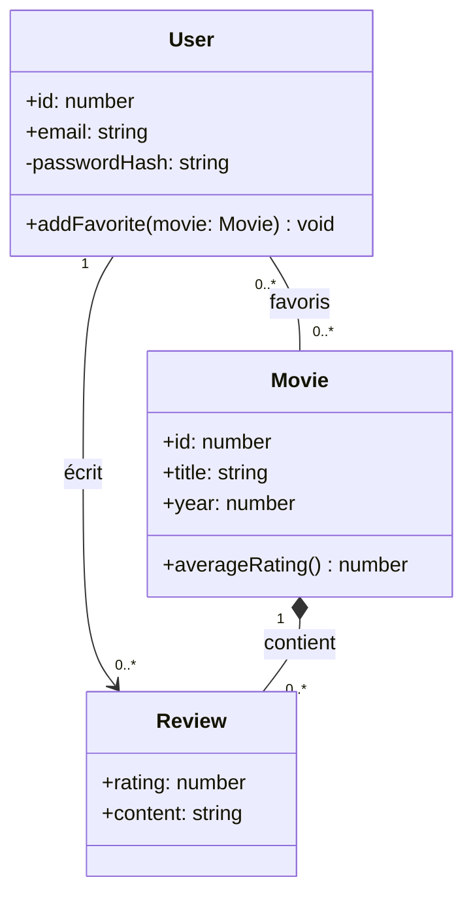

# UML Diagramme de Classes

> [!abstract] En bref
> Le **diagramme de classes** est le **plan** de tes données et de ton code : quelles « choses » existent (Utilisateur, Film, Critique), ce qu'elles contiennent, et comment elles sont liées. Sur tes projets, il sert surtout à réfléchir au **modèle métier** avant d'écrire le schéma Prisma.

## Exemple : CinéTrack



## Lire une classe

```text
┌──────────────────────┐
│ User                 │  ← nom
├──────────────────────┤
│ +id: number          │  ← attributs (+ public, - privé, # protégé)
│ -passwordHash: string│
├──────────────────────┤
│ +addFavorite() void  │  ← méthodes
└──────────────────────┘
```

## Les relations

| Relation | Mermaid | Sens | Exemple |
|---|---|---|---|
| **Association** | `--` ou `-->` | « est lié à » | un utilisateur écrit des critiques |
| **Composition** | `*--` | « fait partie de », meurt avec le tout | les critiques d'un film supprimé disparaissent |
| **Agrégation** | `o--` | « contient », mais la partie vit seule | une liste contient des films qui existent sans elle |
| **Héritage** | `<\|--` | « est un » | `Admin` est un `User` |
| **Implémente** | `..\|>` | respecte une interface | `EmailNotifier` implémente `Notifier` |

## Les multiplicités

| Notation | Sens |
|---|---|
| `1` | exactement un |
| `0..1` | zéro ou un |
| `0..*` | zéro ou plusieurs |
| `1..*` | au moins un |

Elles annoncent directement ta base de données :
- `User 1 — 0..* Review` → une clé étrangère `userId` dans `Review` ;
- `User 0..* — 0..* Movie` → une **table d'association** `Favorite(userId, movieId)`.

Voir [[CONC-07-Modelisation-Donnees-MCD-MLD|MCD / MLD]] et [[ORM-01-Prisma-Schema-Migrations|Prisma]].

## Quand en faire un

- ✅ Au début d'un projet, pour les **entités métier** (5 à 10 classes).
- ✅ Pour expliquer un module compliqué.
- ❌ Pour documenter chaque classe du code : c'est vite faux et personne ne le maintient.

## Pièges

- **Confondre composition et agrégation** : demande-toi « si je supprime le tout, la partie disparaît-elle ? ».
- **Un diagramme qui contredit le code** : mieux vaut pas de diagramme qu'un diagramme faux.
