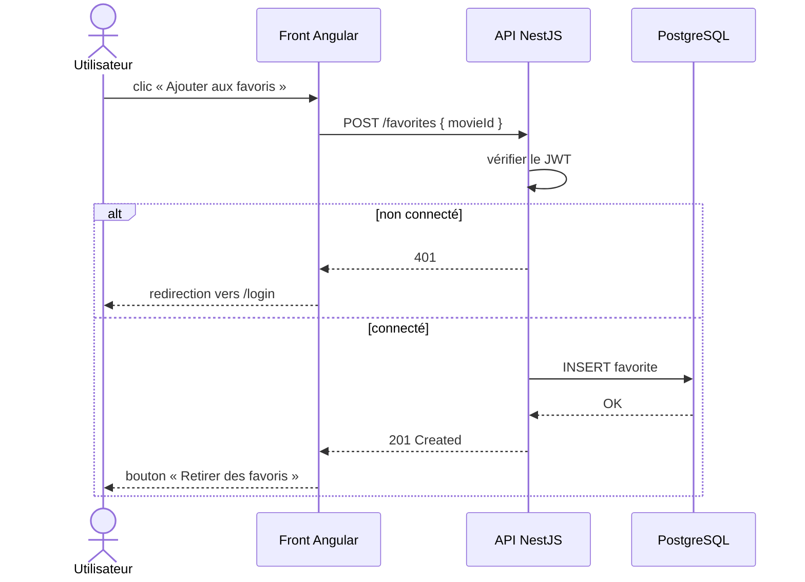
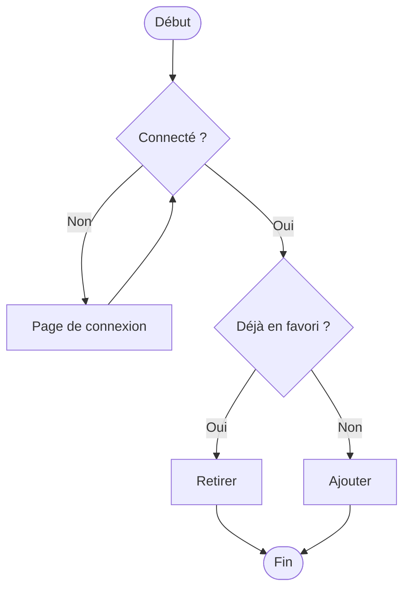

# UML Séquence et Activité

> [!abstract] En bref
> Le **diagramme de séquence** montre **qui parle à qui, dans quel ordre** : parfait pour comprendre un appel d'API ou une connexion. Le **diagramme d'activité** montre un **processus avec ses choix** (« connecté ? oui / non »). Les deux s'écrivent en Mermaid, donc directement dans tes notes et tes README.

## Le diagramme de séquence

Ajouter un favori dans CinéTrack :

| Syntaxe | Sens |
|---|---|
| `A->>B: texte` | A appelle B |
| `B-->>A: texte` | B répond à A |
| `alt … else … end` | deux chemins possibles |
| `opt … end` | étape optionnelle |
| `loop … end` | répétition |

Le temps s'écoule **de haut en bas**.

## Le diagramme d'activité

Le même processus, vu comme un parcours avec des décisions :

## Lequel choisir

| Je veux montrer… | Diagramme |
|---|---|
| les échanges entre front, API, base, service externe | **séquence** |
| un processus métier avec des choix | **activité** |
| qui peut faire quoi | [[CONC-03-UML-Cas-Utilisation\|cas d'utilisation]] |
| la structure des données | [[CONC-04-UML-Diagramme-de-Classes\|classes]] |

## Sur tes projets

Un diagramme de séquence pour chaque flux **important** dans le README de l'API : connexion (JWT + refresh), ajout de favori, appel à TMDB avec cache. Un schéma d'une minute évite une heure d'explication.

## Pièges

- **Trop de détails** (chaque méthode interne) : garde les échanges entre **composants**.
- **Oublier les cas d'erreur** : le bloc `alt` est fait pour ça.
