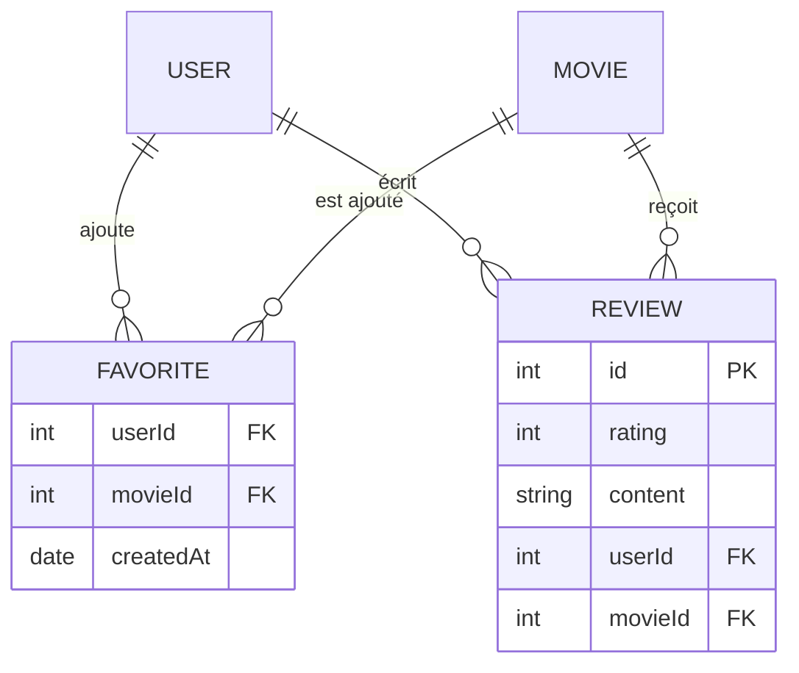

# Modélisation des Données MCD MLD

> [!abstract] En bref
> Avant de créer tes tables, tu dessines tes données. La méthode **Merise** (très utilisée en France, et demandée aux examens) le fait en deux temps : le **MCD** décrit les « choses » du métier et leurs liens, le **MLD** les traduit en **tables** avec leurs clés. Ensuite, ça devient ton schéma Prisma presque directement.

## MCD : le métier

On parle **entités** (Utilisateur, Film) et **associations** (un utilisateur NOTE un film), avec des **cardinalités**.

```text
UTILISATEUR (0,n) ──── NOTER ──── (0,n) FILM
                    (note, date)
```

Se lit : « un utilisateur note **0 ou plusieurs** films » et « un film est noté par **0 ou plusieurs** utilisateurs ». La note et la date appartiennent à l'**association**.

> ⚠️ En Merise, la cardinalité se lit **du côté de l'entité** : c'est l'inverse de l'UML. Source classique d'erreurs.

## MLD : les tables

Les 3 règles de passage :

| Association | Devient | Exemple |
|---|---|---|
| **1 — N** | une **clé étrangère** du côté N | `Review(id, content, #userId)` |
| **N — N** | une **table d'association** | `Rating(#userId, #movieId, rating, date)` |
| **1 — 1** | une clé étrangère **unique** | `Profile(id, bio, #userId unique)` |

(`#` = clé étrangère, souligné / `id` = clé primaire.)

## Le résultat pour CinéTrack



## Et en Prisma

```prisma
model Favorite {
  userId    Int
  movieId   Int
  createdAt DateTime @default(now())
  user      User     @relation(fields: [userId], references: [id])
  movie     Movie    @relation(fields: [movieId], references: [id])

  @@id([userId, movieId])     // la paire est unique : pas deux fois le même favori
}
```

Voir [[ORM-01-Prisma-Schema-Migrations|Prisma : schéma et migrations]] et [[BDD-02-Modelisation-Normalisation|Modélisation et normalisation]].

## Les 3 niveaux Merise

| Niveau | Contient |
|---|---|
| **MCD** (conceptuel) | entités, associations, cardinalités : le **métier** |
| **MLD** (logique) | tables, clés primaires et étrangères |
| **MPD** (physique) | types exacts, index, SGBD choisi (le SQL de création) |

## Pièges

- **Lire les cardinalités dans le mauvais sens.**
- **Oublier la table d'association** pour un N — N (tu mets une liste d'identifiants dans une colonne : à éviter).
- **Mettre la note dans Film** alors qu'elle dépend de l'utilisateur **et** du film.
