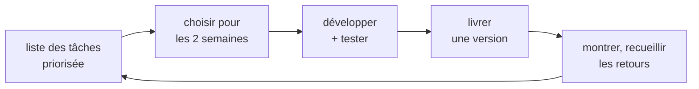

# Agile et Manifeste Agile

> [!abstract] En bref
> Travailler en **agile**, c'est livrer **par petits morceaux**, montrer souvent le résultat, et **ajuster** selon les retours, plutôt que tout planifier au départ et livrer une seule fois à la fin. C'est comme cuisiner pour des invités en **goûtant à chaque étape**, plutôt que suivre une recette les yeux fermés.

## Avant / avec l'agile

| | Cycle en V (traditionnel) | Agile |
|---|---|---|
| Plan | tout est défini au départ | on affine au fur et à mesure |
| Livraison | une fois, à la fin (des mois après) | toutes les 1 à 4 semaines |
| Changement | coûteux, évité | normal, attendu |
| Risque | on découvre les problèmes à la fin | on les voit à chaque livraison |

## La boucle



Exemple :
```text
Sprint 1 : recherche de films → démo → « il faudrait filtrer par genre »
Sprint 2 : filtres par genre + favoris
```
Le retour du sprint 1 a changé les priorités du sprint 2 : c'est ça, l'agilité.

## Les 4 valeurs du Manifeste Agile (2001)

On privilégie…
1. les **personnes et leurs échanges** plutôt que les processus et les outils ;
2. un **logiciel qui fonctionne** plutôt qu'une documentation exhaustive ;
3. la **collaboration avec le client** plutôt que la négociation du contrat ;
4. l'**adaptation au changement** plutôt que le suivi d'un plan.

« Plutôt que » ne veut pas dire « sans » : la documentation et le plan comptent, mais moins.

## Les méthodes agiles

| Méthode | En une ligne |
|---|---|
| [[METH-02-Scrum\|Scrum]] | des sprints de durée fixe, avec des rôles et des réunions définis |
| [[METH-03-Kanban\|Kanban]] | un tableau de flux continu, avec une limite de tâches en cours |
| XP (*Extreme Programming*) | des pratiques techniques : tests, pair programming, intégration continue |

## Et pour tes projets

Tu travailles déjà en agile : chaque projet est découpé en jalons, tu livres une version qui marche, puis tu améliores. La qualité technique (tests, [[CICD-01-Fondamentaux|CI]]) est ce qui permet de livrer souvent sans tout casser.

## Pièges

- **Agile = pas de rigueur** : faux, il faut au contraire des tests et une conception propre.
- **Agile = pas de documentation** : on documente l'utile, pas tout.
- **Des réunions sans fin** : les rituels doivent rester courts et utiles.
