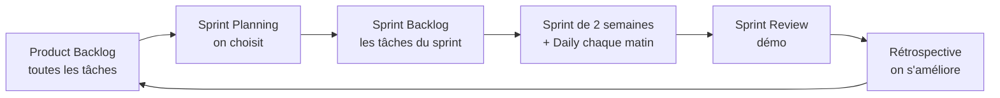

# Scrum

> [!abstract] En bref
> **Scrum** est la méthode agile la plus utilisée en entreprise, donc très probablement celle de ton équipe. Le travail est découpé en **sprints** (souvent 2 semaines). À chaque sprint : on choisit les tâches, on se synchronise chaque jour, on montre le résultat, et on se demande comment faire mieux.

## Le déroulé d'un sprint



## Les 3 rôles

| Rôle | Fait quoi |
|---|---|
| **Product Owner** (PO) | décide **quoi** faire et dans quel ordre (la valeur pour l'utilisateur) |
| **Scrum Master** | anime les rituels, **débloque** les obstacles |
| **Développeurs** (toi) | décident **comment** faire, et le font |

## Les rituels

| Rituel | Quand | Durée | À quoi ça sert |
|---|---|---|---|
| **Sprint Planning** | début du sprint | 1 à 2 h | choisir et découper les tâches |
| **Daily** | chaque jour | 15 min max | se synchroniser, signaler les blocages |
| **Sprint Review** | fin du sprint | 1 h | montrer ce qui marche, recueillir les retours |
| **Rétrospective** | fin du sprint | 1 h | ce qui a marché, ce qui coince, **une** action concrète |
| **Affinage** (*refinement*) | pendant le sprint | 1 h | préparer les tâches des prochains sprints |

## Réussir son daily

Trois phrases :

```text
« Hier : endpoint /favorites et ses tests.
  Aujourd'hui : le bouton favoris côté Angular.
  Blocage : j'attends les accès à la base de recette. »
```

Court, précis, blocage **explicite** : le Scrum Master sait quoi débloquer. Les discussions techniques se font **après**, avec les personnes concernées.

## Le vocabulaire

- **Product Backlog** : la liste de tout ce qui reste à faire, triée par priorité.
- **Sprint Backlog** : ce que l'équipe s'engage à faire ce sprint.
- **Incrément** : la version qui fonctionne à la fin du sprint.
- **Definition of Done** : ce qu'il faut pour dire « terminé » (relu, testé, déployé en recette).
- **Vélocité** : ce que l'équipe réalise en moyenne par sprint (voir [[CONC-09-Estimation-Planification|Estimation]]).

## Pièges

- **Un daily de 45 minutes** qui tourne en réunion technique.
- **Ajouter du travail en plein sprint** sans rien retirer.
- **Une rétro sans action concrète** : on se plaint, rien ne change.
- **Rester bloqué en silence** : le daily est fait pour le dire.
