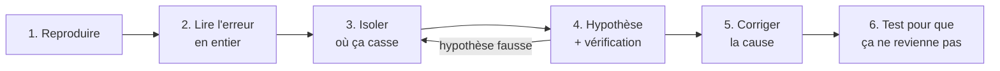

# Résolution de Problèmes et Débogage

> [!abstract] En bref
> Tu vas passer beaucoup de temps à chercher pourquoi « ça ne marche pas ». Changer le code au hasard jusqu'à ce que ça passe fait perdre des heures. La bonne méthode ressemble à celle d'un **médecin** : observer, faire une hypothèse, vérifier, puis traiter **la cause** (pas le symptôme). C'est une compétence qui se muscle à chaque projet.

## La méthode en 6 étapes



1. **Reproduire** : quelles étapes exactes provoquent le bug ? Toujours, ou parfois ?
2. **Lire le message d'erreur en entier** : la cause est souvent écrite, avec le fichier et la ligne.
3. **Isoler** : front ou back ? Quel composant ? Quelle donnée ? Coupe le problème en deux à chaque étape.
4. **Faire une hypothèse et la vérifier** (log, point d'arrêt, test), **une seule** modification à la fois.
5. **Corriger la cause**, pas le symptôme.
6. **Écrire un test** qui reproduit le bug : il ne reviendra pas.

## Exemple réel

```text
Bug : la page « Mes favoris » est vide en recette, mais pas en local.

Onglet Network : GET /api/favorites → 200 mais []   → le front affiche bien ce qu'il reçoit
Hypothèse 1 : l'utilisateur n'a pas de favoris ?     → vérifié en base : il en a 3  ❌
Hypothèse 2 : l'API filtre avec un mauvais userId    → log côté API : userId = undefined  ✅
Cause : le JWT de recette met l'identifiant dans « id » au lieu de « sub »
Correction + test e2e qui vérifie le contenu du JWT
```

Chaque étape **élimine la moitié** des causes possibles.

## Les questions qui débloquent

- **Qu'est-ce qui a changé** depuis que ça marchait ? (`git diff`, `git log`)
- Ça marche **où** ? Pour **qui** ? (local / recette, un utilisateur / tous)
- Quelle est la **plus petite** situation qui provoque le bug ?

## Les outils

| Outil | Pour |
|---|---|
| DevTools : Console, **Network** | erreurs JS, requêtes, statuts, réponses ([[JS-12-Erreurs-Debug-DevTools\|DevTools]]) |
| Points d'arrêt (IDE ou navigateur) | voir les valeurs pas à pas ([[IJ-05-Debogage\|Débogueur IntelliJ]]) |
| Logs | comprendre ce qui se passe côté serveur |
| `git bisect` | trouver le commit qui a cassé ([[GIT-08-Git-Avance\|Git]]) |
| Le « canard en plastique » | expliquer le problème à voix haute : on trouve souvent en l'expliquant |

## Demander de l'aide

Bloqué plus de **30 à 60 minutes** ? Demande, avec un message clair :

```text
Je veux : afficher les favoris de l'utilisateur.
Il se passe : la liste est vide en recette (OK en local).
J'ai vérifié : la requête renvoie 200 avec [], l'utilisateur a bien 3 favoris en base.
Je pense que : le userId est mal lu dans le JWT.
```

Rien qu'en écrivant ce message, tu trouves souvent la solution.

## Pièges

- **Changer plusieurs choses à la fois** : impossible de savoir laquelle a réglé le problème.
- **Masquer l'erreur** avec un `try/catch` vide ou un `?.` ajouté au hasard.
- **Lire seulement la première ligne** de l'erreur.
