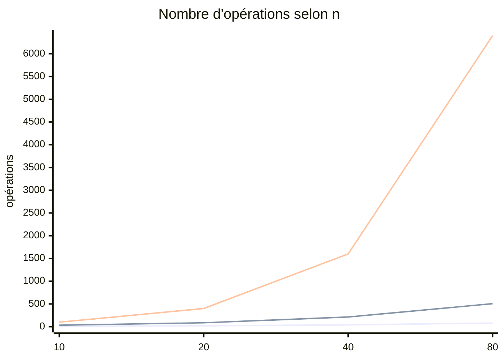

# Complexité Big O

> [!abstract] Introduction
> La notation Big O décrit comment le temps (ou la mémoire) d'un algorithme évolue quand la taille des données augmente — pour prévoir si un code tiendra avec 10, 10 000 ou 10 millions d'éléments.

---

## Théorie

> [!question]- C'est quoi ?
> | Notation | Nom | Exemple |
> |---|---|---|
> | O(1) | Constant | Accès `tab[i]`, `map.get(k)` |
> | O(log n) | Logarithmique | Recherche binaire |
> | O(n) | Linéaire | Parcourir un tableau, `includes`, `find` |
> | O(n log n) | Quasi-linéaire | Tri efficace (`sort`) |
> | O(n²) | Quadratique | Deux boucles imbriquées |
> | O(2ⁿ) | Exponentielle | Toutes les combinaisons |

> [!example]- Analogie
> Chercher un mot dans un dictionnaire en lisant chaque page (O(n)) ou en l'ouvrant au milieu puis en coupant en deux à chaque fois (O(log n)).

> [!question]- Pourquoi l'utiliser ?
> Un filtre en O(n²) sur 100 éléments passe inaperçu, sur 50 000 il fige l'interface. C'est aussi un grand classique des entretiens techniques.

> [!question]- Comment ça marche ?
> Règles : on garde le terme dominant et on ignore les constantes (O(2n + 5) = O(n)). On raisonne sur le pire cas.
> ```typescript
> // O(n²) : pour chaque film, on parcourt tous les favoris
> const avecFavori = films.map(f => ({ ...f, favori: favorisIds.includes(f.id) }));
> // O(n) : on construit un Set une fois (O(m)), puis chaque recherche est O(1)
> const ids = new Set(favorisIds);
> const avecFavori2 = films.map(f => ({ ...f, favori: ids.has(f.id) }));
> ```

> [!question]- Quand l'utiliser ?
> Dès qu'une opération s'applique à des listes potentiellement grandes (tableaux, rendus, requêtes).

> [!danger]- Quand NE PAS l'utiliser / Limites
> Big O ignore les constantes : pour de petites données, un algorithme « moins bon » mais simple peut être plus rapide. Mesurer en cas de doute.

### Schéma


(courbes : O(n), O(n log n), O(n²))

---

## Vocabulaire

| Terme | Définition en une ligne |
|-------|--------------------------|
| Complexité temporelle | Évolution du temps selon la taille |
| Complexité spatiale | Évolution de la mémoire utilisée |
| Pire cas | Scénario le plus défavorable |
| n | Taille de l'entrée |

---

## Points clés

- Garder le terme dominant, ignorer les constantes
- Boucles imbriquées sur les mêmes données = O(n²)
- `Set`/`Map` transforment une recherche O(n) en O(1)
- Trier coûte O(n log n)

---

## Pièges courants

> [!bug]- Erreurs fréquentes
> - `includes`/`find`/`indexOf` dans une boucle → O(n²) caché
> - `array.shift()` en boucle (O(n) à chaque fois)

---

## Exemple minimal

```typescript
// Détecter des doublons : O(n) avec un Set au lieu de O(n²)
function aDesDoublons(ids: number[]): boolean {
  return new Set(ids).size !== ids.length;
}
```

> [!note] Ce que j'en retiens
> Un Set résout en une ligne ce qu'une double boucle ferait en O(n²).

---

## Pour aller plus loin (niveau senior)

> [!tip]- Ce qui distingue un dev expérimenté
> - Complexité amortie, arbitrage temps/mémoire, profilage réel

---

## Connexions

**Arbre théorique :**
- Sujet parent → [[Algorithmes]]
- Sous-sujets → [[ALGO-02-Tableaux-Chaines|Tableaux et Chaînes]], [[ALGO-04-Tables-de-Hachage-Map-Set|Tables de Hachage Map et Set]]
- À comparer avec → (—)

**Pratique :**
- Extrait de code → [[04_Snippets/algo-01-complexite-big-o]]

---

## Auto-vérification

> [!check]- Est-ce que je maîtrise vraiment ?
> - Quelle est la complexité de `films.filter(f => favoris.includes(f.id))` ?

> [!faq]- Questions d'entretien
> - Quelle est la complexité de votre solution ? Peut-on faire mieux ?

---

## Tâches

- [ ] #task Faire 5 exercices « Easy » sur LeetCode en annonçant la complexité avant de coder
- [ ] #task Mettre à jour `status` une fois maîtrisé

---

## Notes brutes

- ?
