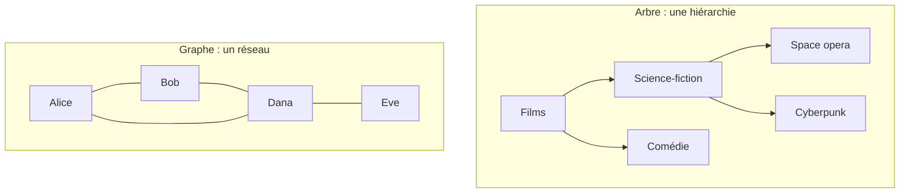

# Arbres et Graphes

> [!abstract] En bref
> Un **arbre** est une **hiérarchie** : un point de départ, des enfants, des petits-enfants (le DOM, les dossiers, les routes, les catégories). Un **graphe** est un **réseau** : des points reliés entre eux, sans hiérarchie (amis d'un réseau social, dépendances npm, stations de métro). On les parcourt de deux façons : **en profondeur** ou **en largeur**.

## Arbre ou graphe



| | Arbre | Graphe |
|---|---|---|
| Point de départ | une **racine** | aucun en particulier |
| Boucles | jamais | possibles |
| Exemples | DOM, dossiers, routes, commentaires | réseau social, dépendances, carte routière |

Vocabulaire : **nœud** (un point), **racine** (le sommet), **feuille** (un nœud sans enfant), **arête** (un lien).

## Les deux parcours

| Parcours | Image | Outil | Sert à |
|---|---|---|---|
| **En profondeur** (DFS) | suivre un couloir du labyrinthe jusqu'au bout, puis revenir | [[ALGO-05-Recursivite\|récursivité]] ou pile | explorer tout un arbre, trouver un chemin |
| **En largeur** (BFS) | l'onde d'un caillou dans l'eau, cercle par cercle | file | **le plus court chemin** en nombre d'étapes |

```ts
// En largeur : les amis, puis les amis d'amis…
function bfs(graph: Map<string, string[]>, start: string): string[] {
  const seen = new Set([start]);
  const queue = [start];
  const order: string[] = [];
  while (queue.length) {
    const node = queue.shift()!;
    order.push(node);
    for (const next of graph.get(node) ?? []) {
      if (!seen.has(next)) {
        seen.add(next);
        queue.push(next);
      }
    }
  }
  return order;
}
```

Le `Set` des nœuds **déjà vus** est obligatoire dans un graphe : sans lui, les boucles font tourner à l'infini.

## Le cas le plus fréquent : liste plate → arbre

Une API ou une base renvoie souvent des éléments avec un `parentId`. Il faut reconstruire l'arbre pour l'afficher :

```ts
interface Category { id: number; name: string; parentId: number | null }
type TreeNode = Category & { children: TreeNode[] };

function buildTree(items: Category[]): TreeNode[] {
  const byId = new Map<number, TreeNode>(items.map((i) => [i.id, { ...i, children: [] }]));
  const roots: TreeNode[] = [];
  for (const node of byId.values()) {
    if (node.parentId === null) roots.push(node);
    else byId.get(node.parentId)?.children.push(node);
  }
  return roots;
}
```

Un seul parcours grâce à la [[ALGO-04-Tables-de-Hachage-Map-Set|Map]].

## Où tu les croises

- le **DOM** et l'arbre des composants Angular / Vue ;
- les **dépendances** de ton projet (npm refuse les boucles impossibles, le bundler suit le graphe des imports) ;
- les **index** de PostgreSQL (des arbres, voir [[ALGO-08-Recherche-Binaire|Recherche binaire]]) ;
- l'ordre des **migrations** ou des étapes CI qui dépendent les unes des autres.

## Pièges

- **Oublier les nœuds déjà visités** dans un graphe → boucle infinie.
- **Supposer qu'il n'y a qu'une racine** : une liste de catégories en a souvent plusieurs.
