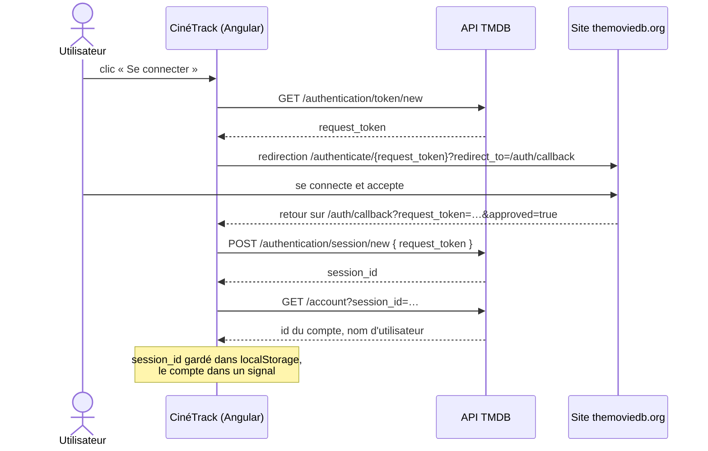

# 🎬 CinéTrack

> [!abstract] Le projet n°1
> Une application **Angular** qui affiche les films de l'**API TMDB** (populaires, recherche, fiche détaillée) avec la librairie UI **PrimeNG**. Une personne peut **se connecter avec son compte TMDB** pour gérer ses **favoris**, sa **liste « à voir »** et **noter** des films. Pas de back-end à coder : TMDB s'occupe de tout stocker.

**Stack :** Angular (standalone, signals), RxJS, HttpClient + intercepteur, formulaires réactifs, PrimeNG (thème Aura) + PrimeIcons, API TMDB, Git + GitLab

---

## Ce que fait l'application

| Qui | Peut… |
|---|---|
| **Visiteur** | voir les films populaires et les tendances · rechercher un film · filtrer par genre · ouvrir la fiche d'un film (casting, bande-annonce) |
| **Personne connectée** (compte TMDB) | tout ce que fait le visiteur · ajouter / retirer des **favoris** · gérer sa liste **« à voir »** · **noter** un film · voir ses pages « Mes favoris » et « À voir » · se déconnecter |

---

## Prérequis

> [!info] Comment lire cette liste
> 📁 = **tout le dossier** est utile : le lien ouvre la note principale du dossier, qui liste toutes ses notes.
> 📄 = **une seule note** à connaître.
>
> Pas besoin de tout maîtriser avant de commencer : lis ce qu'il faut au moment où une tâche en a besoin (les tâches plus bas indiquent quelle note ouvrir).

### Outils et environnement
- 📄 [[OUT-01-Terminal-Bash|Terminal et Bash]] · WSL, se déplacer, lancer des commandes
- 📄 [[NODE-01-Node-npm|Node.js et npm]] · installer Node, `npm install`, `npm run`, `package.json`
- 📄 [[OUT-02-Outillage-Build-Vite-Bundlers|Outillage de build]] · ce que fait `ng build`
- 📄 [[OUT-03-ESLint-Prettier-Qualite|ESLint et Prettier]]
- 📁 [[IntelliJ IDEA]] · ton éditeur (ou 📄 [[OUT-04-VSCode-Productivite|VS Code]])
- 📄 [[OUT-05-Clients-API-Postman-Bruno|Postman / Bruno]] · tester les appels TMDB avant de les coder
- 📄 [[OUT-06-Recherche-Documentation|Recherche et documentation]] · lire la doc Angular, PrimeNG et TMDB

### Git et GitLab
- 📁 [[Git]]
- 📄 [[01-GitLab|GitLab]] · créer le dépôt
- 📄 [[02-Merge-Requests|Merge requests]] · une branche + une MR par fonctionnalité
- 📄 [[04-Issues-Boards|Issues et boards]] · une tâche = un ticket
- 📄 [[03-CI-CD|CI/CD GitLab]] · pipeline lint + tests + build (fin de projet)

### Langages
- 📁 [[HTML-CSS]]
- 📁 [[JavaScript]]
- 📁 [[TypeScript]]
- 📁 [[Théorie Générale]] · mémoire, asynchrone, POO, fonctionnel, nommage

### Angular et librairie UI
- 📁 [[Angular]]
- 📄 [[UI-Librairies-Interfaces-Rapides|Librairies UI]] · installer et configurer PrimeNG

### Web, API et réseau
- 📄 [[NET-05-HTTP-Approfondi|HTTP]] · méthodes, statuts, en-têtes
- 📄 [[ARCH-04-API-REST-Design|API REST]] · lire la doc TMDB
- 📄 [[ARCH-05-Client-Serveur-Communication|Client / serveur]]

### Sécurité
- 📄 [[SEC-03-Authentification-Sessions-JWT|Authentification et sessions]] · comprendre la session TMDB
- 📄 [[SEC-06-XSS-CSRF|XSS et CSRF]] · ne jamais injecter du HTML venant de l'API
- 📄 [[SEC-07-CORS-Same-Origin|CORS]] · comprendre les erreurs dans la console
- 📄 [[SEC-10-Gestion-des-Secrets|Gestion des secrets]] · le jeton TMDB

### Architecture et conception
- 📄 [[ARCH-15-Structure-de-Projet|Structure de projet]] · le modèle de dossiers
- 📄 [[ARCH-14-Architecture-Frontend|Architecture front-end]]
- 📄 [[CONC-01-Recueil-des-Besoins|Recueil des besoins]] · le MVP
- 📄 [[CONC-02-User-Stories-Criteres-Acceptation|User stories]] · écrire les tickets
- 📄 [[CONC-06-Wireframe-Maquette-Prototype|Wireframe et maquette]] · dessiner les pages avant de coder

### Tests et qualité
- 📄 [[TEST-01-Pyramide-des-Tests|Pyramide des tests]]
- 📄 [[TEST-02-Tests-Unitaires-Vitest-Jest|Tests unitaires]]
- 📄 [[TEST-03-Mocks-Stubs-Spies|Mocks]] · simuler l'API TMDB dans les tests
- 📄 [[TEST-07-Code-Review|Code review]] · relire ses propres MR

### Méthode
- 📄 [[METH-03-Kanban|Kanban]] · organiser les tâches
- 📄 [[METH-05-Resolution-Problemes-Debug|Débogage]]
- 📄 [[METH-04-Documentation-Technique|Documentation]] · le README

### Mise en ligne
- 📄 [[CLOUD-02-Heberger-Front|Héberger un front]]

---

## La connexion avec un compte TMDB

TMDB propose sa propre connexion : l'utilisateur valide l'accès **sur le site de TMDB**, puis revient sur CinéTrack avec une **session**. Ensuite, favoris, liste « à voir » et notes sont enregistrés **dans son compte TMDB**.



```ts
// core/auth/auth.service.ts (le principe)
@Injectable({ providedIn: 'root' })
export class AuthService {
  private http = inject(HttpClient);
  private config = inject(TMDB_CONFIG);

  readonly account = signal<Account | null>(null);
  readonly isLoggedIn = computed(() => this.account() !== null);

  async startLogin(): Promise<void> {
    const { request_token } = await firstValueFrom(
      this.http.get<{ request_token: string }>(`${this.config.apiUrl}/authentication/token/new`),
    );
    const redirect = `${location.origin}/auth/callback`;
    location.href = `https://www.themoviedb.org/authenticate/${request_token}?redirect_to=${redirect}`;
  }

  async finishLogin(requestToken: string): Promise<void> {
    const { session_id } = await firstValueFrom(
      this.http.post<{ session_id: string }>(`${this.config.apiUrl}/authentication/session/new`, {
        request_token: requestToken,
      }),
    );
    localStorage.setItem('tmdb_session', session_id);
    await this.loadAccount(session_id);
  }

  private async loadAccount(sessionId: string): Promise<void> {
    const account = await firstValueFrom(
      this.http.get<Account>(`${this.config.apiUrl}/account`, { params: { session_id: sessionId } }),
    );
    this.account.set(account);
  }
}
```

---

## L'arborescence du projet

Le modèle général de [[ARCH-15-Structure-de-Projet|Structure de projet]], appliqué à CinéTrack. À adapter si besoin.

```text
src/app/
├── core/
│   ├── config/tmdb.config.ts          ← URL de l'API, jeton, langue
│   ├── http/tmdb.interceptor.ts       ← ajoute le jeton et language=fr-FR
│   ├── auth/
│   │   ├── auth.service.ts            ← connexion, session, compte
│   │   └── auth.guard.ts              ← protège les pages perso
│   └── layout/header/                 ← logo, recherche, bouton connexion
├── shared/
│   ├── ui/movie-card/                 ← la carte d'un film (réutilisée partout)
│   └── pipes/                         ← runtime (2 h 35), poster-url…
└── features/
    ├── movies/
    │   ├── data/                      ← movie.dto.ts, movie.model.ts, movie.mapper.ts, movies.api.ts
    │   ├── components/                ← movie-grid, search-bar, genre-filter
    │   └── pages/                     ← movies-page, movie-details-page
    └── account/
        ├── data/                      ← account.api.ts (favoris, à voir, notes)
        └── pages/                     ← login-page, auth-callback-page, favorites-page, watchlist-page
```

---

## Jalons

Chaque tâche indique la note à ouvrir si tu bloques.

### 0 · Mise en place
- [ ] #task Créer un compte TMDB, demander une clé API, récupérer le **jeton d'accès en lecture** → [[OUT-05-Clients-API-Postman-Bruno|Postman / Bruno]] pour tester `GET /movie/popular`
- [ ] #task Dessiner les 5 pages en wireframe (accueil, recherche, fiche, favoris, connexion) → [[CONC-06-Wireframe-Maquette-Prototype|Wireframe]]
- [ ] #task Écrire les tickets GitLab (une story par fonctionnalité) → [[CONC-02-User-Stories-Criteres-Acceptation|User stories]], [[04-Issues-Boards|Issues]]
- [ ] #task `ng new cinetrack`, dépôt GitLab, premier commit → [[ANG-01-Fondamentaux|Angular]], [[GIT-01-Fondamentaux|Git]]
- [ ] #task Installer PrimeNG + thème Aura + PrimeIcons → [[UI-Librairies-Interfaces-Rapides|Librairies UI]]
- [ ] #task Créer l'arborescence et les alias `@core`, `@shared`, `@features` → [[ANG-30-Template-Architecture-Angular|Template Angular]], [[TS-11-Modules|Modules TS]]
- [ ] #task ESLint + Prettier → [[OUT-03-ESLint-Prettier-Qualite|ESLint et Prettier]]

### 1 · Afficher les films
- [ ] #task Types des réponses TMDB (DTO), modèle `Movie`, mapper, type générique `TmdbPage<T>` → [[TS-03-Interfaces-Types|Interfaces]], [[TS-06-Generics|Generics]]
- [ ] #task Configuration TMDB + intercepteur (jeton, `language=fr-FR`) → [[ANG-21-Guards-Resolvers-Intercepteurs|Intercepteurs]], [[ANG-05-Services-DI|Services]]
- [ ] #task `MoviesApi` : populaires et tendances → [[ANG-09-HTTP-Communication-Serveur|HTTP Angular]]
- [ ] #task Page d'accueil : grille de cartes + pagination PrimeNG → [[ANG-02-Composants|Composants]], [[CSS-04-Grid|Grid]]
- [ ] #task États chargement (squelettes), vide, erreur → [[ANG-03-Templates-Data-Binding|Templates]], [[TS-07-Union-Intersection|Unions]]
- [ ] #task Carte de film : affiche (ou image de remplacement), note, année → [[ANG-19-Communication-Composants|input / output]], [[HTML-07-Images-Medias|Images]]

### 2 · Recherche et fiche film
- [ ] #task Barre de recherche avec délai (debounce) → [[ANG-08-RxJS|RxJS]], [[ANG-10-Signals|Signals]]
- [ ] #task Route `/movies/:id` + page détail (genres, durée, casting, bande-annonce) → [[ANG-06-Routing|Routing]]
- [ ] #task Pipe `runtime` (155 → « 2 h 35 ») → [[ANG-20-Pipes|Pipes]]
- [ ] #task Filtre par genre → [[ANG-07-Formulaires|Formulaires]]
- [ ] #task Chargement différé des pages (lazy loading) → [[ANG-27-Defer-Vues-Differees|@defer]], [[ANG-06-Routing|Routing]]

### 3 · Connexion
- [ ] #task `AuthService` : démarrer la connexion, page `/auth/callback`, créer la session → [[SEC-03-Authentification-Sessions-JWT|Sessions]], [[JS-07-Promises-Async-Await|async / await]]
- [ ] #task Garder la session dans `localStorage` et la restaurer au démarrage → [[JS-11-Stockage-Navigateur|Stockage navigateur]]
- [ ] #task En-tête : « Se connecter » ou nom d'utilisateur + « Se déconnecter » → [[ANG-10-Signals|Signals]]
- [ ] #task Guard qui redirige vers la connexion sur les pages perso → [[ANG-21-Guards-Resolvers-Intercepteurs|Guards]]
- [ ] #task Déconnexion (`DELETE /authentication/session`) et nettoyage

### 4 · Espace personnel
- [ ] #task Bouton favori sur la carte et la fiche → [[ANG-12-State-Management|State management]]
- [ ] #task Bouton « à voir » sur la fiche
- [ ] #task Noter un film (composant de notation PrimeNG) → [[ANG-07-Formulaires|Formulaires]]
- [ ] #task Afficher l'état du film pour l'utilisateur (favori, à voir, note) via `account_states`
- [ ] #task Pages « Mes favoris » et « À voir »

### 5 · Qualité et mise en ligne
- [ ] #task Tests : mapper, pipes, `AuthService` avec une fausse API → [[ANG-14-Tests|Tests Angular]], [[TEST-03-Mocks-Stubs-Spies|Mocks]]
- [ ] #task Responsive (mobile d'abord) → [[CSS-05-Responsive-Design|Responsive]]
- [ ] #task Accessibilité : clavier, `alt`, contrastes → [[HTML-03-Accessibilite-Web|Accessibilité]], [[ANG-16-i18n-Accessibilite|Accessibilité Angular]]
- [ ] #task `OnPush` partout + audit Lighthouse → [[ANG-11-Detection-de-changement|Détection de changement]], [[ANG-15-Performance-Bonnes-Pratiques|Performance]]
- [ ] #task Pipeline GitLab : lint, tests, build → [[03-CI-CD|CI/CD GitLab]]
- [ ] #task Mise en ligne → [[CLOUD-02-Heberger-Front|Héberger un front]], [[ANG-17-Deploiement-Build|Build Angular]]
- [ ] #task README avec captures, lien de démo, choix techniques → [[METH-04-Documentation-Technique|Documentation]]

---

## API TMDB : aide-mémoire

Base : `https://api.themoviedb.org/3` · en-tête `Authorization: Bearer <jeton d'accès en lecture>` · paramètre `language=fr-FR`

### Films

| Besoin | Endpoint |
|---|---|
| Films populaires | `GET /movie/popular?page=1` |
| Tendances de la semaine | `GET /trending/movie/week` |
| Recherche | `GET /search/movie?query=dune&page=1` |
| Fiche + casting + vidéos | `GET /movie/{id}?append_to_response=credits,videos` |
| Liste des genres | `GET /genre/movie/list` |
| Films d'un genre | `GET /discover/movie?with_genres=878&sort_by=popularity.desc` |
| Films similaires | `GET /movie/{id}/similar` |

### Connexion et compte (avec `session_id`)

| Besoin | Endpoint |
|---|---|
| Créer un jeton de demande | `GET /authentication/token/new` |
| Page de validation (site TMDB) | `https://www.themoviedb.org/authenticate/{request_token}?redirect_to=…` |
| Créer la session | `POST /authentication/session/new` · corps `{ "request_token": "…" }` |
| Infos du compte | `GET /account?session_id=…` |
| Déconnexion | `DELETE /authentication/session` · corps `{ "session_id": "…" }` |
| Ajouter / retirer un favori | `POST /account/{account_id}/favorite?session_id=…` · corps `{ "media_type": "movie", "media_id": 438631, "favorite": true }` |
| Mes favoris | `GET /account/{account_id}/favorite/movies?session_id=…` |
| Ajouter / retirer de « à voir » | `POST /account/{account_id}/watchlist?session_id=…` · corps `{ "media_type": "movie", "media_id": 438631, "watchlist": true }` |
| Ma liste « à voir » | `GET /account/{account_id}/watchlist/movies?session_id=…` |
| Noter un film (0,5 à 10) | `POST /movie/{id}/rating?session_id=…` · corps `{ "value": 8.5 }` |
| Retirer sa note | `DELETE /movie/{id}/rating?session_id=…` |
| État du film pour l'utilisateur | `GET /movie/{id}/account_states?session_id=…` → `{ favorite, watchlist, rated }` |

### Images et règles
- **Images** : `https://image.tmdb.org/t/p/w342{poster_path}` (tailles `w185`, `w342`, `w500`, `original`). `poster_path` peut être `null` : prévois une image de remplacement.
- **Pagination** : `{ page, results, total_pages, total_results }` → type générique `TmdbPage<T>`.
- **Attribution** : afficher le logo TMDB et la mention « This product uses the TMDB API but is not endorsed or certified by TMDB ».

```ts
// features/movies/data/movies.api.ts
@Injectable({ providedIn: 'root' })
export class MoviesApi {
  private http = inject(HttpClient);
  private config = inject(TMDB_CONFIG);

  popular(page = 1) {
    return this.http
      .get<TmdbPage<MovieDto>>(`${this.config.apiUrl}/movie/popular`, { params: { page } })
      .pipe(map((res) => ({ ...res, results: res.results.map(toMovie) })));
  }
}

// core/http/tmdb.interceptor.ts
export const tmdbInterceptor: HttpInterceptorFn = (req, next) => {
  const config = inject(TMDB_CONFIG);
  if (!req.url.startsWith(config.apiUrl)) return next(req);
  return next(
    req.clone({
      setHeaders: { Authorization: `Bearer ${config.token}` },
      setParams: { language: 'fr-FR' },
    }),
  );
};
```

> [!warning] Le jeton et la session dans le front
> Le jeton TMDB placé dans le code Angular est **visible par tous** dans le bundle, et le `session_id` est lisible par tout script de la page. C'est acceptable pour ce projet d'apprentissage (jeton en lecture, compte TMDB personnel), pas pour une vraie application : plus tard, une API à toi servira d'intermédiaire et gardera les secrets côté serveur (voir [[SEC-10-Gestion-des-Secrets|Gestion des secrets]]).

---

## Définition de « terminé »

- Toutes les fonctionnalités du tableau « Ce que fait l'application » marchent, connecté et non connecté
- Code sur GitLab, une MR par fonctionnalité, pipeline vert
- Tests sur la logique importante (mapper, pipes, connexion)
- Responsive et accessible au clavier
- En ligne, avec un README : objectif, captures, lien de démo, démarrage en 5 minutes, choix techniques

---

## Journal

- 2026-09-24 : projet créé
- 2026-09-27 : devient le projet n°1 (Angular + PrimeNG + connexion avec un compte TMDB)
