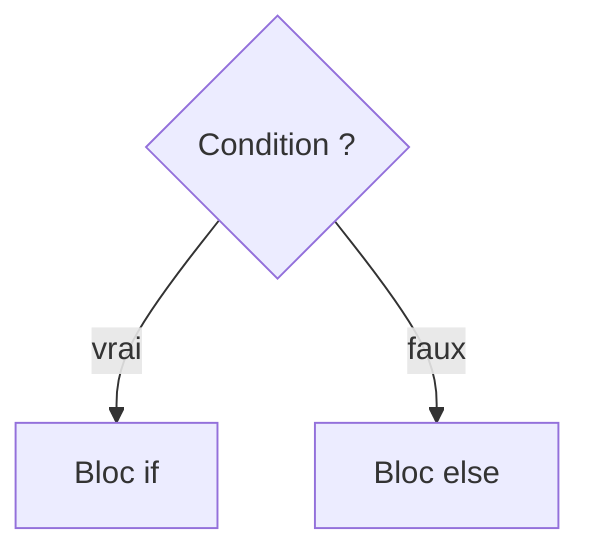

# Condition (if)

> [!info] En une phrase
> Faire une chose seulement si une condition est vraie, et autre chose sinon.

```dataviewjs
await dv.view("10 — Templates/Scripts/learning", { view: "concept" })
```

## 1 · Comprendre
### Définition
`if` teste une expression qui vaut `True` ou `False`. Le bloc indenté dessous ne s'exécute que si elle est vraie. `elif` ajoute un autre cas, `else` le cas par défaut.

### Pourquoi ça existe
Un programme doit réagir à la situation : le fichier existe-t-il ? Est-ce un `.png` ? L'archive est-elle trop grosse ?

### Le problème résolu
Sans condition, un programme ferait toujours exactement la même chose, quel que soit son entrée.

## 2 · Explorer
### Comment ça fonctionne

```mermaid
flowchart TD
  T{Condition ?} -- vrai --> A[Bloc if]
  T -- faux --> B[Bloc else]
```
| Opérateur | Sens |
| --- | --- |
| `==`, `!=` | égal, différent |
| `<`, `>`, `<=`, `>=` | comparaisons |
| `and`, `or`, `not` | combiner |
| `in` | « est dans » : `".png" in nom` |

### Exemple concret
```python
extension = ".png"
taille_mo = 120

if extension == ".png" and taille_mo < 100:
    print("Image à zipper")
elif extension == ".png":
    print("Image trop lourde, ignorée")
else:
    print("Pas une image")
```

> [!abstract]- Comment ça s'écrit (référence à chercher, pas à apprendre par cœur)
> L'idée est la même partout ; seule l'écriture change.
>
> **Python**
> ```python
> if montant > 100:
>     print("grosse")
> elif montant > 20:
>     print("moyenne")
> else:
>     print("petite")
> ```
> Le bloc est défini par l'**indentation**.
>
> **JavaScript / TypeScript**
> ```js
> if (montant > 100) {
>   console.log("grosse");
> } else if (montant > 20) {
>   console.log("moyenne");
> } else {
>   console.log("petite");
> }
> const taille = montant > 100 ? "grosse" : "petite";  // ternaire
> ```
> Accolades et parenthèses obligatoires ; compare avec `===`.
>
> **Bash**
> ```bash
> if [ "$montant" -gt 100 ]; then
>   echo "grosse"
> elif [ "$montant" -gt 20 ]; then
>   echo "moyenne"
> else
>   echo "petite"
> fi
> ```
> Espaces obligatoires dans `[ … ]` ; `-gt`, `-lt`, `-eq` pour les nombres, `=` pour le texte. `if` teste en fait le **code de sortie** d'une commande.

### Cas d'utilisation
- Ne traiter que certains types de fichiers
- Vérifier qu'un dossier existe avant de travailler dedans

> [!warning] À ne pas confondre
> L'indentation fait partie du code : une ligne mal indentée sort du bloc `if` ou provoque `IndentationError`. Et `if x = 3` (erreur) au lieu de `if x == 3`.

## 3 · Pratiquer

### Exercice visuel

Sur Excalidraw, **sans regarder la fiche**. Puis je compare avec la fiche, je corrige en rouge ce qui était faux, et j'explique mon dessin à voix haute ou à Claude dans le chat.

> [!example] 🧠 Dessine de mémoire
> Dessine un aiguillage : une dépense arrive, `if montant > 100`, `elif`, `else`. Montre le chemin de trois dépenses différentes.

> [!example] 🔄 Change de contexte
> Redessine le même tri dans un template Vue avec `v-if`. Où se fait le test cette fois ?

### Mon schéma

> [!tip] Mon dessin Excalidraw
> _Je crée le dessin « Schéma - Condition (if) » et je l'intègre ici avec `![[Schéma - Condition (if).excalidraw]]`, puis je coche `schema`._

### Appliquer dans le fil rouge
- [[Dépenses 02 - Classer les dépenses]]

## 4 · Relier
- **Prérequis** : [[Variables et types]]
- **Complémentaires** : [[Boucle (for, while)]]
- **Utilisé par** : [[Fonction]] · [[Exception]]

## 5 · Réviser
> [!question] Me faire interroger
> Je demande à Claude de m'interroger sur cette notion pour vérifier que je l'ai comprise.

### Validation de la maîtrise
Trois cases à cocher dans les propriétés de la fiche :
- `schema` : mon dessin du concept est dans « Mon schéma » ;
- `exercice_visuel` : j'ai fait et corrigé les exercices visuels de la section 3 ;
- `fil_rouge` : je l'ai appliqué dans le fil rouge (coché tout seul quand une étape qui l'utilise est réussie).

Les trois cochées : la notion compte comme **comprise**. **Maîtrisé** : c'est moi qui le mets dans `status`, quand je le sens.

```dataviewjs
await dv.view("10 — Templates/Scripts/learning", { view: "maitrise" })
```
