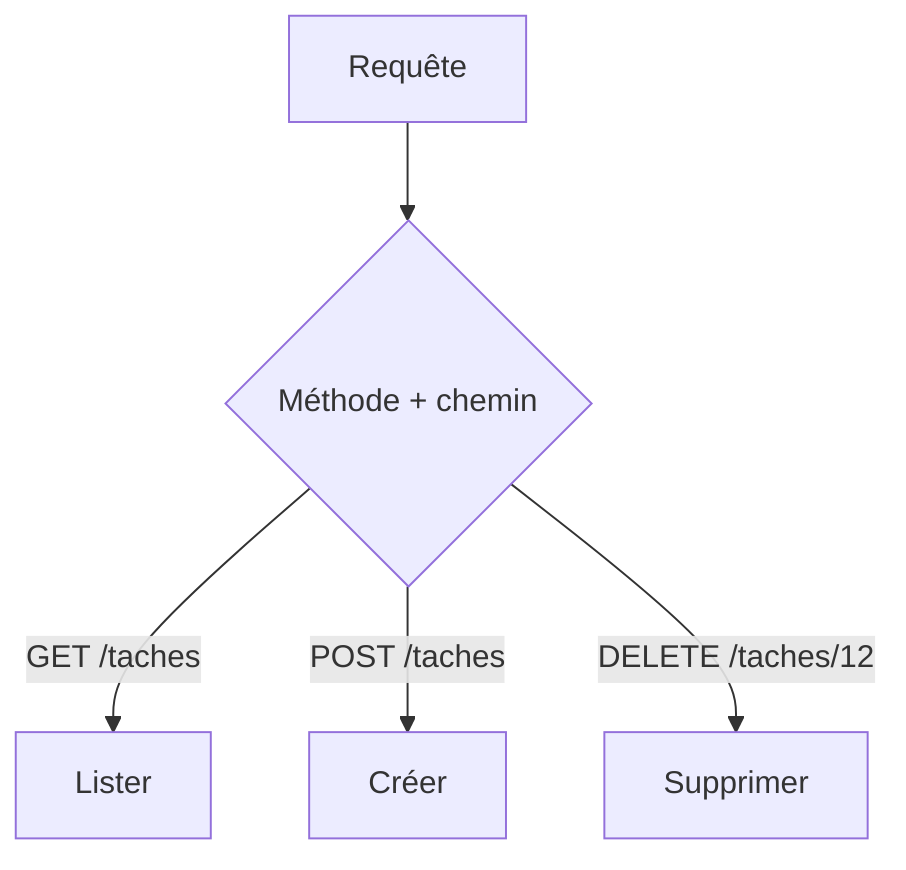

# Endpoint

> [!info] En une phrase
> Un endpoint est une adresse précise d'une API combinée à une méthode HTTP (GET /api/tasks/12) : c'est une opération du contrat.

```dataviewjs
await dv.view("10 — Templates/Scripts/learning", { view: "concept" })
```

## 1 · Comprendre
### Définition
**Endpoint** = **méthode** + **chemin**. `GET /notes` (lister) et `POST /notes` (créer) sont deux endpoints différents sur la même route.
Ce qu'un endpoint peut recevoir :
| Où | Exemple | En Express | En Python (requests) |
| --- | --- | --- | --- |
| Paramètre de chemin | `/taches/12` | `req.params.id` | dans l'URL |
| Paramètre de requête | `/taches?page=2&statut=fini` | `req.query.page` | `params={...}` |
| En-têtes | `Authorization: Bearer …` | `req.headers` | `headers={...}` |
| Corps (JSON) | `{ "nom": "x" }` | `req.body` | `json={...}` |
Chaque endpoint documente aussi ses **réponses** possibles (codes de statut et forme du JSON).

### Pourquoi ça existe
Une API offre beaucoup d'opérations : il faut un nom précis pour chacune.

### Le problème résolu
Savoir exactement quoi appeler, avec quoi, et à quoi s'attendre.

## 2 · Explorer
### Comment ça fonctionne

```mermaid
flowchart TD
R[Requête] --> M{Méthode + chemin}
  M -->|GET /taches| L[Lister]
  M -->|POST /taches| C[Créer]
  M -->|DELETE /taches/12| S[Supprimer]
```

### Exemple concret
```bash
curl "https://jsonplaceholder.typicode.com/todos?userId=1&_limit=2"
curl -X POST https://jsonplaceholder.typicode.com/todos \
     -H "Content-Type: application/json" \
     -d '{"title":"exporter","completed":false}'
```
Dans une API de projets : `GET /api/tasks/{id}/comments` renvoie les commentaires d'une tâche.

### Cas d'utilisation
- Lire la documentation d'une API
- Écrire une route Express

> [!warning] À ne pas confondre
> Le **chemin** (`/taches/12`) et le **paramètre de requête** (`?page=2`) : le chemin identifie une ressource, la requête filtre ou pagine.

## 3 · Pratiquer

### Exercice visuel

Sur Excalidraw, **sans regarder la fiche**. Puis je compare avec la fiche, je corrige en rouge ce qui était faux, et j'explique mon dessin à voix haute ou à Claude dans le chat.

> [!example] 🧠 Dessine de mémoire
> Dessine le contrat de ton API comme une liste d'endpoints (méthode + adresse) et entoure ceux qui ont un paramètre de chemin.

> [!example] 🔄 Change de contexte
> Redessine trois endpoints d'une API publique (par exemple GitHub : dépôts, issues d'un dépôt). Quel paramètre précise la ressource ?

### Mon schéma

> [!tip] Mon dessin Excalidraw
> _Je crée le dessin « Schéma - Endpoint » et je l'intègre ici avec `![[Schéma - Endpoint.excalidraw]]`, puis je coche `schema`._

### Appliquer dans le fil rouge
- Pas encore d'étape du fil rouge pour cette notion : elle sera pratiquée dans le fil rouge de son niveau (voir [[Niveaux]]).

## 4 · Relier
- **Au travail** : [[Endpoint au travail]]
- **Prérequis** : [[API]] · [[Méthode HTTP]]
- **Complémentaires** : [[API REST]] · [[Express]]

## 5 · Réviser
> [!question] Me faire interroger
> Je demande à Claude de m'interroger sur cette notion pour vérifier que je l'ai comprise.

### Validation (compris, puis maîtrisé)
Trois cases à cocher dans les propriétés de la fiche :
- `schema` : mon dessin du concept est dans « Mon schéma » ;
- `exercice_visuel` : j'ai fait et corrigé les exercices visuels de la section 3 ;
- `fil_rouge` : je l'ai appliqué dans le fil rouge (coché tout seul quand une étape qui l'utilise est réussie).

Les trois cochées : la notion compte comme **comprise**. **Maîtrisé** : c'est moi qui le mets dans `status`, quand je le sens.

```dataviewjs
await dv.view("10 — Templates/Scripts/learning", { view: "maitrise" })
```
