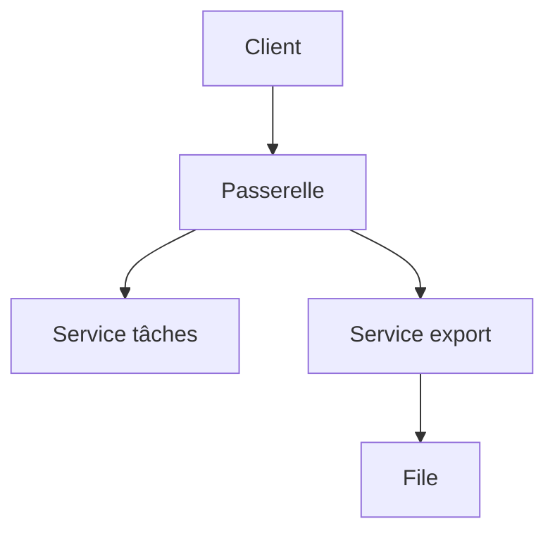

# Monolithe et microservices

> [!info] En une phrase
> Un monolithe est une seule application qui fait tout ; une architecture en microservices découpe en petits services indépendants qui communiquent par le réseau, chacun déployé séparément.

## 1 · Comprendre
### Définition
| | Monolithe | Microservices |
| --- | --- | --- |
| Déploiement | un seul | un par service |
| Communication | appels de fonction | HTTP, messages (file) |
| Base | souvent une seule | une par service |
| Complexité | dans le code | dans l'infrastructure (réseau, supervision, versions) |
| Bon pour | la plupart des projets, petites équipes | grandes organisations, parties à faire évoluer séparément |
Entre les deux : le **monolithe modulaire** (une application, mais des modules bien séparés). Et les **fonctions serverless** (AWS Lambda, Cloud Functions) : de petits traitements déclenchés à la demande.
Beaucoup d'applications réelles sont un **monolithe** entouré de quelques services (frontend, workers, Redis, base, reverse proxy, fonctions serverless).

### Pourquoi ça existe
Quand une application et l'équipe grandissent, tout livrer ensemble devient lent ; mais découper trop tôt coûte cher.

### Le problème résolu
Choisir consciemment : la simplicité du monolithe, ou l'indépendance des services au prix de la complexité.

## 2 · Explorer
### Comment ça fonctionne

```mermaid
flowchart TD
U[Client] --> G[Passerelle]
  G --> S1[Service tâches]
  G --> S2[Service export]
  S2 --> Q[File]
```

### Exemple concret
```yaml
# docker compose : plusieurs services qui se parlent par le réseau
services:
  api:     { image: app/api:1.4, depends_on: [db, redis] }
  worker:  { image: app/api:1.4, command: ["python", "worker.py"] }
  db:      { image: postgres:16 }
  redis:   { image: redis:7 }
  proxy:   { image: traefik:v3 }
```
Une fonction serverless est un service séparé : l'appli l'appelle par HTTP, elle a son propre déploiement et ses propres dépendances.

### Cas d'utilisation
- Décider de découper (ou non) une application
- Fonctions serverless

> [!warning] À ne pas confondre
> Croire que les microservices sont « plus modernes » donc mieux : un mauvais découpage crée un monolithe distribué, avec tous les inconvénients des deux. Commence en monolithe bien organisé.

## 3 · Relier
- **Au travail** : [Monolithe et microservices au travail](obsidian://open?vault=Travail&file=Monolithe%20et%20microservices%20au%20travail)
- **Prérequis** : [[API REST]] · [[Docker Compose]]
- **Complémentaires** : [[Architecture en couches]] · [[Reverse proxy]]
