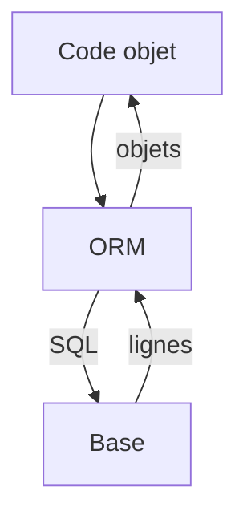

# ORM

> [!info] En une phrase
> Un ORM fait correspondre les tables de la base à des objets ou classes du langage, pour lire et écrire sans écrire tout le SQL à la main.

```dataviewjs
await dv.view("10 — Templates/Scripts/learning", { view: "concept" })
```

## 1 · Comprendre
### Définition
**ORM** (*Object-Relational Mapping*) : tu décris un modèle dans ton langage, l'ORM génère les requêtes SQL.
- Node / TypeScript : **Prisma**, **Drizzle**, **TypeORM**, **Sequelize**.
```ts
// Prisma
const taches = await prisma.tache.findMany({
  where: { projetId: 1, fini: false },
  include: { projet: true },     // jointure
  orderBy: { nom: "asc" },
});
```
Requête produite (à peu près) : `SELECT … FROM tache JOIN projet … WHERE projet_id = 1 AND fini = false ORDER BY nom`.

### Pourquoi ça existe
Écrire et maintenir à la main chaque requête SQL et la conversion ligne ↔ objet est long et source d'erreurs.

### Le problème résolu
Moins de code répétitif, des requêtes paramétrées (protection contre l'[[Injection SQL]]), des types, et les migrations intégrées.

## 2 · Explorer
### Comment ça fonctionne

```mermaid
flowchart TD
C[Code objet] --> O[ORM]
  O -->|SQL| B[Base]
  B -->|lignes| O
  O -->|objets| C
```

### Exemple concret
```python
# Django
class Tache(models.Model):
    projet = models.ForeignKey(Projet, on_delete=models.CASCADE)
    nom = models.CharField(max_length=100)

Tache.objects.filter(projet__nom="Chantier").count()
```
Piège classique : le **problème N+1**. Charger 100 tâches puis, dans une boucle, leur projet un par un, fait 101 requêtes. Solution : demander la jointure (`include`, `select_related`).

> [!abstract]- Comment ça s'écrit (référence à chercher, pas à apprendre par cœur)
> L'idée est la même partout ; seule l'écriture change. Les exemples plus haut sont en Python ou en JavaScript.
>
> **C# (.NET)**
> ```csharp
> public class AppDb : DbContext
> {
>     public AppDb(DbContextOptions<AppDb> options) : base(options) { }
>     public DbSet<Depense> Depenses => Set<Depense>();   // une table
> }
>
> var grosses = await db.Depenses.Where(d => d.Montant > 100).ToListAsync();
> db.Depenses.Add(new Depense("Loyer", 600m));
> await db.SaveChangesAsync();
> ```
> L'ORM de .NET est **Entity Framework Core**. Le `Where` est traduit en SQL. Les migrations : `dotnet ef migrations add Init` puis `dotnet ef database update`.

### Cas d'utilisation
- Le backend d'une application web
- Prototyper vite

> [!warning] À ne pas confondre
> Un ORM ne dispense **pas** de connaître SQL : pour comprendre une lenteur ou écrire une requête complexe, il faut lire le SQL produit (activer le log des requêtes).

## 3 · Pratiquer

### Exercice visuel

Sur Excalidraw, **sans regarder la fiche**. Puis je compare avec la fiche, je corrige en rouge ce qui était faux, et j'explique mon dessin à voix haute ou à Claude dans le chat.

> [!example] 🛣️ Suis le trajet
> Dessine le trajet de `session.add(Depense(...))` dans ton API : l'objet Python, SQLAlchemy, la requête SQL, la ligne dans SQLite.

> [!example] 🔄 Change de contexte
> Redessine-le quand tu passes à PostgreSQL avec `DATABASE_URL`. Qu'est-ce qui change dans ton code, qu'est-ce qui change en dessous ?

### Mon schéma

> [!tip] Mon dessin Excalidraw
> _Je crée le dessin « Schéma - ORM » et je l'intègre ici avec `![[Schéma - ORM.excalidraw]]`, puis je coche `schema`._

### Appliquer dans le fil rouge
- Pas encore d'étape du fil rouge pour cette notion : elle sera pratiquée dans le fil rouge de son niveau (voir [[Niveaux]]).

## 4 · Relier
- **Au travail** : [[ORM au travail]]
- **Prérequis** : [[SQL]] · [[Clé primaire et clé étrangère]]
- **Complémentaires** : [[Migration de base de données]]

## 5 · Réviser
> [!question] Me faire interroger
> Je demande à Claude de m'interroger sur cette notion pour vérifier que je l'ai comprise.

### Validation (compris, puis maîtrisé)
Trois cases à cocher dans les propriétés de la fiche :
- `schema` : mon dessin du concept est dans « Mon schéma » ;
- `exercice_visuel` : j'ai fait et corrigé les exercices visuels de la section 3 ;
- `fil_rouge` : je l'ai appliqué dans le fil rouge (coché tout seul quand une étape qui l'utilise est réussie).

Les trois cochées : la notion compte comme **comprise**. **Maîtrisé** : c'est moi qui le mets dans `status`, quand je le sens.

```dataviewjs
await dv.view("10 — Templates/Scripts/learning", { view: "maitrise" })
```
