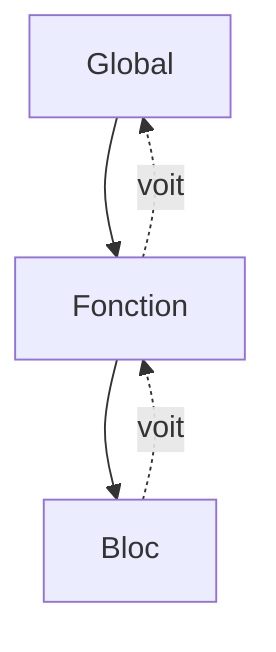

# Portée et closure

> [!info] En une phrase
> Une variable n'existe que dans le bloc où elle est déclarée (portée) ; une fonction se souvient des variables de l'endroit où elle a été créée (closure).

```dataviewjs
await dv.view("10 — Templates/Scripts/learning", { view: "concept" })
```

## 1 · Comprendre
### Définition
- **Portée de bloc** : une variable `let`/`const` déclarée entre `{ }` n'existe que dans ce bloc.
- **Portée de fonction** : les variables d'une fonction sont invisibles à l'extérieur.
- **Closure** (fermeture) : une fonction créée à l'intérieur d'une autre garde l'accès aux variables de celle-ci, même après la fin de la fonction extérieure.
```js
function compteur() {
  let n = 0;                 // privé
  return () => { n += 1; return n; };
}
const suivant = compteur();
suivant(); // 1
suivant(); // 2   ← n a survécu
```

### Pourquoi ça existe
Isoler les variables pour qu'un morceau de code n'écrase pas celles d'un autre, et garder un état privé.

### Le problème résolu
Éviter les variables globales partagées par tout le programme, source de bugs difficiles.

## 2 · Explorer
### Comment ça fonctionne

```mermaid
flowchart TD
G[Global] --> F[Fonction]
  F --> B[Bloc]
  B -.voit.-> F
  F -.voit.-> G
```

### Exemple concret
```js
const tarif = 2;                 // global
function prix(qte) {
  const total = qte * tarif;     // voit tarif
  if (total > 10) {
    const remise = 1;            // n'existe que dans ce if
    return total - remise;
  }
  return total;
}
// console.log(total);  ← ReferenceError : total n'existe pas ici
```

### Cas d'utilisation
- Les gestionnaires d'événements qui utilisent des variables de leur composant
- Les hooks React (`useState` repose sur des closures)
- Fabriquer des fonctions configurées (`creerLogger("zip")`)

> [!warning] À ne pas confondre
> Une closure ne copie pas la valeur : elle garde **la variable**. Si la variable change ensuite, la fonction voit la nouvelle valeur.

## 3 · Pratiquer

### Exercice visuel

Sur Excalidraw, **sans regarder la fiche**. Puis je compare avec la fiche, je corrige en rouge ce qui était faux, et j'explique mon dessin avec mes mots (section 4).

> [!example] 🧠 Dessine de mémoire
> Dessine des boîtes imbriquées : le fichier, une fonction, un bloc `if`. Place chaque variable dans la boîte où elle existe.

> [!example] 🛣️ Suis le trajet
> Dessine une fonction `compteur()` qui renvoie une autre fonction. Suis la variable gardée en mémoire après la fin de `compteur`.

### Mon schéma

> [!tip] Mon dessin Excalidraw
> _Je crée le dessin « Schéma - Portée et closure » et je l'intègre ici avec `![[Schéma - Portée et closure.excalidraw]]`._

### Appliquer dans le fil rouge
- Pas encore d'étape du fil rouge pour cette notion : je l'applique dans mon travail (CVAT, Nuclio) ou je demande une étape à Claude.

## 4 · Expliquer
> [!quote] Mon résumé, avec mes mots
> _J'explique mon schéma avec mes mots, sans regarder la fiche. Si je bloque, je ne l'ai pas encore compris._

## 5 · Relier
- **Prérequis** : [[Fonction fléchée et callback]]
- **Complémentaires** : [[Module JavaScript (import et export)]]
- **Utilisé par** : [[React]]

## 6 · Réviser
> [!question] Me faire interroger
> Je demande à Claude de m'interroger sur cette notion pour vérifier que je l'ai comprise.

### Validation de la maîtrise
La notion est maîtrisée quand je sais :
1. **l'expliquer** de façon fluide, à partir de mon schéma (section 4) ;
2. **l'adapter** à un autre contexte (consigne « Change de contexte », ou Claude m'interroge sur un autre cas) ;
3. **l'appliquer** pour de vrai dans le fil rouge (section 3).

Réussir un exercice ne suffit pas. C'est moi qui passe le statut en `maitrise`.

```dataviewjs
await dv.view("10 — Templates/Scripts/learning", { view: "maitrise" })
```
