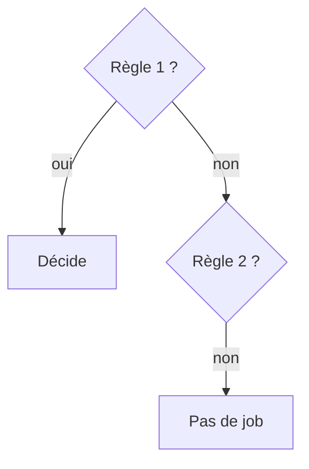

# Règles d'un job GitLab (rules)

> [!info] En une phrase
> La section rules: d'un job décide s'il est lancé, quand (automatique ou manuel) et si son échec bloque la pipeline.

## 1 · Comprendre
### Définition
`rules:` est une liste de conditions lues **dans l'ordre** ; la **première** qui correspond décide. Chaque règle peut dire :
- `if:` une condition sur des variables (`$CI_COMMIT_BRANCH == "main"`) ;
- `changes:` seulement si certains fichiers ont changé ;
- `when:` `on_success` (par défaut), `manual` (bouton ▶), `never` (jamais), `always` ;
- `allow_failure: true` : un échec n'arrête pas la pipeline.

Si **aucune** règle ne correspond, le job n'est **pas ajouté** à la pipeline.

### Pourquoi ça existe
Tous les jobs ne doivent pas tourner tout le temps : publier seulement sur `main`, déployer seulement sur demande, ignorer un job instable.

### Le problème résolu
Des pipelines qui font tout à chaque push (lentes, coûteuses) ou qui publient des images depuis n'importe quelle branche.

## 2 · Explorer
### Comment ça fonctionne

```mermaid
flowchart TD
  R1{Règle 1 ?} -- oui --> D1[Décide]
  R1 -- non --> R2{Règle 2 ?}
  R2 -- non --> N[Pas de job]
```

### Exemple concret
```yaml
publier:
  stage: publish
  script: ./publier.sh
  rules:
    - if: $CI_COMMIT_BRANCH == $CI_DEFAULT_BRANCH   # sur main : automatique
    - if: $CI_COMMIT_TAG                            # sur un tag : automatique
    - when: manual                                  # ailleurs : bouton ▶
      allow_failure: true                           # sans bloquer la pipeline

tests-lents:
  script: pytest tests/lents
  rules:
    - changes: [cvat/**/*]                          # seulement si le code a changé
```
Un job **manuel** sans `allow_failure: true` **bloque** les stages suivants jusqu'au clic.

### Cas d'utilisation
- Construire à chaque push, publier seulement sur `main` ou un tag
- Un job manuel de déploiement

> [!warning] À ne pas confondre
> `when: never` / aucune règle (le job **n'existe pas** dans la pipeline) et `skipped` (le job existe mais n'a pas été lancé). Et l'ancien `only:` / `except:` : même rôle, à ne pas mélanger avec `rules:` dans un même job.

## 3 · Relier
- **Au travail** : [Règles d'un job GitLab (rules) au travail](obsidian://open?vault=Travail&file=R%C3%A8gles%20d%27un%20job%20GitLab%20%28rules%29%20au%20travail)
- **Prérequis** : [[Pipeline GitLab CI]] · [[Variables CI-CD GitLab]] · [[YAML]]
- **Complémentaires** : [[extends GitLab CI]]
