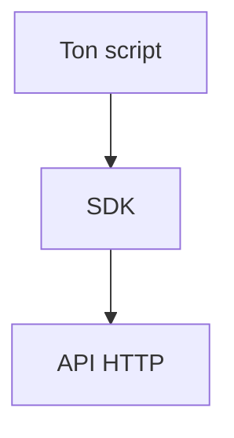

# SDK

> [!info] En une phrase
> Une bibliothèque fournie pour utiliser une API depuis un langage, sans écrire soi-même les requêtes HTTP.

```dataviewjs
await dv.view("10 — Templates/Scripts/learning", { view: "concept" })
```

## 1 · Comprendre
### Définition
Un **SDK** (*Software Development Kit*) emballe les appels à une API dans des fonctions et des objets du langage. Au lieu de construire l'URL, les en-têtes et de décoder le JSON, on appelle `client.tasks.retrieve(12)`. Beaucoup de SDK sont **générés** à partir du fichier [[OpenAPI]].

### Pourquoi ça existe
Gagner du temps et éviter les erreurs (URL, authentification, format) en utilisant une API.

### Le problème résolu
Réécrire dans chaque script la même plomberie HTTP, et la casser quand l'API évolue.

## 2 · Explorer
### Comment ça fonctionne

```mermaid
flowchart TD
  S[Ton script] --> K[SDK]
  K --> A[API HTTP]
```

### Exemple concret
Sans SDK (avec `requests`) :
```python
import requests
r = requests.get("http://localhost:8080/api/tasks/12/annotations", auth=("user", "motdepasse"))
r.raise_for_status()
annotations = r.json()
```
Avec le SDK de CVAT (`pip install cvat-sdk`, même version que le serveur) :
```python
from cvat_sdk import make_client
with make_client("http://localhost:8080", credentials=("user", "motdepasse")) as client:
    tache = client.tasks.retrieve(12)
    annotations = tache.get_annotations()
```

### Cas d'utilisation
- Récupérer les annotations CVAT dans la fonction Nuclio
- Automatiser la création de tâches

> [!warning] À ne pas confondre
> **SDK** (bibliothèque côté client) et **API** (le service côté serveur). La version du SDK doit correspondre à celle du serveur CVAT, sinon des champs manquent ou changent.

## 3 · Pratiquer

### Exercice visuel

Sur Excalidraw, **sans regarder la fiche**. Puis je compare avec la fiche, je corrige en rouge ce qui était faux, et j'explique mon dessin avec mes mots (section 4).

> [!example] ⚖️ Avant / après
> Avant / après : récupérer les labels d'un job CVAT avec requests, puis avec le SDK Python. Dessine ce que le SDK fait à ta place.

> [!example] 🧠 Dessine de mémoire
> Dessine les trois couches : ton script, le SDK, l'API HTTP. Place où vivent l'adresse du serveur et l'authentification.

### Mon schéma

> [!tip] Mon dessin Excalidraw
> _Je crée le dessin « Schéma - SDK » et je l'intègre ici avec `![[Schéma - SDK.excalidraw]]`._

### Appliquer dans le fil rouge
- Pas encore d'étape du fil rouge pour cette notion : je l'applique dans mon travail (CVAT, Nuclio) ou je demande une étape à Claude.

## 4 · Expliquer
> [!quote] Mon résumé, avec mes mots
> _J'explique mon schéma avec mes mots, sans regarder la fiche. Si je bloque, je ne l'ai pas encore compris._

## 5 · Relier
- **Prérequis** : [[API REST]] · [[pip]] · [[Liste et dictionnaire]]
- **Complémentaires** : [[OpenAPI]] · [[JSON]]
- **Complémentaires** : [[Appeler une API HTTP (requests)]] (le même appel, sans SDK)

## 6 · Réviser
> [!question] Me faire interroger
> Je demande à Claude de m'interroger sur cette notion pour vérifier que je l'ai comprise.

### Validation de la maîtrise
La notion est maîtrisée quand je sais :
1. **l'expliquer** de façon fluide, à partir de mon schéma (section 4) ;
2. **l'adapter** à un autre contexte (consigne « Change de contexte », ou Claude m'interroge sur un autre cas) ;
3. **l'appliquer** pour de vrai dans le fil rouge (section 3).

Réussir un exercice ne suffit pas. C'est moi qui passe le statut en `maitrise`.

```dataviewjs
await dv.view("10 — Templates/Scripts/learning", { view: "maitrise" })
```
