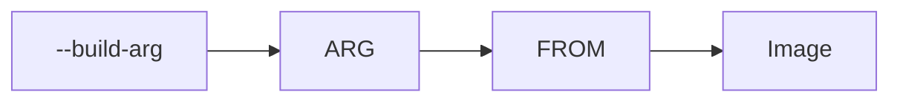

# Variable de build Docker (ARG)

> [!info] En une phrase
> ARG déclare une variable de build : on change sa valeur avec --build-arg, et on peut s'en servir dans le FROM pour choisir l'image de base.

```dataviewjs
await dv.view("10 — Templates/Scripts/learning", { view: "concept" })
```

## 1 · Comprendre
### Définition
`ARG NOM=valeur` déclare dans un [[Dockerfile]] une variable qui n'existe **que pendant la construction**. `docker build --build-arg NOM=autre` change sa valeur.

### Pourquoi ça existe
Construire des variantes d'une même image (autre version, autre registre) sans dupliquer ni modifier le Dockerfile.

### Le problème résolu
On copiait le Dockerfile pour chaque variante, ou on le modifiait à la main avant chaque build : copies divergentes, modifications oubliées.

## 2 · Explorer
### Comment ça fonctionne

```mermaid
flowchart LR
  BA[--build-arg] --> A[ARG]
  A --> FR[FROM] --> I[Image]
```

### Exemple concret
```dockerfile
ARG PYTHON_VERSION=3.11              # le seul cas où une instruction précède FROM
FROM python:${PYTHON_VERSION}-slim
ARG APP_VERSION=dev
RUN echo "Version $APP_VERSION" > /version.txt
```
```bash
docker build --build-arg PYTHON_VERSION=3.12 --build-arg APP_VERSION=1.4.0 -t mon-app .
```

| | `ARG` | `ENV` |
| --- | --- | --- |
| Existe pendant | le build seulement | le build **et** l'exécution |
| Se change avec | `docker build --build-arg` | `docker run -e` |

### Cas d'utilisation
- Choisir une version ou un registre d'image de base au moment du build

> [!warning] À ne pas confondre
> `ARG` (build seulement) et `ENV` (aussi dans le conteneur qui tourne). Et un `ARG` déclaré **avant** `FROM` n'existe plus **après** : il faut le redéclarer.

## 3 · Pratiquer

### Exercice visuel

Sur Excalidraw, **sans regarder la fiche**. Puis je compare avec la fiche, je corrige en rouge ce qui était faux, et j'explique mon dessin à voix haute ou à Claude dans le chat.

> [!example] ⚖️ Avant / après
> Avant / après : un Dockerfile avec l'adresse du registre écrite en dur, puis avec `ARG`. Dessine ce qui change quand tu construis sur deux réseaux différents.

> [!example] 🔍 Trouve l'erreur
> Ce schéma est faux. Corrige-le en rouge et explique l'erreur.
>
> ```mermaid
> flowchart TD
>   A[ARG API_URL] --> B[Build]
>   B --> R[Conteneur lancé]
>   R --> L[Lit ARG]
> ```

### Mon schéma

> [!tip] Mon dessin Excalidraw
> _Je crée le dessin « Schéma - Variable de build Docker (ARG) » et je l'intègre ici avec `![[Schéma - Variable de build Docker (ARG).excalidraw]]`, puis je coche `schema`._

### Appliquer dans le fil rouge
- [[MesDépenses Front 04 - Le front Vue dans Docker]]
- [[MesDépenses 04 - L'API dans Docker]]
- [[Fil rouge 02 - Écrire le Dockerfile]]

## 4 · Relier
- **Au travail** : [Variable de build Docker (ARG) au travail](obsidian://open?vault=Travail&file=Variable%20de%20build%20Docker%20%28ARG%29%20au%20travail)
- **Prérequis** : [[Dockerfile]]
- **Notion parente** : [[Dockerfile]]
- **Utilisé par** : [[Construire une image dans la CI]]
- **Commandes** : [[docker build]]

## 5 · Réviser
> [!question] Me faire interroger
> Je demande à Claude de m'interroger sur cette notion pour vérifier que je l'ai comprise.

### Validation (compris, puis maîtrisé)
Trois cases à cocher dans les propriétés de la fiche :
- `schema` : mon dessin du concept est dans « Mon schéma » ;
- `exercice_visuel` : j'ai fait et corrigé les exercices visuels de la section 3 ;
- `fil_rouge` : je l'ai appliqué dans le fil rouge (coché tout seul quand une étape qui l'utilise est réussie).

Les trois cochées : la notion compte comme **comprise**. **Maîtrisé** : c'est moi qui le mets dans `status`, quand je le sens.

```dataviewjs
await dv.view("10 — Templates/Scripts/learning", { view: "maitrise" })
```
