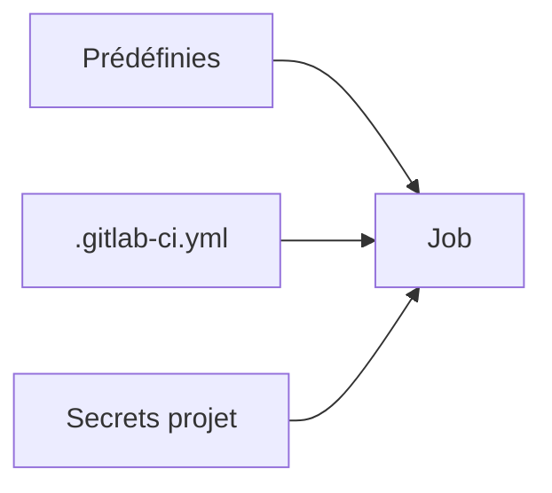

# Variables CI-CD GitLab

> [!info] En une phrase
> Des valeurs que GitLab injecte dans les jobs : certaines sont fournies par GitLab, les secrets se rangent dans les paramètres du projet, jamais dans le .gitlab-ci.yml.

```dataviewjs
await dv.view("10 — Templates/Scripts/learning", { view: "concept" })
```

## 1 · Comprendre
### Définition
Dans un `script:`, une variable se lit comme en shell : `$NOM`. Il y en a trois sortes : **prédéfinies** par GitLab, déclarées dans le fichier (`variables:`), et déclarées dans le projet (*Settings > CI/CD > Variables*).

### Pourquoi ça existe
Donner à la pipeline des informations qui changent (commit, branche) ou secrètes (mots de passe, jetons) sans les écrire dans le code.

### Le problème résolu
Les mots de passe écrits dans le fichier de CI étaient lisibles par tous et restaient pour toujours dans l'historique Git.

## 2 · Explorer
### Comment ça fonctionne

```mermaid
flowchart LR
  GL[Prédéfinies] --> J[Job]
  Y[.gitlab-ci.yml] --> J
  S[Secrets projet] --> J
```

### Exemple concret
| Variable prédéfinie | Contient |
| --- | --- |
| `$CI_COMMIT_SHORT_SHA` | l'identifiant court du commit (pratique comme tag) |
| `$CI_COMMIT_BRANCH` | la branche |
| `$CI_DEFAULT_BRANCH` | la branche par défaut |
| `$CI_PROJECT_DIR` | le dossier du dépôt dans le job |
| `$CI_REGISTRY_IMAGE` | l'adresse de l'image dans le registre GitLab du projet |

| Option d'une variable de projet | Effet |
| --- | --- |
| **Masked** | remplacée par `[MASKED]` dans les logs |
| **Protected** | existe seulement sur les branches et tags protégés |
| **Type File** | la valeur est écrite dans un fichier, la variable contient son chemin |

```yaml
variables:
  IMAGE_NAME: mon-app        # pas secret : dans le fichier
before_script:               # NEXUS_USER et NEXUS_PASSWORD : dans les paramètres du projet
  - echo "$NEXUS_PASSWORD" | docker login -u "$NEXUS_USER" --password-stdin "$NEXUS_URL"
```
La variable spéciale **`DOCKER_AUTH_CONFIG`** permet au runner de récupérer l'`image:` d'un job depuis un registre privé.

### Cas d'utilisation
- Tagger les images avec le commit
- Se connecter à un registre sans exposer le mot de passe
- Projet CVAT : partie 1 (reprendre CVAT sur GitLab, construire ses images en CI via le Nexus)

> [!warning] À ne pas confondre
> **Protected** et **Masked** : une variable protégée est **vide** sur une branche non protégée, d'où un job qui échoue sur ta branche et marche sur `main`.

## 3 · Pratiquer

### Exercice visuel

Sur Excalidraw, **sans regarder la fiche**. Puis je compare avec la fiche, je corrige en rouge ce qui était faux, et j'explique mon dessin à voix haute ou à Claude dans le chat.

> [!example] 🧠 Dessine de mémoire
> Dessine les variables d'un job : celles fournies par GitLab (`CI_COMMIT_SHA`…), celles du projet, les secrets masqués. Montre d'où vient chacune.

> [!example] 🔍 Trouve l'erreur
> Ce schéma est faux. Corrige-le en rouge et explique l'erreur.
>
> ```mermaid
> flowchart TD
>   S[Mot de passe] --> Y[gitlab-ci.yml]
>   Y --> G[Dépôt public]
> ```

### Mon schéma

> [!tip] Mon dessin Excalidraw
> _Je crée le dessin « Schéma - Variables CI-CD GitLab » et je l'intègre ici avec `![[Schéma - Variables CI-CD GitLab.excalidraw]]`, puis je coche `schema`._

### Appliquer dans le fil rouge
- [[MesDépenses 08 - La CI de l'API]]
- [[Fil rouge 05 - Première pipeline, les tests]]

## 4 · Relier
- **Prérequis** : [[Pipeline GitLab CI]]
- **Notion parente** : [[Pipeline GitLab CI]]
- **Complémentaires** : [[Nexus]]
- **Utilisé par** : [[Construire une image dans la CI]] · [[Kaniko]]
- **Commandes** : [[docker login]]

## 5 · Réviser
> [!question] Me faire interroger
> Je demande à Claude de m'interroger sur cette notion pour vérifier que je l'ai comprise.

### Validation de la maîtrise
Trois cases à cocher dans les propriétés de la fiche :
- `schema` : mon dessin du concept est dans « Mon schéma » ;
- `exercice_visuel` : j'ai fait et corrigé les exercices visuels de la section 3 ;
- `fil_rouge` : je l'ai appliqué dans le fil rouge (coché tout seul quand une étape qui l'utilise est réussie).

Les trois cochées : la notion compte comme **comprise**. **Maîtrisé** : c'est moi qui le mets dans `status`, quand je le sens.

```dataviewjs
await dv.view("10 — Templates/Scripts/learning", { view: "maitrise" })
```
