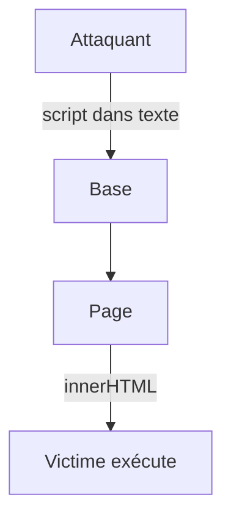

# XSS

> [!info] En une phrase
> Le XSS (cross-site scripting) arrive quand une page affiche comme du HTML un texte fourni par un utilisateur : un script malveillant s'exécute alors chez les autres visiteurs.

```dataviewjs
await dv.view("10 — Templates/Scripts/learning", { view: "concept" })
```

## 1 · Comprendre
### Définition
Un utilisateur nomme sa tâche ``. Si la page l'insère avec `innerHTML`, le code s'exécute **dans le navigateur de chaque personne** qui voit la liste, avec ses droits.
Types : **stocké** (en base, le plus grave), **réfléchi** (dans l'URL), **DOM** (le JS de la page insère un paramètre).
Protections :
- **Échapper** à l'affichage : `textContent` au lieu de `innerHTML` ; React, Vue et Angular échappent par défaut.
- Se méfier de `dangerouslySetInnerHTML` (React), `v-html` (Vue), `[innerHTML]` (Angular) ; si nécessaire, nettoyer avec **DOMPurify**.
- Cookies `HttpOnly` (le script ne peut pas les lire).
- En-tête **Content-Security-Policy** qui interdit les scripts non prévus.

### Pourquoi ça existe
Les pages affichent constamment du contenu venant des utilisateurs (noms, commentaires, labels).

### Le problème résolu
Empêcher qu'un utilisateur exécute du code chez les autres et vole leurs sessions.

## 2 · Explorer
### Comment ça fonctionne

```mermaid
flowchart TD
A[Attaquant] -->|script dans texte| B[Base]
  B --> P[Page]
  P -->|innerHTML| V[Victime exécute]
```

### Exemple concret
```js
// vulnérable
li.innerHTML = tache.nom;
// sûr
li.textContent = tache.nom;
```
```jsx
// React : sûr par défaut
<li>{tache.nom}</li>
```

### Cas d'utilisation
- Tout affichage de contenu saisi
- Revue de code front
- Configuration des en-têtes de sécurité du reverse proxy

> [!warning] À ne pas confondre
> Le **XSS** (script injecté dans la page, exécuté par le navigateur) n'est pas l'[[Injection SQL]] (code injecté dans la requête, exécuté par la base). Même idée : une donnée devenue code.

## 3 · Pratiquer

### Exercice visuel

Sur Excalidraw, **sans regarder la fiche**. Puis je compare avec la fiche, je corrige en rouge ce qui était faux, et j'explique mon dessin à voix haute ou à Claude dans le chat.

> [!example] 🛣️ Suis le trajet
> Dessine une dépense dont le libellé est `<script>…</script>`, enregistrée puis affichée. Montre où le script s'exécute et chez qui.

> [!example] 🔍 Trouve l'erreur
> Ce schéma est faux. Corrige-le en rouge et explique l'erreur.
>
> ```mermaid
> flowchart TD
>   L[Libellé piégé] --> V[v-html]
>   V --> S[Affichage sûr]
> ```

### Mon schéma

> [!tip] Mon dessin Excalidraw
> _Je crée le dessin « Schéma - XSS » et je l'intègre ici avec `![[Schéma - XSS.excalidraw]]`, puis je coche `schema`._

### Appliquer dans le fil rouge
- Pas encore d'étape du fil rouge pour cette notion : elle sera pratiquée dans le fil rouge de son niveau (voir [[Niveaux]]).

## 4 · Relier
- **Prérequis** : [[DOM]] · [[HTML]]
- **Complémentaires** : [[Session et cookie]] · [[CSRF]]

## 5 · Réviser
> [!question] Me faire interroger
> Je demande à Claude de m'interroger sur cette notion pour vérifier que je l'ai comprise.

### Validation (compris, puis maîtrisé)
Trois cases à cocher dans les propriétés de la fiche :
- `schema` : mon dessin du concept est dans « Mon schéma » ;
- `exercice_visuel` : j'ai fait et corrigé les exercices visuels de la section 3 ;
- `fil_rouge` : je l'ai appliqué dans le fil rouge (coché tout seul quand une étape qui l'utilise est réussie).

Les trois cochées : la notion compte comme **comprise**. **Maîtrisé** : c'est moi qui le mets dans `status`, quand je le sens.

```dataviewjs
await dv.view("10 — Templates/Scripts/learning", { view: "maitrise" })
```
