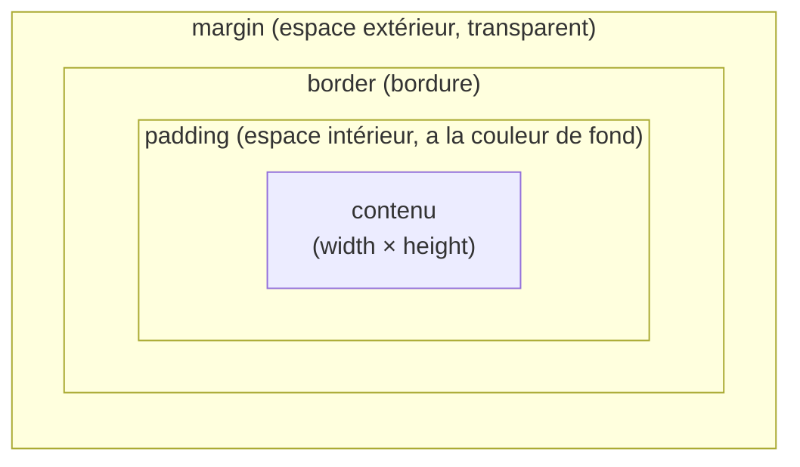

# Box Model CSS

> [!abstract] En bref
> Chaque élément de la page est une **boîte** faite de 4 couches : le contenu, un rembourrage intérieur (`padding`), une bordure (`border`) et un espace extérieur (`margin`). Presque tous les problèmes de taille et d'espacement viennent de là.

## Les 4 couches



Image : un **tableau encadré accroché au mur**. Le contenu est la toile, le `padding` le passe-partout blanc, la `border` le cadre, la `margin` l'espace entre ce tableau et le suivant.

```css
.carte {
  padding: 20px;             /* espace entre le bord et le texte */
  border: 1px solid #1a2232;
  margin-bottom: 16px;       /* espace avec la carte suivante */
}
```

## LA ligne à mettre dans tous tes projets

```css
*, *::before, *::after {
  box-sizing: border-box;
}
```

| | `width: 300px` + `padding: 20px` + `border: 1px` |
|---|---|
| Sans (`content-box`) | largeur réelle = **342 px** 😱 |
| Avec `border-box` | largeur réelle = **300 px** ✅ (le padding est inclus) |

Angular, Vue et Tailwind l'incluent souvent déjà ; vérifie qu'elle est là.

## Écrire les valeurs

```css
padding: 16px;                /* les 4 côtés */
padding: 8px 16px;            /* haut-bas, gauche-droite */
padding: 8px 16px 12px 16px;  /* haut, droite, bas, gauche (sens des aiguilles d'une montre) */
padding-inline: 16px;         /* gauche et droite */
padding-block: 44px;          /* haut et bas */
```

## Espacer des éléments : utilise `gap`

Au lieu de mettre une marge sur chaque élément, dans un conteneur Flex ou Grid :

```css
.grille {
  display: grid;
  grid-template-columns: repeat(3, 1fr);
  gap: 18px;   /* espace entre les cartes, pas sur les bords */
}
```

## Bloc ou en ligne

| Type | Exemples | Comportement |
|---|---|---|
| `block` | `div`, `p`, `h1`, `section` | prend toute la largeur, passe à la ligne |
| `inline` | `span`, `a`, `strong` | reste dans la ligne ; `width` et marges verticales ignorées |
| `inline-block` | | dans la ligne, mais accepte `width` et `padding` |

## Pièges

- **Deux marges verticales qui se touchent fusionnent** : 20 px + 30 px = 30 px, pas 50. `gap` n'a pas ce problème.
- **`width: 100%` + `padding`** sans `border-box` : ça déborde.
- **Déboguer** : F12 → Elements → le schéma coloré en bas du panneau Styles montre chaque couche avec ses dimensions.
