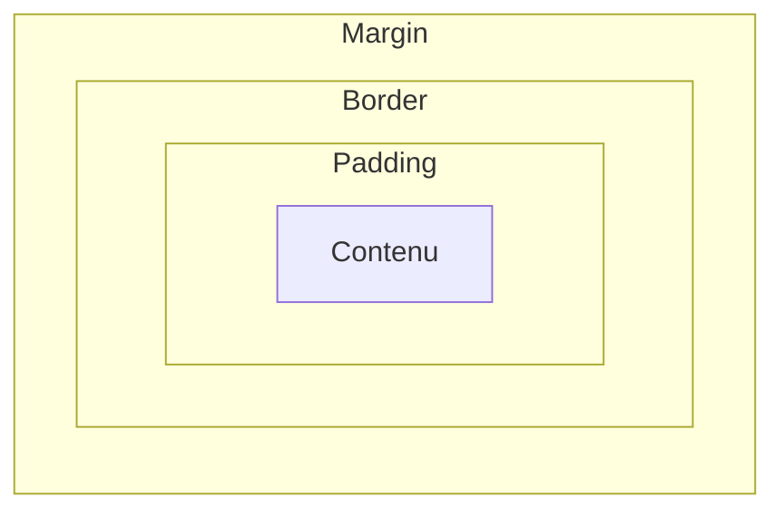

# Box Model CSS

> [!abstract] Introduction
> Chaque élément HTML est une boîte composée de contenu, padding, border et margin ; comprendre ce modèle est la clé de toute mise en page.

> [!warning]- Prérequis
> [[CSS-01-Selecteurs-Cascade-Specificite|Sélecteurs Cascade et Spécificité CSS]]

---

## Théorie

> [!question]- C'est quoi ?
> ```css
> *, *::before, *::after { box-sizing: border-box; }
> .carte { width: 300px; padding: 16px; border: 1px solid #ddd; margin: 0 auto 24px; }
> ```

> [!example]- Analogie
> Un tableau encadré : la toile (contenu), le passe-partout (padding), le cadre (border), et l'espace sur le mur entre deux tableaux (margin).

> [!question]- Pourquoi l'utiliser ?
> Sans comprendre le box model, les tailles « ne tombent jamais juste » (débordements, éléments qui passent à la ligne).

> [!question]- Comment ça marche ?
> - `content-box` (défaut) : `width` = contenu seul → largeur réelle = width + padding + border
> - `border-box` : `width` inclut padding et border → **à mettre partout**
> - Les marges verticales entre blocs **fusionnent** (margin collapse)
> - `display` : `block`, `inline`, `inline-block`, `flex`, `grid`, `none`
> - Unités : `px`, `rem` (relatif à la police racine), `%`, `vw/vh`, `dvh`, `ch`

> [!question]- Quand l'utiliser ?
> À chaque composant. Utiliser `rem` pour les tailles de texte et espacements (respect du zoom utilisateur).

> [!danger]- Quand NE PAS l'utiliser / Limites
> Le margin collapse surprend : il n'existe pas dans un conteneur flex/grid. Utiliser `gap` plutôt que des marges entre enfants.

### Schéma



---

## Vocabulaire

| Terme | Définition en une ligne |
|-------|--------------------------|
| Padding | Espace intérieur entre contenu et bordure |
| Margin | Espace extérieur autour de la boîte |
| border-box | La largeur inclut padding et bordure |
| rem | Unité relative à la taille de police racine |

---

## Points clés

- `box-sizing: border-box` globalement
- `gap` pour espacer les enfants d'un flex/grid
- `rem` pour l'accessibilité (zoom)
- Onglet « Computed » des DevTools pour visualiser la boîte

---

## Pièges courants

> [!bug]- Erreurs fréquentes
> - Oublier `border-box` et avoir des débordements de 2px
> - Utiliser `height` fixe sur du contenu dynamique → texte qui déborde
> - `100vh` sur mobile (barre d'adresse) → préférer `100dvh`

---

## Exemple minimal

```css
:root { font-size: 100%; }
.stack > * + * { margin-top: 1rem; }   /* « owl selector » : espace entre éléments frères */
```

> [!note] Ce que j'en retiens
> Espacer par le parent (gap, owl selector) plutôt que chaque enfant évite les marges parasites en début/fin.

---

## Pour aller plus loin (niveau senior)

> [!tip]- Ce qui distingue un dev expérimenté
> - Maîtriser les propriétés logiques (`margin-inline`, `padding-block`) pour le RTL
> - Utiliser `clamp()` pour des tailles fluides

---

## Connexions

**Arbre théorique :**
- Sujet parent → [[HTML-CSS]]
- Sous-sujets → [[CSS-03-Flexbox|Flexbox CSS]], [[CSS-04-Grid|Grid CSS]]
- À comparer avec → (—)

**Pratique :**
- Extrait de code → [[04_Snippets/css-02-box-model]]
- Projet → [[02_Projects/CinéTrack]]

---

## Auto-vérification

> [!check]- Est-ce que je maîtrise vraiment ?
> - Quelle est la largeur réelle d'une boîte `width:200px; padding:10px; border:1px` en content-box ?

---

## Tâches

- [ ] #task Inspecter 5 éléments d'un site connu avec l'onglet Computed
- [ ] #task Mettre à jour `status` une fois maîtrisé

---

## Notes brutes

- ?
