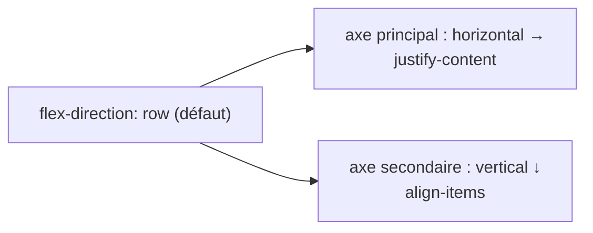

# Flexbox CSS

> [!abstract] En bref
> Flexbox aligne des éléments **sur une seule ligne ou une seule colonne** et répartit l'espace entre eux. C'est l'outil n°1 pour une barre de navigation, une rangée de boutons, ou centrer quelque chose.

## Le principe

On active Flexbox sur le **parent**, et ce sont ses **enfants directs** qui s'alignent :

```css
.barre {
  display: flex;
  justify-content: space-between;  /* répartition sur l'axe principal */
  align-items: center;             /* alignement sur l'autre axe */
  gap: 16px;                       /* espace entre les enfants */
}
```

```html
<header class="barre">
  <a class="logo">TN</a>
  <nav>…</nav>
  <button>Contact</button>
</header>
```

Résultat : logo à gauche, bouton à droite, nav au milieu, tout centré verticalement.

## Les 2 axes



Avec `flex-direction: column`, les axes s'inversent : `justify-content` agit à la verticale.

## Aide-mémoire

**Sur le parent**

| Propriété | Valeurs utiles |
|---|---|
| `flex-direction` | `row` (en ligne), `column` (en colonne) |
| `justify-content` | `flex-start`, `center`, `space-between`, `flex-end` |
| `align-items` | `stretch` (défaut), `center`, `flex-start`, `flex-end` |
| `flex-wrap` | `wrap` : passe à la ligne s'il n'y a plus de place |
| `gap` | espace entre les enfants |

**Sur un enfant**

| Propriété | Effet |
|---|---|
| `flex: 1` | prend toute la place restante |
| `flex-shrink: 0` | refuse de rétrécir (une icône, un logo) |
| `margin-left: auto` | se pousse tout à droite |
| `align-self: center` | s'aligne autrement que les autres |

## Les recettes

```css
/* Centrer parfaitement */
.centre { display: flex; justify-content: center; align-items: center; }

/* Des tags qui passent à la ligne */
.tags { display: flex; flex-wrap: wrap; gap: 6px; }

/* Un champ qui prend la place, un bouton à côté */
.recherche { display: flex; gap: 8px; }
.recherche input { flex: 1; }

/* Le pied d'une carte toujours en bas */
.carte { display: flex; flex-direction: column; }
.carte .pied { margin-top: auto; }
```

## Flexbox ou Grid ?

- **Une dimension** (une ligne OU une colonne) → Flexbox.
- **Deux dimensions** (lignes ET colonnes : grille de cartes, mise en page) → [[CSS-04-Grid|Grid]].

Jeu pour s'entraîner : [Flexbox Froggy](https://flexboxfroggy.com/#fr).

## Pièges

- **`display: flex` sur l'enfant** au lieu du parent.
- **Un texte long qui déborde** d'un élément flex : ajoute `min-width: 0` sur cet élément.
