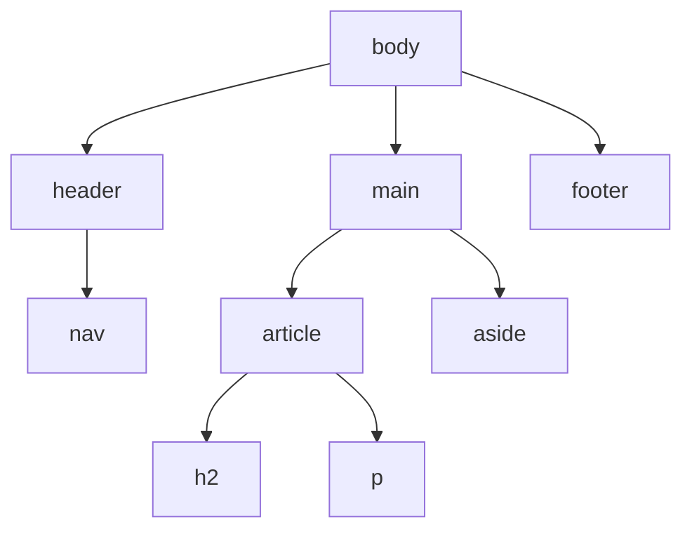

# Structure HTML et Sémantique

> [!abstract] Introduction
> HTML décrit la STRUCTURE et le SENS du contenu d'une page ; utiliser la bonne balise (sémantique) rend la page accessible, bien référencée et plus facile à styliser.

---

## Théorie

> [!question]- C'est quoi ?
> ```html
> <!doctype html>
> <html lang="fr">
> <head>
>   <meta charset="utf-8">
>   <meta name="viewport" content="width=device-width, initial-scale=1">
>   <title>CinéTrack</title>
> </head>
> <body>
>   <header><nav><a href="/">Accueil</a></nav></header>
>   <main>
>     <h1>Mes films</h1>
>     <article><h2>Inception</h2><p>Un voleur qui s'infiltre dans les rêves.</p></article>
>   </main>
>   <footer>© 2026</footer>
> </body>
> </html>
> ```

> [!example]- Analogie
> Le HTML sémantique, c'est un livre bien structuré (titre, chapitres, paragraphes, notes) ; le HTML à base de `<div>` partout, c'est le même texte sans aucune mise en forme : lisible par un humain qui voit, illisible pour une machine ou un lecteur d'écran.

> [!question]- Pourquoi l'utiliser ?
> - Accessibilité : les lecteurs d'écran naviguent par titres, landmarks (`main`, `nav`), boutons
> - SEO : les moteurs comprennent la hiérarchie
> - Comportements gratuits : un `<button>` est focusable et activable au clavier, un `<a>` est un vrai lien

> [!question]- Comment ça marche ?
> Balises structurelles : `header`, `nav`, `main` (une seule), `section`, `article`, `aside`, `footer`.
> Contenu : `h1`…`h6` (hiérarchie sans saut), `p`, `ul/ol/li`, `a`, `img` (+ `alt`), `button`, `figure/figcaption`, `table` (données tabulaires uniquement).
> Bloc vs en ligne : `div`/`p`/`section` prennent toute la largeur ; `span`/`a`/`strong` s'insèrent dans le texte.

> [!question]- Quand l'utiliser ?
> Toujours, y compris dans les templates Angular et Vue : un composant produit du HTML, il doit être sémantique.

> [!danger]- Quand NE PAS l'utiliser / Limites
> Le HTML ne gère ni l'apparence (CSS) ni le comportement (JS). `<div>` et `<span>` restent légitimes quand aucune balise n'a de sens particulier.

### Schéma



---

## Vocabulaire

| Terme | Définition en une ligne |
|-------|--------------------------|
| Sémantique | Balise choisie pour son SENS, pas son apparence |
| Landmark | Zone repérable (header, nav, main, footer) |
| Attribut | Information supplémentaire sur une balise (`href`, `alt`) |
| Élément vide | Balise sans contenu (`img`, `input`, `br`) |

---

## Points clés

- Un seul `h1` par page, hiérarchie des titres sans saut
- `button` pour une action, `a` pour une navigation
- `alt` obligatoire sur les images (`alt=""` si décorative)
- `lang="fr"` sur `<html>`, `meta viewport` pour le mobile

---

## Pièges courants

> [!bug]- Erreurs fréquentes
> - `<div (click)>` au lieu de `<button>` → inaccessible au clavier
> - Choisir `h3` parce qu'il est « plus petit » (c'est le rôle du CSS)
> - Utiliser `<table>` pour la mise en page
> - Oublier `type="button"` sur un bouton dans un formulaire (il soumet par défaut)

---

## Exemple minimal

```html
<article class="film-card">
  
  <h2>Inception</h2>
  <p><time datetime="2010-07-16">2010</time> · Science-fiction</p>
  <button type="button" aria-pressed="false">Ajouter aux favoris</button>
</article>
```

> [!note] Ce que j'en retiens
> Chaque balise dit ce qu'est le contenu : image décrite, date lisible par machine, vrai bouton.

---

## Pour aller plus loin (niveau senior)

> [!tip]- Ce qui distingue un dev expérimenté
> - Valider le HTML (validator.w3.org) et auditer avec Lighthouse/axe
> - Connaître les microdonnées / JSON-LD pour le SEO
> - Utiliser `<dialog>`, `<details>`, `popover` natifs avant d'installer une lib

---

## Connexions

**Arbre théorique :**
- Sujet parent → [[HTML-CSS]]
- Sous-sujets → [[HTML-02-Formulaires|Formulaires HTML]], [[HTML-03-Accessibilite-Web|Accessibilité Web]]
- À comparer avec → [[ANG-16-i18n-Accessibilite|Internationalisation & Accessibilité Angular]]

**Pratique :**
- Extrait de code → [[04_Snippets/html-01-structure-semantique]]
- Projet → [[02_Projects/CinéTrack]]

---

## Auto-vérification

> [!check]- Est-ce que je maîtrise vraiment ?
> - Pourquoi `<button>` est-il meilleur qu'un `<div>` cliquable ?

> [!faq]- Questions d'entretien
> - Qu'est-ce que le HTML sémantique et pourquoi est-ce important ?

---

## Tâches

- [ ] #task Construire la page d'accueil de ton portfolio en HTML sémantique pur
- [ ] #task Passer la page dans Lighthouse (onglet Accessibilité)
- [ ] #task Mettre à jour `status` une fois maîtrisé

---

## Notes brutes

- ?
