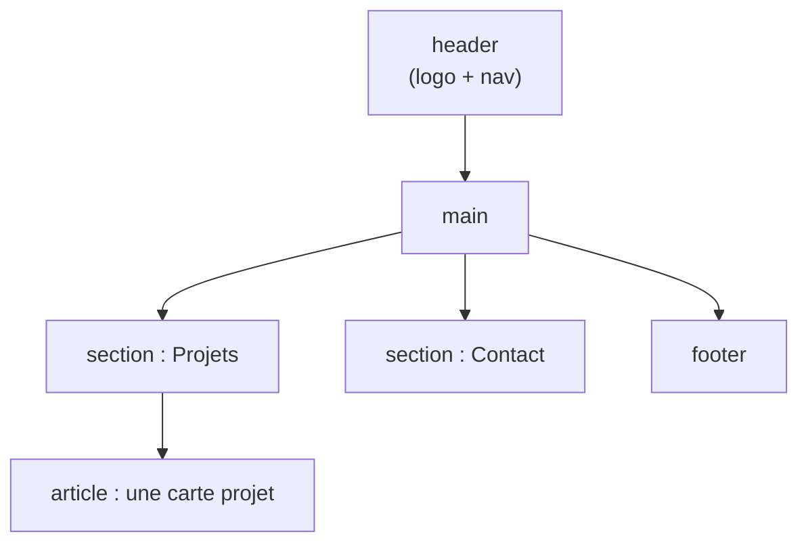

# Structure HTML et Sémantique

> [!abstract] En bref
> HTML décrit **ce qu'est** chaque morceau de la page : un titre, un menu, un article, un bouton. Choisir la balise qui a le bon **sens** (on dit « sémantique ») rend la page lisible par les lecteurs d'écran, par Google, et plus facile à styliser. Même si l'IA écrit ton HTML, tu dois savoir le relire et le corriger.

## Le squelette d'une page

```html
<!doctype html>
<html lang="fr">
<head>
  <meta charset="utf-8">
  <meta name="viewport" content="width=device-width, initial-scale=1">
  <title>Mon portfolio</title>
</head>
<body>
  <header>   <!-- en-tête : logo, menu -->
    <nav>…</nav>
  </header>
  <main>     <!-- le contenu principal, un seul par page -->
    <section>…</section>
  </main>
  <footer>…</footer>  <!-- pied de page -->
</body>
</html>
```

Le détail du `<head>` : [[HTML-06-Head-Meta-Scripts|Head, meta et scripts]].

## Les zones de la page



| Balise | Pour |
|---|---|
| `<header>` | en-tête de la page (ou d'un article) |
| `<nav>` | un menu de navigation |
| `<main>` | le contenu principal (un seul) |
| `<section>` | une partie avec un titre (« Projets », « Contact ») |
| `<article>` | un contenu autonome : une carte projet, un post |
| `<aside>` | contenu annexe : barre latérale |
| `<footer>` | pied de page |

## Les titres : une vraie hiérarchie

Un seul `<h1>` par page (le sujet principal), puis `<h2>` pour les sections, `<h3>` à l'intérieur… **sans sauter de niveau**. On choisit le niveau pour le **sens**, pas pour la taille : la taille se règle en CSS.

## `<div>` ou balise sémantique ?

```html
<!-- ❌ que des div : personne ne comprend la structure -->
<div class="header"><div class="menu">…</div></div>
<div class="bouton" onclick="…">Envoyer</div>

<!-- ✅ -->
<header><nav>…</nav></header>
<button type="button">Envoyer</button>
```

**Règle :** utilise la balise qui a du sens. `<div>` (bloc) et `<span>` (dans une ligne) ne servent qu'à regrouper pour le style, quand aucune autre balise ne convient.

Le cas le plus important : **un élément cliquable est un `<button>` (action) ou un `<a>` (navigation vers une autre page)**, jamais un `<div>`. Un `<button>` fonctionne au clavier et avec les lecteurs d'écran, un `<div>` non.

## Pièges

- **Plusieurs `<h1>`** ou des niveaux sautés (`h2` puis `h4`).
- **Oublier `lang="fr"`** sur `<html>` : les lecteurs d'écran prononcent mal.
- **Un `<a>` sans `href`** utilisé comme bouton : utilise `<button>`.

La liste complète des balises : [[HTML-04-Aide-Memoire-Balises|Aide-mémoire des balises]].
