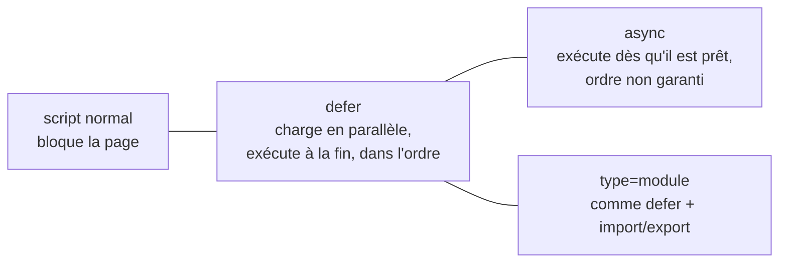

# Head Meta et Chargement des Scripts

> [!abstract] En bref
> Le `<head>` contient tout ce qui ne s'affiche pas mais compte : l'encodage, l'adaptation au mobile, le titre de l'onglet, la description pour Google, l'aperçu quand on partage le lien, l'icône. C'est aussi là qu'on charge les scripts. Pour le Portfolio, c'est ce qui fait un bon aperçu sur LinkedIn.

## Le `<head>` d'un site vitrine

```html
<head>
  <meta charset="utf-8">                                                  <!-- accents OK -->
  <meta name="viewport" content="width=device-width, initial-scale=1">  <!-- adapté au mobile -->

  <title>Ton Nom — Développeur full stack TypeScript</title>           <!-- onglet + Google -->
  <meta name="description" content="Applications web sécurisées et performantes avec Angular, Vue et NestJS.">

  <!-- Aperçu quand on partage le lien (LinkedIn, Slack, WhatsApp…) -->
  <meta property="og:title" content="Ton Nom — Développeur full stack">
  <meta property="og:description" content="Mes projets et études de cas.">
  <meta property="og:image" content="https://ton-site.fr/apercu.png">  <!-- 1200 × 630 px -->
  <meta property="og:url" content="https://ton-site.fr">

  <link rel="icon" href="/favicon.svg" type="image/svg+xml">              <!-- icône d'onglet -->
  <link rel="stylesheet" href="/styles.css">
  <script type="module" src="/main.js"></script>
</head>
```

| Balise | Oubliée, ça donne… |
|---|---|
| `charset` | des accents cassés (`é`) |
| `viewport` | un site minuscule sur mobile |
| `title` + `description` | un mauvais référencement |
| `og:*` | un lien partagé sans image ni texte |

Avec Vue Router ou Angular, on change le `title` à chaque page (champ `title` des routes Angular, `document.title` ou `useHead` en Vue).

## Charger un script



| Écriture | Quand |
|---|---|
| `<script src>` dans le `<head>` | **à éviter** : la page attend le script |
| `<script defer src>` | ton code qui touche la page |
| `<script async src>` | un script indépendant (statistiques) |
| `<script type="module" src>` | code moderne avec `import` (ce que génère Vite) |

Angular CLI et Vite écrivent ces balises pour toi : tu dois surtout savoir les lire.

## Pièges

- **Même `title` sur toutes les pages** : Google et l'historique du navigateur s'y perdent.
- **Image `og:image` en chemin relatif** (`/apercu.png`) : il faut l'URL complète.
- **Script sans `defer` dans le `<head>`** qui cherche un élément : il n'existe pas encore → `null`.
