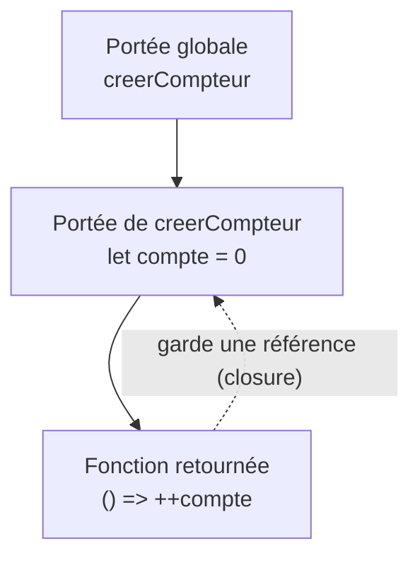

# Fonctions Scope et Closures JavaScript

> [!abstract] Introduction
> En JavaScript les fonctions sont des valeurs comme les autres ; une closure est une fonction qui « se souvient » des variables de l'endroit où elle a été créée — la base des callbacks, des hooks Vue et de RxJS.

> [!warning]- Prérequis
> [[JS-01-Fondamentaux|Fondamentaux JavaScript]]

---

## Théorie

> [!question]- C'est quoi ?
> Trois façons de créer une fonction :
> ```javascript
> function additionner(a, b) { return a + b; }          // déclaration (hoistée)
> const multiplier = function (a, b) { return a * b; }; // expression
> const diviser = (a, b) => a / b;                       // fléchée (arrow)
> ```
> Une **closure** = une fonction + l'environnement (les variables) dans lequel elle a été créée.

> [!example]- Analogie
> Une closure, c'est un sac à dos : quand une fonction quitte l'endroit où elle est née, elle emporte avec elle les variables dont elle a besoin, et peut les réutiliser plus tard.

> [!question]- Pourquoi l'utiliser ?
> - Les fonctions « de première classe » permettent de passer du comportement en paramètre (callbacks, `map`, `filter`, gestionnaires d'événements).
> - Les closures permettent d'encapsuler un état privé sans classe (c'est exactement ce que font les composables Vue `useXxx()`).

> [!question]- Comment ça marche ?
> **Portée lexicale** : une fonction voit les variables de l'endroit où elle est ÉCRITE, pas de l'endroit où elle est appelée.
> ```javascript
> function creerCompteur() {
>   let compte = 0;                 // variable privée
>   return () => ++compte;          // la fonction fléchée « capture » compte
> }
> const suivant = creerCompteur();
> suivant(); // 1
> suivant(); // 2  → compte survit entre les appels
> ```
> **Paramètres** : valeurs par défaut `(a = 1)`, rest `(...args)`, déstructuration `({ titre, annee })`.
> **Fonctions d'ordre supérieur** : qui prennent ou renvoient une fonction (`map`, `debounce`, `creerCompteur`).

> [!question]- Quand l'utiliser ?
> - Fléchées : callbacks courts, méthodes de tableau, quand on veut garder le `this` extérieur.
> - Déclarations `function` : fonctions utilitaires nommées de haut niveau.
> - Closures : état privé, factories, mémoïsation, debounce/throttle.

> [!danger]- Quand NE PAS l'utiliser / Limites
> Une closure garde en vie toutes les variables capturées : capturer un gros objet dans un callback jamais détruit (listener, setInterval) = fuite mémoire.

### Schéma



---

## Vocabulaire

| Terme | Définition en une ligne |
|-------|--------------------------|
| Fonction de première classe | Fonction manipulable comme une valeur |
| Callback | Fonction passée en paramètre, appelée plus tard |
| Closure | Fonction qui garde l'accès à sa portée de création |
| Portée lexicale | La portée dépend de l'endroit où le code est écrit |
| Fonction pure | Même entrée → même sortie, sans effet de bord |

---

## Points clés

- Les fonctions sont des valeurs : on peut les stocker, passer, retourner
- Portée lexicale : ce qui compte est l'endroit d'écriture
- Une closure capture des variables (pas des copies de valeurs)
- Les fléchées n'ont pas leur propre `this` ni `arguments`

---

## Pièges courants

> [!bug]- Erreurs fréquentes
> - Utiliser une fonction fléchée comme méthode d'objet qui a besoin de `this`
> - Créer des closures dans une boucle `var` → toutes partagent la même variable
> - Oublier de retirer un listener → la closure et tout ce qu'elle capture restent en mémoire

---

## Exemple minimal

```javascript
function debounce(fn, delai) {
  let timer;                          // capturé par la closure
  return (...args) => {
    clearTimeout(timer);
    timer = setTimeout(() => fn(...args), delai);
  };
}
const rechercher = debounce((texte) => console.log("API:", texte), 300);
rechercher("inc"); rechercher("ince"); rechercher("incep"); // 1 seul appel : "incep"
```

> [!note] Ce que j'en retiens
> `debounce` est une closure classique : `timer` survit entre les appels. C'est exactement ce que fait `debounceTime` en RxJS.

---

## Pour aller plus loin (niveau senior)

> [!tip]- Ce qui distingue un dev expérimenté
> - Savoir implémenter `debounce`, `throttle`, `memoize`, `once` de tête
> - Comprendre la curryfication et la composition de fonctions
> - Identifier les fuites mémoire dues aux closures avec l'onglet Memory des DevTools

---

## Connexions

**Arbre théorique :**
- Sujet parent → [[JavaScript]]
- Sous-sujets → [[JS-04-this-Prototypes-Classes|this et Prototypes JavaScript]]
- À comparer avec → [[TS-04-Fonctions|Fonctions Typées]], [[PY-04-Fonctions|Fonctions Python]]

**Pratique :**
- Extrait de code → [[04_Snippets/js-03-fonctions-scope-closures]]
- Projet → [[02_Projects/CinéTrack]]

---

## Auto-vérification

> [!check]- Est-ce que je maîtrise vraiment ?
> - Pourquoi `compte` n'est-il pas remis à 0 à chaque appel de `suivant()` ?
> - Qu'est-ce qu'une portée lexicale ?

> [!faq]- Questions d'entretien
> - Qu'est-ce qu'une closure ? Donnez un cas d'usage réel.
> - Différences entre fonction fléchée et fonction classique ?

---

## Tâches

- [ ] #task Coder `debounce` et `throttle` sans regarder
- [ ] #task Réécrire un compteur avec closure puis avec classe, comparer
- [ ] #task Mettre à jour `status` une fois maîtrisé

---

## Notes brutes

- ?
