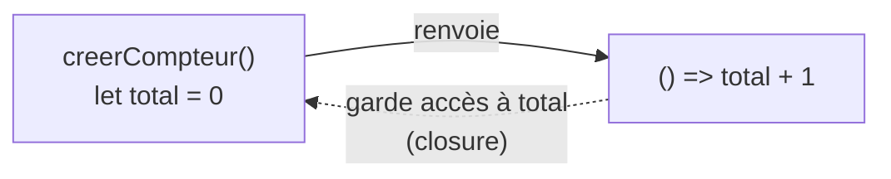

# Fonctions Scope et Closures JavaScript

> [!abstract] En bref
> En JavaScript, une fonction est **une valeur** : on peut la ranger dans une variable, la passer à une autre fonction ou la renvoyer. Une **closure**, c'est une fonction qui se souvient des variables de l'endroit où elle a été créée. Les deux idées sont partout : événements, `map`, composables Vue, RxJS.

## 1. Une fonction est une valeur

Une fonction, c'est une **recette** écrite sur une fiche. On peut ranger la fiche dans une boîte (une variable), comme un nombre :

```js
function doubler(n) { return n * 2; }          // déclaration classique
const doubler = function (n) { return n * 2; }; // même chose, rangée dans une variable
const doubler = (n) => n * 2;                   // même chose, en fonction fléchée
```

### Avec ou sans parenthèses : LA clé

```js
doubler      // la recette elle-même (la fonction), rien n'est exécuté
doubler(5)   // on suit la recette → 10
```

C'est ce qui permet de **donner une fonction à une autre** :

```js
[1, 2, 3].map(doubler);                        // [2, 4, 6]
bouton.addEventListener('click', ouvrirMenu);  // ✅ on donne la recette, exécutée au clic
bouton.addEventListener('click', ouvrirMenu()); // ❌ exécutée TOUT DE SUITE
```

Une fonction passée à une autre s'appelle un **callback** (« rappelle-moi plus tard »).

## 2. La portée (scope)

Une variable n'existe que dans le bloc `{ }` où elle est déclarée. Une fonction voit les variables **autour de l'endroit où elle est écrite**.

```js
const prenom = 'Awa';
function saluer() {
  console.log(prenom);   // ✅ voit prenom, déclarée autour
  const message = 'Hi';
}
console.log(message);    // ❌ message n'existe que dans saluer
```

## 3. La closure

Image : chaque fonction part avec un **sac à dos** qui contient les variables présentes autour d'elle au moment de sa création. Elle le garde toute sa vie.

```js
function creerCompteur() {
  let total = 0;
  return () => {          // on renvoie une fonction
    total = total + 1;    // elle garde accès à total
    return total;
  };
}

const compteur = creerCompteur();  // creerCompteur a fini de s'exécuter…
compteur();  // 1
compteur();  // 2  … mais total existe encore, dans le sac à dos
```

- Chaque appel à `creerCompteur()` crée un **nouveau** `total` : deux compteurs sont indépendants.
- C'est un **lien vivant**, pas une copie : la fonction lit toujours la valeur actuelle.



## Où tu t'en sers

- **Les écouteurs d'événements** : la fonction du `click` se souvient des variables autour d'elle quand le clic arrive, bien plus tard.
- **Les composables Vue** : `useCompteur()` est exactement `creerCompteur()` avec un `ref`.
- **Une variable privée** : impossible de modifier `total` depuis l'extérieur, seulement via la fonction.
- **Un `debounce`** (attendre que l'utilisateur ait fini de taper avant de chercher) :

```js
function debounce(fn, delai) {
  let timer;                              // gardé dans le sac à dos
  return (...args) => {
    clearTimeout(timer);                  // annule l'appel précédent
    timer = setTimeout(() => fn(...args), delai);
  };
}
const rechercher = debounce((texte) => console.log('API :', texte), 300);
rechercher('inc'); rechercher('ince'); rechercher('incep');  // 1 seul appel : 'incep'
```

C'est ce que fait `debounceTime` en RxJS : voir [[ANG-08-RxJS|RxJS]].

## Pièges

- **`var` dans une boucle** : toutes les fonctions partagent le même `i`.
  ```js
  for (var i = 1; i <= 3; i++) setTimeout(() => console.log(i));  // 4, 4, 4
  for (let i = 1; i <= 3; i++) setTimeout(() => console.log(i));  // 1, 2, 3
  ```
- **Un écouteur jamais retiré** garde en mémoire tout ce que contient son sac à dos (fuite mémoire).

> [!check] Tu as compris si…
> ```js
> const a = creerCompteur();
> const b = creerCompteur();
> a(); a();
> b();   // ?
> ```
> Réponse : `1`, car `b` a son propre `total`.
