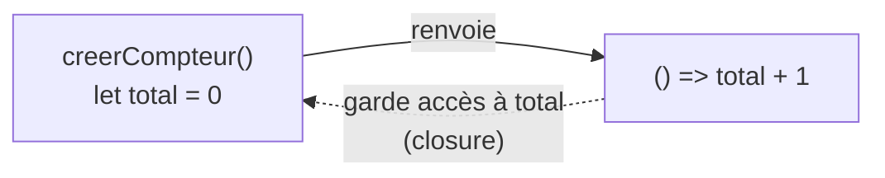

# Fonctions Scope et Closures JavaScript

> [!abstract] En bref
> En JavaScript, une fonction est **une valeur** : on peut la ranger dans une variable, la passer à une autre fonction ou la renvoyer. Une **closure**, c'est une fonction qui se souvient des variables de l'endroit où elle a été créée. Les deux idées sont partout : événements, `map`, composables Vue, RxJS.

## 1. Une fonction est une valeur

Une fonction, c'est une **recette** écrite sur une fiche. On peut ranger la fiche dans une boîte (une variable), comme un nombre :

```js
function doubler(n) { return n * 2; }          // déclaration classique
const doubler = function (n) { return n * 2; }; // même chose, rangée dans une variable
const doubler = (n) => n * 2;                   // même chose, en fonction fléchée
```

### Avec ou sans parenthèses : LA clé

```js
doubler      // la recette elle-même (la fonction), rien n'est exécuté
doubler(5)   // on suit la recette → 10
```

C'est ce qui permet de **donner une fonction à une autre** :

```js
[1, 2, 3].map(doubler);                        // [2, 4, 6]
bouton.addEventListener('click', ouvrirMenu);  // ✅ on donne la recette, exécutée au clic
bouton.addEventListener('click', ouvrirMenu()); // ❌ exécutée TOUT DE SUITE
```

Une fonction passée à une autre s'appelle un **callback** (« rappelle-moi plus tard »).

## 2. La portée (scope)

Une variable n'existe que dans le bloc `{ }` où elle est déclarée. Une fonction voit les variables **autour de l'endroit où elle est écrite**.

```js
const prenom = 'Awa';
function saluer() {
  console.log(prenom);   // ✅ voit prenom, déclarée autour
  const message = 'Hi';
}
console.log(message);    // ❌ message n'existe que dans saluer
```

## 3. La closure

Image : chaque fonction part avec un **sac à dos** qui contient les variables présentes autour d'elle au moment de sa création. Elle le garde toute sa vie.

```js
function creerCompteur() {
  let total = 0;
  return () => {          // on renvoie une fonction
    total = total + 1;    // elle garde accès à total
    return total;
  };
}

const compteur = creerCompteur();  // creerCompteur a fini de s'exécuter…
compteur();  // 1
compteur();  // 2  … mais total existe encore, dans le sac à dos
```

- Chaque appel à `creerCompteur()` crée un **nouveau** `total` : deux compteurs sont indépendants.
- C'est un **lien vivant**, pas une copie : la fonction lit toujours la valeur actuelle.


```mermaid
flowchart LR
  C["creerCompteur()<br/>let total = 0"] -->|renvoie| F["() => total + 1"]
  F -. "garde accès à total<br/>(closure)" .-> C
```

## Où tu t'en sers

- **Les écouteurs d'événements** : la fonction du `click` se souvient des variables autour d'elle quand le clic arrive, bien plus tard.
- **Les composables Vue** : `useCompteur()` est exactement `creerCompteur()` avec un `ref`.
- **Une variable privée** : impossible de modifier `total` depuis l'extérieur, seulement via la fonction.
- **Un `debounce`** (attendre que l'utilisateur ait fini de taper avant de chercher) :

```js
function debounce(fn, delai) {
  let timer;                              // gardé dans le sac à dos
  return (...args) => {
    clearTimeout(timer);                  // annule l'appel précédent
    timer = setTimeout(() => fn(...args), delai);
  };
}
const rechercher = debounce((texte) => console.log('API :', texte), 300);
rechercher('inc'); rechercher('ince'); rechercher('incep');  // 1 seul appel : 'incep'
```

C'est ce que fait `debounceTime` en RxJS : voir [[ANG-08-RxJS|RxJS]].

## Pourquoi ça marche

**Fonction = valeur.** Pour JavaScript, une fonction est un objet comme un autre : on peut donc la ranger dans une variable ou la donner à une autre fonction. Écrire `ouvrirMenu` (sans parenthèses), c'est montrer l'objet ; écrire `ouvrirMenu()`, c'est l'exécuter.

**Closure.** Quand une fonction est créée, JavaScript lui attache une référence vers les variables de l'endroit où elle a été écrite. Tant que la fonction existe, ces variables existent aussi : le ramasse-miettes (*garbage collector*) ne les efface pas, puisque quelqu'un s'en sert encore. C'est pour ça que `total` survit après la fin de `creerCompteur()`.

## Contre-exemple

**Intuition fausse : « la closure garde une copie de la valeur au moment de sa création ».**

```js
let label = 'Dune';
const show = () => console.log(label);
label = 'Alien';
show();   // 'Alien', pas 'Dune'
```

La closure garde un **lien** vers la variable, pas une photo de sa valeur. Elle lit toujours la valeur actuelle.

## Pièges

- **`var` dans une boucle** : toutes les fonctions partagent le même `i`.
  ```js
  for (var i = 1; i <= 3; i++) setTimeout(() => console.log(i));  // 4, 4, 4
  for (let i = 1; i <= 3; i++) setTimeout(() => console.log(i));  // 1, 2, 3
  ```
- **Un écouteur jamais retiré** garde en mémoire tout ce que contient son sac à dos (fuite mémoire).

> [!check] Tu as compris si…
> ```js
> const a = creerCompteur();
> const b = creerCompteur();
> a(); a();
> b();   // ?
> ```
> Réponse : `1`, car `b` a son propre `total`.

## Vérifie sans tes notes

Réponds de tête, à voix haute ou par écrit, **avant** d’ouvrir la réponse.

**1. Quelle différence entre `bouton.addEventListener('click', ouvrir)` et `bouton.addEventListener('click', ouvrir())` ?**

> [!check]- Réponse
> Le premier donne la fonction, exécutée au clic. Le second exécute `ouvrir` tout de suite et donne son résultat (souvent `undefined`).

**2. Qu'est-ce qu'une closure, en une phrase ?**

> [!check]- Réponse
> Une fonction qui garde accès aux variables de l'endroit où elle a été créée, même après la fin de la fonction qui les contenait.

**3. Pourquoi deux compteurs créés par `creerCompteur()` sont-ils indépendants ?**

> [!check]- Réponse
> Chaque appel crée un nouveau `total` ; chaque fonction renvoyée garde le sien.

## Exercices

> [!info] Comment t’entraîner
> 1. Cherche seul, sans regarder la note.
> 2. Bloqué ? Ouvre l’**indice 1**, puis l’**indice 2**.
> 3. Seulement ensuite, la **solution**.
> 4. Referme tout et **refais l’exercice sans regarder**.

### Exercice 1 · Avec ou sans parenthèses

Que contiennent `a` et `b` ?

```js
function getYear() {
  return 2024;
}

const a = getYear;
const b = getYear();
```

> [!tip]- Indice 1
> Regarde s'il y a des parenthèses après `getYear` : on donne la fonction, ou on l'exécute ?

> [!tip]- Indice 2
> Quelle valeur la fonction renvoie-t-elle quand on l'exécute ?

> [!success]- Solution
> - `a` contient **la fonction elle-même** (sans parenthèses, on ne l'exécute pas). On peut l'appeler plus tard : `a()` → `2024`.
> - `b` contient **2024**, le résultat de l'appel (avec parenthèses, on exécute).
>
> C'est la même chose quand on passe une fonction à `addEventListener('click', handle)` : sans parenthèses, sinon elle s'exécute tout de suite.

### Exercice 2 · Créer un compteur avec une closure

Écris une fonction `createCounter()` qui renvoie une fonction. Chaque appel de cette fonction renvoie le nombre suivant : 1, puis 2, puis 3. Deux compteurs créés séparément doivent être indépendants.

> [!tip]- Indice 1
> La variable du compteur doit être déclarée **dans** `createCounter`, mais **en dehors** de la fonction renvoyée.

> [!tip]- Indice 2
> La fonction renvoyée augmente cette variable, puis la renvoie.

> [!success]- Solution
> ```js
> function createCounter() {
>   let count = 0;            // variable « enfermée » dans la closure
>   return function () {
>     count++;
>     return count;
>   };
> }
>
> const views = createCounter();
> views(); // 1
> views(); // 2
>
> const likes = createCounter();
> likes(); // 1 → indépendant de views
> ```
>
> La fonction renvoyée se souvient de `count` même après la fin de `createCounter` : c'est la closure.

### Transfert · Un « une seule fois »

Un problème différent : il vérifie que tu as compris le principe, pas seulement l’exemple.

Écris `once(fn)` qui renvoie une nouvelle fonction. Au premier appel, elle exécute `fn` ; aux appels suivants, elle ne fait plus rien. Utilise-la pour qu'un bouton « Payer » ne déclenche le paiement qu'une seule fois.

> [!tip]- Indice 1
> Il faut se souvenir, entre deux appels, si `fn` a déjà été exécutée : une variable dans la closure.

> [!tip]- Indice 2
> Déclare `let done = false` dans `once`, et teste-la dans la fonction renvoyée.

> [!success]- Solution
> ```js
> function once(fn) {
>   let done = false;
>   return (...args) => {
>     if (done) return;
>     done = true;
>     return fn(...args);
>   };
> }
>
> const pay = once(() => console.log('Paiement envoyé'));
> payButton.addEventListener('click', pay);   // 3 clics → 1 seul paiement
> ```

## Je maîtrise quand…

Coche quand tu sais le faire **sans aide**. Une notion n’est maîtrisée que si les 6 cases sont cochées (voir [[Methode-du-coach|Méthode du coach]]).

- [ ] **Expliquer** : Expliquer une closure avec tes mots, et pourquoi la variable survit
- [ ] **Rappeler** : Dire de mémoire la différence entre `f` et `f()`
- [ ] **Utiliser** : Écrire un compteur ou un `once` sans modèle
- [ ] **Résoudre un problème nouveau** : Prédire ce qu'affiche une closure quand la variable change après sa création
- [ ] **Repérer les erreurs** : Trouver le bug d'un `addEventListener('click', f())` ou d'un `var` dans une boucle
- [ ] **Savoir quand ne pas l’utiliser** : Savoir quand une closure pose problème (écouteur jamais retiré, fuite mémoire)
