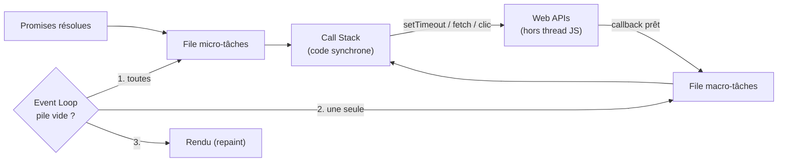

# Event Loop JavaScript

> [!abstract] Introduction
> L'event loop est le mécanisme qui permet à JavaScript, mono-thread, de gérer des milliers d'opérations asynchrones (clics, timers, requêtes) sans jamais bloquer — à comprendre absolument pour RxJS, les Promises et la détection de changement Angular.

> [!warning]- Prérequis
> [[TG-04-Synchrone-vs-Asynchrone|Synchrone vs Asynchrone]], [[JS-03-Fonctions-Scope-Closures|Fonctions Scope et Closures JavaScript]]

---

## Théorie

> [!question]- C'est quoi ?
> Composants :
> - **Call stack** (pile d'appels) : le code synchrone en cours
> - **Web APIs / APIs Node** : timers, fetch, événements DOM (gérés hors du thread JS)
> - **File de macro-tâches** (task queue) : callbacks de `setTimeout`, événements, I/O
> - **File de micro-tâches** : callbacks de Promises (`then`, `await`), `queueMicrotask`
> - **Event loop** : quand la pile est vide, vide TOUTES les micro-tâches, puis prend UNE macro-tâche, puis (navigateur) peut redessiner l'écran.

> [!example]- Analogie
> Un serveur seul dans un restaurant : il prend une commande (pile), la transmet en cuisine (Web API) et ne reste pas planté devant le four. Quand un plat est prêt, il est posé au passe (file). Le serveur ne va chercher un plat que lorsqu'il a les mains libres. Les micro-tâches sont les clients VIP servis en priorité.

> [!question]- Pourquoi l'utiliser ?
> Expliquer pourquoi `setTimeout(fn, 0)` ne s'exécute pas « tout de suite », pourquoi une boucle lourde fige l'UI, pourquoi Zone.js peut savoir quand relancer la détection de changement Angular, et l'ordre des logs dans du code async.

> [!question]- Comment ça marche ?
> ```javascript
> console.log("1");
> setTimeout(() => console.log("2 (macro)"), 0);
> Promise.resolve().then(() => console.log("3 (micro)"));
> console.log("4");
> // Affiche : 1, 4, 3 (micro), 2 (macro)
> ```

> [!question]- Quand l'utiliser ?
> À chaque fois qu'on débogue un ordre d'exécution surprenant, une interface qui « freeze », ou qu'on doit découper un traitement lourd.

> [!danger]- Quand NE PAS l'utiliser / Limites
> Un code synchrone long (boucle sur 1 million d'éléments, JSON énorme) bloque tout : ni clic, ni rendu. Solutions : découper le travail, `requestIdleCallback`, ou un Web Worker.

### Schéma



---

## Vocabulaire

| Terme | Définition en une ligne |
|-------|--------------------------|
| Call stack | Pile des fonctions en cours d'exécution |
| Macro-tâche | Callback de timer, événement, I/O |
| Micro-tâche | Callback de Promise, exécuté avant la macro-tâche suivante |
| Web API | Fonctionnalité fournie par le navigateur (timer, fetch, DOM) |
| Bloquant | Code qui occupe la pile et empêche le reste de s'exécuter |

---

## Points clés

- Un seul thread JS, mais les I/O se font en parallèle hors de ce thread
- Micro-tâches (Promises) toujours AVANT la prochaine macro-tâche
- `setTimeout(fn, 0)` = « dès que possible après le reste », pas « maintenant »
- Le rendu du navigateur n'a lieu qu'entre deux macro-tâches

---

## Pièges courants

> [!bug]- Erreurs fréquentes
> - Croire que `await` bloque tout le programme (il ne bloque que la fonction async)
> - Boucle infinie de micro-tâches → l'écran ne se redessine jamais
> - Mesurer un temps d'exécution async avec `console.time` mal placé

---

## Exemple minimal

```javascript
async function demo() {
  console.log("A");
  await null;            // la suite devient une micro-tâche
  console.log("C");
}
demo();
console.log("B");        // A, B, C
```

> [!note] Ce que j'en retiens
> Tout ce qui suit un `await` est reporté en micro-tâche : le code appelant continue d'abord.

---

## Pour aller plus loin (niveau senior)

> [!tip]- Ce qui distingue un dev expérimenté
> - Savoir prédire l'ordre de logs mêlant `setTimeout`, `Promise`, `await`, `queueMicrotask`
> - Connaître les phases de l'event loop Node (timers, poll, check → `setImmediate`, `process.nextTick`)
> - Relier event loop et Zone.js/zoneless dans Angular
> - Utiliser l'onglet Performance des DevTools pour repérer les « long tasks » (> 50 ms)

---

## Connexions

**Arbre théorique :**
- Sujet parent → [[JavaScript]]
- Sous-sujets → [[JS-07-Promises-Async-Await|Promises et Async Await JavaScript]]
- À comparer avec → [[PY-15-Async-Asyncio|Async en Python (asyncio)]]

**Pratique :**
- Extrait de code → [[04_Snippets/js-06-event-loop]]
- Projet → [[02_Projects/CinéTrack]]

---

## Auto-vérification

> [!check]- Est-ce que je maîtrise vraiment ?
> - Dans quel ordre s'affichent les logs de l'exemple et pourquoi ?
> - Pourquoi une boucle lourde empêche-t-elle un clic d'être traité ?

> [!faq]- Questions d'entretien
> - Expliquez l'event loop.
> - Différence entre micro-tâche et macro-tâche ?

---

## Tâches

- [ ] #task Regarder la conférence « What the heck is the event loop anyway? » (Philip Roberts)
- [ ] #task Écrire 3 exercices de prédiction d'ordre de logs et les vérifier
- [ ] #task Mettre à jour `status` une fois maîtrisé

---

## Notes brutes

- ?
