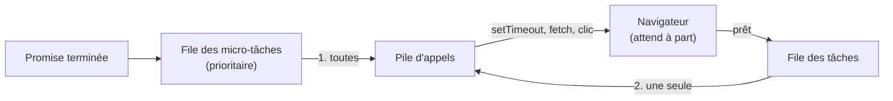

# Event Loop JavaScript

> [!abstract] En bref
> JavaScript ne fait qu'**une chose à la fois**. Pourtant il gère des clics, des minuteurs et des appels réseau en même temps sans se bloquer. Le secret : l'**event loop** (boucle d'événements), qui décide quel morceau de code passe ensuite. La comprendre explique l'ordre bizarre de certains `console.log`.

## L'image : un serveur seul dans un restaurant

1. Il prend une commande et la donne en cuisine. **Il n'attend pas devant le four.**
2. Pendant la cuisson, il prend d'autres commandes.
3. Quand un plat est prêt, il est posé au **passe** (une file d'attente).
4. Le serveur va chercher un plat **seulement quand il a les mains libres**.

Le serveur, c'est JavaScript. La cuisine, c'est le navigateur (qui gère minuteurs, réseau, clics). Le passe, ce sont les **files d'attente**.

## Les pièces du mécanisme

| Pièce | Rôle |
|---|---|
| **Pile d'appels** (call stack) | le code en train de s'exécuter, ligne après ligne |
| **Navigateur / Node** | fait patienter les minuteurs, les requêtes, les clics, **en dehors** de JavaScript |
| **File des micro-tâches** | la suite des Promises (`.then`, ce qui vient après un `await`) : **prioritaire** |
| **File des tâches** | callbacks de `setTimeout`, clics, événements |

**La règle :** quand la pile est vide → on exécute **toutes** les micro-tâches → puis **une** tâche → le navigateur peut redessiner l'écran → on recommence.



## L'exemple qui surprend

```js
console.log('1');
setTimeout(() => console.log('2 (timeout)'), 0);
Promise.resolve().then(() => console.log('3 (promise)'));
console.log('4');

// Affiche : 1, 4, 3 (promise), 2 (timeout)
```

- `1` et `4` : code normal, exécuté tout de suite.
- `3` : micro-tâche, passe **avant** les tâches.
- `2` : `setTimeout(…, 0)` ne veut pas dire « maintenant » mais « **dès que tout le reste est fini** ».

Avec `await` :

```js
async function demo() {
  console.log('A');
  await null;          // la suite est mise dans la file des micro-tâches
  console.log('C');
}
demo();
console.log('B');      // A, B, C
```

`await` ne bloque **que la fonction** où il se trouve. Le reste du programme continue.

## Pourquoi ça compte dans tes projets

- **Une page qui gèle** : une grosse boucle occupe la pile, le navigateur ne peut plus rien afficher ni réagir aux clics.
- **Angular** relance l'affichage après chaque clic, minuteur ou requête : c'est l'event loop qui lui dit quand (voir [[ANG-11-Detection-de-changement|Détection de changement]]).
- **Déboguer un ordre d'exécution** : si un log arrive « trop tard », c'est souvent une histoire de file d'attente.

## Pièges

- **Croire que `await` bloque tout le programme** : il ne met en pause que sa fonction.
- **Un traitement très lourd** (trier 1 million de lignes) fige l'interface : découpe-le ou utilise un Web Worker.
