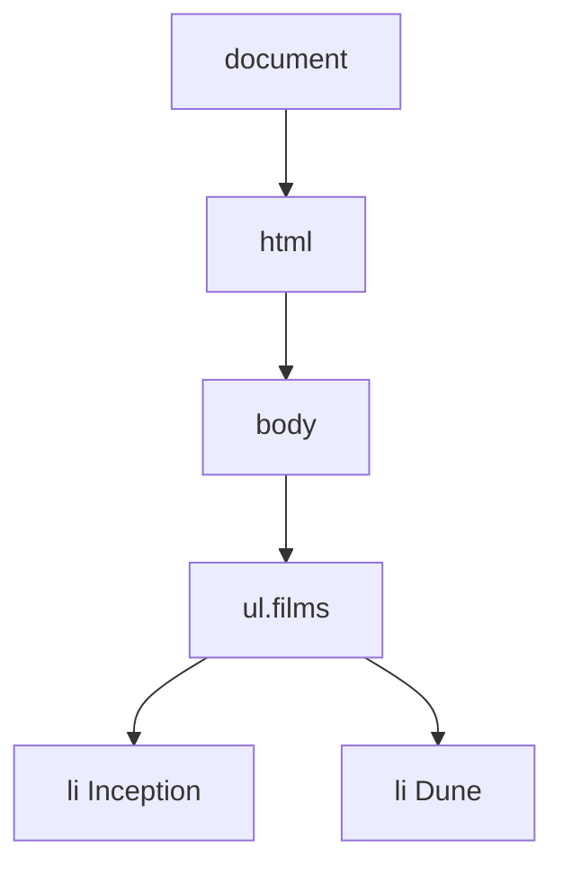

# DOM et Événements JavaScript

> [!abstract] En bref
> Le **DOM** est la page HTML transformée en arbre d'objets que JavaScript peut lire et modifier. Les **événements** (clic, frappe, envoi de formulaire) permettent de réagir à l'utilisateur. Angular et Vue font ce travail à ta place, mais savoir ce qu'il y a dessous t'aide à comprendre et déboguer.

## L'image

Le HTML est le **plan** d'une maison. Le DOM est la **maquette** construite à partir du plan, que JavaScript peut modifier pièce par pièce. Les événements sont les **capteurs** posés dans la maison : sonnette, interrupteurs.



## Réagir à un clic

```js
const bouton = document.querySelector('#ajouter');
const liste = document.querySelector('ul.films');

bouton.addEventListener('click', () => {
  const li = document.createElement('li');
  li.textContent = 'Inception';
  liste.append(li);
});
```

Sélectionner des éléments : [[JS-14-Selectionner-Elements-DOM|Sélectionner des éléments du DOM]]. Les modifier : [[JS-15-Manipuler-le-DOM|Manipuler le DOM]].

## Ce que contient un événement

```js
formulaire.addEventListener('submit', (event) => {
  event.preventDefault();          // empêche le rechargement de la page
  console.log(event.target);       // l'élément concerné
});
```

| Outil | Sert à |
|---|---|
| `event.target` | l'élément réellement cliqué |
| `event.preventDefault()` | bloquer l'action normale du navigateur (envoi de formulaire, suivi de lien) |
| `event.stopPropagation()` | empêcher l'événement de remonter aux parents |

Les événements courants : `click`, `input` (à chaque frappe), `change`, `submit`, `keydown`, `focus`, `blur`, `scroll`.

## La remontée des événements (bubbling)

Un clic sur un `<li>` est aussi « entendu » par son parent `<ul>`, puis par `<body>`, et ainsi de suite jusqu'en haut. Ça permet de mettre **un seul écouteur sur le parent** pour tous les enfants, même ceux ajoutés plus tard :

```js
document.querySelector('ul.films').addEventListener('click', (e) => {
  const li = e.target.closest('li');   // le <li> cliqué (ou son parent le plus proche)
  if (!li) return;
  li.classList.toggle('favori');
});
```

## Et dans Angular / Vue ?

Tu n'écris presque jamais `addEventListener` : tu écris `(click)="ajouter()"` en Angular ou `@click="ajouter"` en Vue, et le framework met à jour le DOM tout seul quand tes données changent. Si tu modifies le DOM directement dans un composant, le framework risque d'écraser tes changements.

## Pièges

- **`innerHTML` avec un texte venant de l'utilisateur** = faille de sécurité (XSS). Utilise `textContent`. Voir [[SEC-06-XSS-CSRF|XSS et CSRF]].
- **Script chargé avant la page** : l'élément n'existe pas encore → `null`. Mets `defer` sur ta balise `<script>`.
- **Écouteurs jamais retirés** : ils s'accumulent en mémoire.
