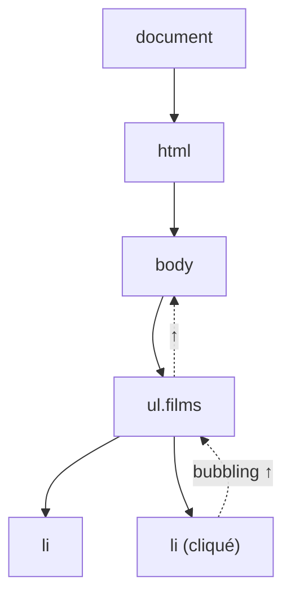

# DOM et Événements JavaScript

> [!abstract] Introduction
> Le DOM est la représentation en arbre d'objets de la page HTML, que JavaScript peut lire et modifier ; les événements (clic, saisie…) sont la façon dont la page réagit à l'utilisateur.

> [!warning]- Prérequis
> [[HTML-01-Structure-Semantique|Structure HTML et Sémantique]], [[JS-01-Fondamentaux|Fondamentaux JavaScript]]

---

## Théorie

> [!question]- C'est quoi ?
> ```javascript
> const bouton = document.querySelector("#ajouter");
> const liste = document.querySelector("ul.films");
> bouton.addEventListener("click", () => {
>   const li = document.createElement("li");
>   li.textContent = "Inception";
>   liste.append(li);
> });
> ```

> [!example]- Analogie
> Le HTML est le plan d'une maison ; le DOM est la maquette 3D construite à partir de ce plan, que JavaScript peut modifier pièce par pièce. Les événements sont les capteurs (sonnette, interrupteurs) posés dans la maison.

> [!question]- Pourquoi l'utiliser ?
> Angular et Vue manipulent le DOM À TA PLACE ; comprendre ce qu'ils font (et ce que coûte une modification du DOM) explique l'intérêt du data binding, de `track`/`:key`, et permet de déboguer ce que le framework ne gère pas (scroll, focus, APIs natives).

> [!question]- Comment ça marche ?
> **Propagation d'un événement** : phase de capture (du document vers la cible) → cible → phase de **bouillonnement** (bubbling, de la cible vers le haut).
> - `event.target` : l'élément réellement cliqué
> - `event.currentTarget` : l'élément qui porte l'écouteur
> - `event.preventDefault()` : empêche l'action native (soumission de formulaire, suivi de lien)
> - `event.stopPropagation()` : stoppe la remontée
>
> **Délégation d'événements** : un seul écouteur sur le parent qui gère tous les enfants (grâce au bubbling).

> [!question]- Quand l'utiliser ?
> En Angular/Vue : rarement directement (on passe par le template, `@ViewChild`/`ref`). Utile pour : intégrer une lib non-framework, gérer le focus, observer la taille (`ResizeObserver`), le scroll infini (`IntersectionObserver`).

> [!danger]- Quand NE PAS l'utiliser / Limites
> Manipuler directement le DOM dans un composant Angular/Vue contourne le framework : le framework peut écraser tes changements au prochain rendu. Et `innerHTML` avec des données utilisateur = faille XSS.

### Schéma



---

## Vocabulaire

| Terme | Définition en une ligne |
|-------|--------------------------|
| DOM | Document Object Model, arbre d'objets représentant la page |
| Nœud | Un élément de l'arbre (balise, texte…) |
| Bubbling | Remontée d'un événement vers les parents |
| Délégation | Un écouteur parent pour gérer plusieurs enfants |
| Reflow | Recalcul de la mise en page, coûteux |

---

## Points clés

- `querySelector`/`querySelectorAll` pour sélectionner
- `textContent` (sûr) plutôt que `innerHTML` (risque XSS)
- Les événements remontent (bubbling) → délégation possible
- `preventDefault` ≠ `stopPropagation`
- Lire puis écrire en alternance dans le DOM provoque des reflows coûteux

---

## Pièges courants

> [!bug]- Erreurs fréquentes
> - Insérer du texte utilisateur avec `innerHTML` → XSS (voir [[SEC-06-XSS-CSRF|XSS et CSRF]])
> - Ajouter des écouteurs sans jamais les retirer → fuites mémoire
> - Confondre `target` et `currentTarget` avec la délégation
> - Accéder au DOM avant qu'il soit chargé (script dans `<head>` sans `defer`)

---

## Exemple minimal

```javascript
// Délégation : un seul listener pour toute la liste, même les éléments ajoutés plus tard
document.querySelector("ul.films").addEventListener("click", (e) => {
  const li = e.target.closest("li");
  if (!li) return;
  li.classList.toggle("favori");
});
```

> [!note] Ce que j'en retiens
> `closest()` + délégation = un seul écouteur, performant, qui fonctionne aussi pour les éléments ajoutés dynamiquement.

---

## Pour aller plus loin (niveau senior)

> [!tip]- Ce qui distingue un dev expérimenté
> - Connaître `IntersectionObserver`, `ResizeObserver`, `MutationObserver`
> - Comprendre layout thrashing et le regroupement lectures/écritures (ce que font les frameworks)
> - Savoir quand utiliser `Renderer2` en Angular plutôt que le DOM direct (SSR)

---

## Connexions

**Arbre théorique :**
- Sujet parent → [[JavaScript]]
- Sous-sujets → [[ANG-03-Templates-Data-Binding|Templates & Data Binding Angular]], [[VUE-04-Directives-Templates|Directives & Templates Vue.js]]
- À comparer avec → [[ANG-11-Detection-de-changement|Détection de Changement Angular]]

**Pratique :**
- Extrait de code → [[04_Snippets/js-08-dom-evenements]]
- Projet → [[02_Projects/CinéTrack]]

---

## Auto-vérification

> [!check]- Est-ce que je maîtrise vraiment ?
> - Différence entre `target` et `currentTarget` ?
> - Pourquoi `innerHTML` est-il dangereux ?

> [!faq]- Questions d'entretien
> - Qu'est-ce que la délégation d'événements ?
> - Expliquez capture et bubbling.

---

## Tâches

- [ ] #task Faire une todo-list en JS pur (ajout, suppression, filtre) avant de la refaire en Angular puis Vue
- [ ] #task Mettre à jour `status` une fois maîtrisé

---

## Notes brutes

- ?
