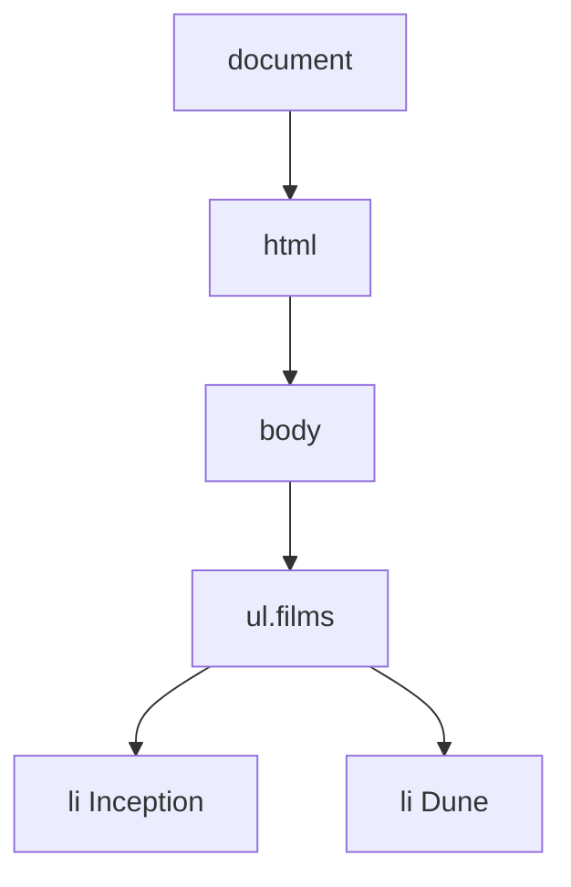

# DOM et Événements JavaScript

> [!abstract] En bref
> Le **DOM** est la page HTML transformée en arbre d'objets que JavaScript peut lire et modifier. Les **événements** (clic, frappe, envoi de formulaire) permettent de réagir à l'utilisateur. Angular et Vue font ce travail à ta place, mais savoir ce qu'il y a dessous t'aide à comprendre et déboguer.

## L'image

Le HTML est le **plan** d'une maison. Le DOM est la **maquette** construite à partir du plan, que JavaScript peut modifier pièce par pièce. Les événements sont les **capteurs** posés dans la maison : sonnette, interrupteurs.


```mermaid
flowchart TB
  D[document] --> H[html] --> B[body] --> U["ul.films"]
  U --> L1["li Inception"]
  U --> L2["li Dune"]
```

## Réagir à un clic

```js
const bouton = document.querySelector('#ajouter');
const liste = document.querySelector('ul.films');

bouton.addEventListener('click', () => {
  const li = document.createElement('li');
  li.textContent = 'Inception';
  liste.append(li);
});
```

Sélectionner des éléments : [[JS-14-Selectionner-Elements-DOM|Sélectionner des éléments du DOM]]. Les modifier : [[JS-15-Manipuler-le-DOM|Manipuler le DOM]].

## Ce que contient un événement

```js
formulaire.addEventListener('submit', (event) => {
  event.preventDefault();          // empêche le rechargement de la page
  console.log(event.target);       // l'élément concerné
});
```

| Outil | Sert à |
|---|---|
| `event.target` | l'élément réellement cliqué |
| `event.preventDefault()` | bloquer l'action normale du navigateur (envoi de formulaire, suivi de lien) |
| `event.stopPropagation()` | empêcher l'événement de remonter aux parents |

Les événements courants : `click`, `input` (à chaque frappe), `change`, `submit`, `keydown`, `focus`, `blur`, `scroll`.

## La remontée des événements (bubbling)

Un clic sur un `<li>` est aussi « entendu » par son parent `<ul>`, puis par `<body>`, et ainsi de suite jusqu'en haut. Ça permet de mettre **un seul écouteur sur le parent** pour tous les enfants, même ceux ajoutés plus tard :

```js
document.querySelector('ul.films').addEventListener('click', (e) => {
  const li = e.target.closest('li');   // le <li> cliqué (ou son parent le plus proche)
  if (!li) return;
  li.classList.toggle('favori');
});
```

## Et dans Angular / Vue ?

Tu n'écris presque jamais `addEventListener` : tu écris `(click)="ajouter()"` en Angular ou `@click="ajouter"` en Vue, et le framework met à jour le DOM tout seul quand tes données changent. Si tu modifies le DOM directement dans un composant, le framework risque d'écraser tes changements.

## Pourquoi ça marche

Le navigateur lit le HTML et construit en mémoire un **arbre d'objets** : le DOM. Chaque balise devient un objet JavaScript avec des propriétés (`textContent`, `classList`) et des méthodes (`append`, `remove`). Modifier un objet du DOM, c'est modifier la page : le navigateur redessine.

Le **bubbling** existe parce qu'un clic sur un `<li>` est aussi un clic sur la `<ul>` qui le contient : l'événement remonte donc chaque parent. C'est ce qui permet la délégation : un seul écouteur sur le parent.

## Contre-exemple

**Intuition fausse : « `event.target` est toujours l'élément où j'ai mis l'écouteur ».**

```js
list.addEventListener('click', (e) => {
  console.log(e.target);   // peut être le <span> à l'intérieur du <li>, pas le <li>
});
```

`event.target` est l'élément **réellement cliqué**, souvent un enfant. L'élément de l'écouteur est `event.currentTarget`. D'où l'usage de `e.target.closest('li')`.

## Pièges

- **`innerHTML` avec un texte venant de l'utilisateur** = faille de sécurité (XSS). Utilise `textContent`. Voir [[SEC-06-XSS-CSRF|XSS et CSRF]].
- **Script chargé avant la page** : l'élément n'existe pas encore → `null`. Mets `defer` sur ta balise `<script>`.
- **Écouteurs jamais retirés** : ils s'accumulent en mémoire.

## Vérifie sans tes notes

Réponds de tête, à voix haute ou par écrit, **avant** d’ouvrir la réponse.

**1. Qu'est-ce que le DOM ?**

> [!check]- Réponse
> La page HTML transformée par le navigateur en arbre d'objets que JavaScript peut lire et modifier.

**2. À quoi sert `event.preventDefault()` ?**

> [!check]- Réponse
> À bloquer l'action normale du navigateur, par exemple le rechargement de la page à l'envoi d'un formulaire.

**3. Pourquoi un seul écouteur sur la `<ul>` suffit-il pour tous les `<li>` ?**

> [!check]- Réponse
> Grâce au bubbling : le clic sur un enfant remonte jusqu'au parent.

## Exercices

> [!info] Comment t’entraîner
> 1. Cherche seul, sans regarder la note.
> 2. Bloqué ? Ouvre l’**indice 1**, puis l’**indice 2**.
> 3. Seulement ensuite, la **solution**.
> 4. Referme tout et **refais l’exercice sans regarder**.

### Exercice 1 · Compter les clics

Avec cette page, écris le JavaScript qui augmente le nombre affiché à chaque clic sur le bouton.

```html
<button id="like">👍 J'aime</button>
<span id="count">0</span>
```

> [!tip]- Indice 1
> Il faut sélectionner deux éléments (`querySelector`) et garder le nombre de clics dans une variable.

> [!tip]- Indice 2
> À chaque clic : augmente la variable, puis mets-la dans `textContent`.

> [!success]- Solution
> ```js
> const button = document.querySelector('#like');
> const count = document.querySelector('#count');
> let likes = 0;
>
> button.addEventListener('click', () => {
>   likes++;
>   count.textContent = likes;
> });
> ```

### Exercice 2 · Un seul écouteur pour toute la liste

Une liste contient des dizaines de films. Au lieu de mettre un écouteur sur chaque `<li>`, mets-en **un seul** sur la `<ul>` qui affiche l'`id` du film cliqué. Quelle notion de la note utilises-tu ?

```html
<ul id="movies">
  <li data-id="438631">Dune</li>
  <li data-id="348">Alien</li>
</ul>
```

> [!tip]- Indice 1
> L'écouteur va sur la `<ul>`. Le clic peut tomber sur un enfant du `<li>` : quelle méthode remonte jusqu'au `<li>` ?

> [!tip]- Indice 2
> L'id est dans `data-id` : il se lit avec `dataset.id`.

> [!success]- Solution
> ```js
> document.querySelector('#movies').addEventListener('click', (event) => {
>   const item = event.target.closest('li');
>   if (!item) return;
>   console.log(item.dataset.id);   // "438631"
> });
> ```
>
> C'est la **remontée des événements** (bubbling) : le clic sur un `<li>` remonte jusqu'à la `<ul>`. On parle de **délégation d'événements**. Avantage : ça marche aussi pour les `<li>` ajoutés plus tard.

### Transfert · Le formulaire de recherche

Un problème différent : il vérifie que tu as compris le principe, pas seulement l’exemple.

Avec `<form id="search"><input name="q"><button>OK</button></form>`, affiche dans la console le texte cherché quand on envoie le formulaire (bouton ou touche Entrée), **sans** que la page se recharge. Ignore une recherche vide.

> [!tip]- Indice 1
> Quel événement couvre à la fois le clic sur le bouton et la touche Entrée ?

> [!tip]- Indice 2
> L'événement `submit`, `event.preventDefault()`, et le champ se lit avec `form.elements.q.value`.

> [!success]- Solution
> ```js
> const form = document.querySelector('#search');
>
> form.addEventListener('submit', (event) => {
>   event.preventDefault();
>   const query = form.elements.q.value.trim();
>   if (!query) return;
>   console.log('Recherche :', query);
> });
> ```

## Je maîtrise quand…

Coche quand tu sais le faire **sans aide**. Une notion n’est maîtrisée que si les 6 cases sont cochées (voir [[Methode-du-coach|Méthode du coach]]).

- [ ] **Expliquer** : Expliquer ce qu'est le DOM avec l'image du plan et de la maquette
- [ ] **Rappeler** : Dire de mémoire la différence entre `target`, `preventDefault` et `stopPropagation`
- [ ] **Utiliser** : Écrire un écouteur qui modifie la page sans modèle
- [ ] **Résoudre un problème nouveau** : Prédire quel élément est dans `event.target` après un clic
- [ ] **Repérer les erreurs** : Utiliser la délégation au lieu de poser cent écouteurs
- [ ] **Savoir quand ne pas l’utiliser** : Savoir quand ne pas toucher au DOM : dans un composant Angular ou Vue, on passe par le template
