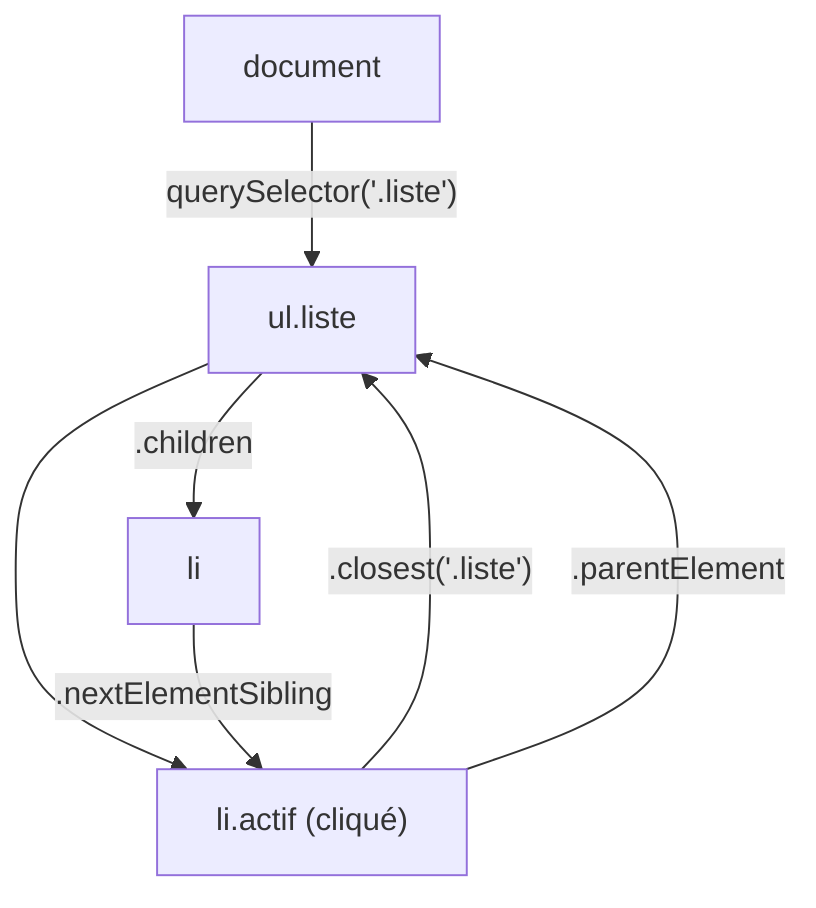

# Sélectionner des Éléments du DOM

> [!abstract] Introduction
> Toutes les façons de trouver un élément dans la page en JavaScript/TypeScript (`querySelector`, `getElementById`, `closest`, parcours parent/enfants), comment les typer en TS, et leurs équivalents propres dans Angular et Vue.

> [!warning]- Prérequis
> [[JS-08-DOM-Evenements|DOM et Événements JavaScript]], [[CSS-01-Selecteurs-Cascade-Specificite|Sélecteurs Cascade et Spécificité CSS]]

---

## Théorie

> [!question]- C'est quoi ?
> | Méthode | Retourne | Remarque |
> |---|---|---|
> | `document.querySelector('.carte')` | Le 1er élément ou `null` | N'importe quel sélecteur CSS |
> | `document.querySelectorAll('.carte')` | `NodeList` statique | Parcourable avec `forEach`, `for…of` |
> | `document.getElementById('recherche')` | Élément ou `null` | Sans `#`, le plus rapide |
> | `document.getElementsByClassName('carte')` | `HTMLCollection` VIVANTE | Se met à jour toute seule, attention |
> | `el.closest('.carte')` | Ancêtre le plus proche (ou lui-même) | Idéal avec la délégation d'événements |
> | `el.matches('.favori')` | `true`/`false` | Tester si l'élément correspond |
> Parcours : `el.parentElement`, `el.children`, `el.firstElementChild`, `el.nextElementSibling`, `el.previousElementSibling`.
> On peut chercher DANS un élément : `carte.querySelector('.titre')`.

> [!example]- Analogie
> `querySelector` est un moteur de recherche qui comprend le langage des sélecteurs CSS ; `closest` remonte l'arbre généalogique jusqu'au premier ancêtre qui correspond.

> [!question]- Pourquoi l'utiliser ?
> Comprendre ce que les frameworks font à ta place, écrire des tests (Testing Library, Playwright), intégrer une librairie non-framework, et déboguer dans la console.

> [!question]- Comment ça marche ?
> **En TypeScript**, `querySelector` renvoie `Element | null` : il faut préciser le type et gérer `null`.
> ```typescript
> const input = document.querySelector<HTMLInputElement>('#recherche');
> if (!input) throw new Error('Champ de recherche introuvable');
> input.value = 'Dune';                                    // ✅ .value existe sur HTMLInputElement
>
> const cartes = document.querySelectorAll<HTMLElement>('.carte');
> cartes.forEach(c => c.classList.add('visible'));
> const tableau = Array.from(cartes);                     // pour map/filter
> ```
> Sélecteurs utiles : `#id`, `.classe`, `balise`, `[data-id="42"]`, `.liste > li`, `li:nth-child(2)`, `input:checked`, `a[href^="http"]`, `.carte:not(.favori)`, `form :invalid`.
>
> **Dans les frameworks, on évite `document.querySelector`** (le composant peut être rendu plusieurs fois, ou côté serveur) :
> - Angular : référence de template `#champ` + `viewChild('champ')` → `ElementRef<HTMLInputElement>` ; `viewChildren` pour une liste
> - Vue : `ref="champ"` + `useTemplateRef<HTMLInputElement>('champ')` (Vue 3.5, avant : `const champ = ref<HTMLInputElement | null>(null)`)

> [!question]- Quand l'utiliser ?
> JS/TS pur, scripts, tests, débogage. Dans un composant : références de template, et uniquement après le rendu (`afterNextRender` / `onMounted`).

> [!danger]- Quand NE PAS l'utiliser / Limites
> Sélectionner par classes de style couple le JS au CSS : préférer des attributs dédiés (`data-*`, rôles) pour le JS et les tests.

### Schéma



---

## Vocabulaire

| Terme | Définition en une ligne |
|-------|--------------------------|
| `NodeList` | Liste d'éléments renvoyée par `querySelectorAll` (statique) |
| `HTMLCollection` | Liste vivante (`getElementsBy…`, `.children`) |
| Référence de template | Nom donné à un élément dans un template (`#champ`, `ref="champ"`) |
| `ElementRef` | Enveloppe Angular d'un élément natif (`.nativeElement`) |

---

## Points clés

- `querySelector` accepte tout sélecteur CSS
- Toujours gérer `null` en TypeScript
- Typer avec `querySelector<HTMLInputElement>`
- `closest` + délégation = un seul écouteur pour une liste
- Dans Angular/Vue : références de template, pas `document`

---

## Pièges courants

> [!bug]- Erreurs fréquentes
> - Oublier le `.` ou le `#` (`querySelector('carte')` cherche une balise `<carte>`)
> - Chercher un élément avant qu'il existe (script sans `defer`, ou dans le `constructor`/`setup` d'un composant)
> - `as HTMLInputElement` sans vérifier `null` → crash si l'élément n'existe pas
> - Utiliser `getElementsByClassName` dans une boucle qui modifie les classes (liste vivante qui change pendant le parcours)

---

## Exemple minimal

```typescript
// Angular
@Component({
  selector: 'app-recherche',
  template: `<input #champ type="search" placeholder="Rechercher"> <button type="button" (click)="focus()">🔍</button>`,
})
export class RechercheComponent {
  champ = viewChild.required<ElementRef<HTMLInputElement>>('champ');
  focus() { this.champ().nativeElement.focus(); }
}
```
```vue
<!-- Vue -->
<script setup lang="ts">
import { useTemplateRef, onMounted } from 'vue';
const champ = useTemplateRef<HTMLInputElement>('champ');
onMounted(() => champ.value?.focus());
</script>
<template><input ref="champ" type="search" placeholder="Rechercher"></template>
```

> [!note] Ce que j'en retiens
> Même besoin (donner le focus au champ), trois écritures : `querySelector` en JS pur, `viewChild` en Angular, `useTemplateRef` en Vue.

---

## Pour aller plus loin (niveau senior)

> [!tip]- Ce qui distingue un dev expérimenté
> - Dans les tests, sélectionner comme un utilisateur (`getByRole`, `getByLabelText`) plutôt que par classes CSS
> - Savoir quand utiliser `Renderer2` en Angular (compatibilité SSR)

---

## Connexions

**Arbre théorique :**
- Sujet parent → [[JavaScript]]
- Sous-sujets → (aucun pour l'instant)
- À comparer avec → [[ANG-22-Content-Projection-Queries|Content Projection et View Queries Angular]]

**Pratique :**
- Extrait de code → [[04_Snippets/js-14-selectionner-elements-dom]]

---

## Auto-vérification

> [!check]- Est-ce que je maîtrise vraiment ?
> - Pourquoi `querySelector` renvoie-t-il `Element | null` en TypeScript et comment le gérer ?
> - Différence entre `NodeList` et `HTMLCollection` ?

> [!faq]- Questions d'entretien
> - Comment accéder à un élément du DOM dans un composant Angular ? Et en Vue ?

---

## Tâches

- [ ] #task Dans la console des DevTools, sélectionner 5 éléments d'un site avec des sélecteurs différents
- [ ] #task Refaire l'exemple du focus dans les trois versions
- [ ] #task Mettre à jour `status` une fois maîtrisé

---

## Notes brutes

- ?
