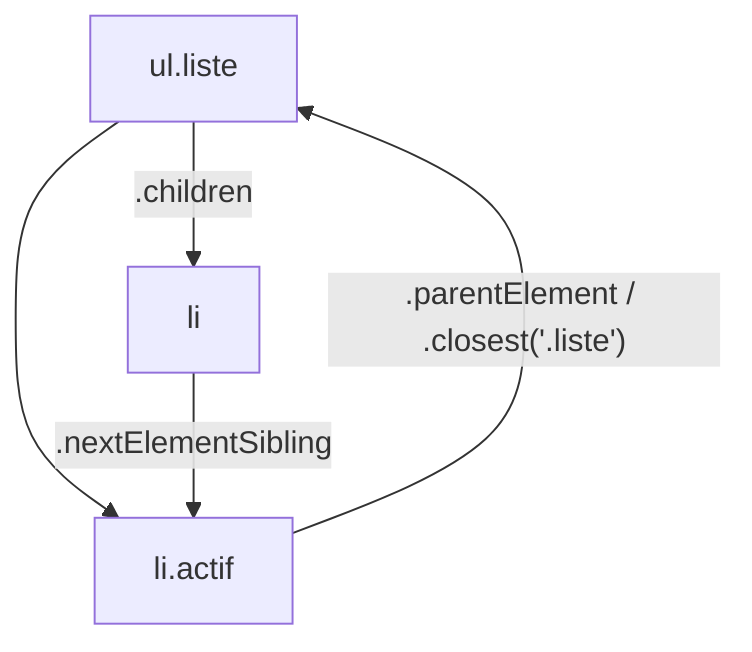

# Sélectionner des Éléments du DOM

> [!abstract] En bref
> Pour agir sur un élément de la page, il faut d'abord le **trouver**. En JavaScript, on utilise surtout `querySelector`, qui comprend les mêmes sélecteurs que le CSS. Dans Angular et Vue, on passe plutôt par une **référence de template**.

## Les méthodes

| Méthode | Renvoie | Exemple |
|---|---|---|
| `querySelector(sel)` | le **premier** élément trouvé, ou `null` | `document.querySelector('.carte')` |
| `querySelectorAll(sel)` | **tous** les éléments trouvés | `document.querySelectorAll('.carte')` |
| `getElementById(id)` | l'élément avec cet id (sans `#`) | `document.getElementById('recherche')` |
| `el.closest(sel)` | le parent le plus proche qui correspond (ou lui-même) | `bouton.closest('.carte')` |
| `el.matches(sel)` | `true` / `false` | `el.matches('.favori')` |

On peut aussi chercher **à l'intérieur** d'un élément : `carte.querySelector('.titre')`.

## Les sélecteurs à connaître

| Sélecteur | Trouve |
|---|---|
| `#recherche` | l'élément avec `id="recherche"` |
| `.carte` | les éléments avec la classe `carte` |
| `button` | toutes les balises `<button>` |
| `[data-id="42"]` | l'élément avec cet attribut |
| `.liste > li` | les `<li>` enfants directs de `.liste` |
| `li:nth-child(2)` | le 2e `<li>` |
| `input:checked` | les cases cochées |
| `.carte:not(.favori)` | les cartes qui ne sont pas favorites |

Aide-mémoire complet : [[CSS-11-Aide-Memoire-Selecteurs|Sélecteurs CSS]].

## Se déplacer autour d'un élément



## En TypeScript

`querySelector` peut renvoyer `null` (élément absent), et TypeScript ne sait pas de quel type d'élément il s'agit. On le précise et on vérifie :

```ts
const input = document.querySelector<HTMLInputElement>('#recherche');
if (!input) throw new Error('Champ de recherche introuvable');
input.value = 'Dune';   // ✅ TypeScript sait que .value existe

const cartes = document.querySelectorAll<HTMLElement>('.carte');
cartes.forEach(c => c.classList.add('visible'));
const liste = Array.from(cartes);   // pour utiliser map / filter
```

## Dans Angular et Vue

Dans un composant, **n'utilise pas `document.querySelector`** : le composant peut exister en plusieurs exemplaires, ou être rendu côté serveur. On nomme l'élément dans le template :

```ts
// Angular
@Component({
  selector: 'app-recherche',
  template: `<input #champ type="search"> <button type="button" (click)="focus()">🔍</button>`,
})
export class RechercheComponent {
  champ = viewChild.required<ElementRef<HTMLInputElement>>('champ');
  focus() { this.champ().nativeElement.focus(); }
}
```

```vue
<!-- Vue -->
<script setup lang="ts">
const champ = useTemplateRef<HTMLInputElement>('champ');
onMounted(() => champ.value?.focus());
</script>

<template><input ref="champ" type="search"></template>
```

## Pièges

- **Oublier `.` ou `#`** : `querySelector('carte')` cherche une balise `<carte>`, pas la classe.
- **Chercher trop tôt** : l'élément n'existe pas encore. Script avec `defer`, ou dans `onMounted` (Vue) / `afterNextRender` (Angular).
- **Sélectionner par une classe de style** : si quelqu'un renomme la classe CSS, ton JS casse. Préfère un attribut dédié (`data-testid`, `id`).
