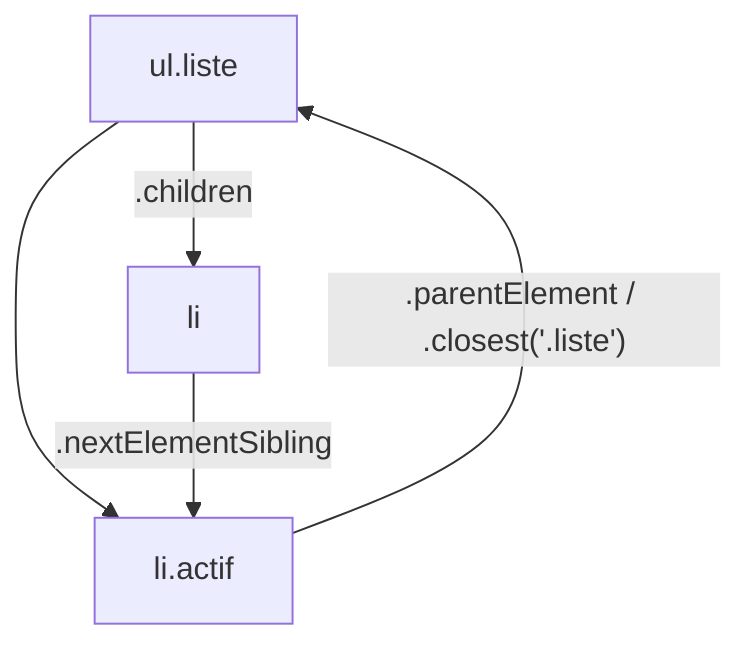

# Sélectionner des Éléments du DOM

> [!abstract] En bref
> Pour agir sur un élément de la page, il faut d'abord le **trouver**. En JavaScript, on utilise surtout `querySelector`, qui comprend les mêmes sélecteurs que le CSS. Dans Angular et Vue, on passe plutôt par une **référence de template**.

## Les méthodes

| Méthode | Renvoie | Exemple |
|---|---|---|
| `querySelector(sel)` | le **premier** élément trouvé, ou `null` | `document.querySelector('.carte')` |
| `querySelectorAll(sel)` | **tous** les éléments trouvés | `document.querySelectorAll('.carte')` |
| `getElementById(id)` | l'élément avec cet id (sans `#`) | `document.getElementById('recherche')` |
| `el.closest(sel)` | le parent le plus proche qui correspond (ou lui-même) | `bouton.closest('.carte')` |
| `el.matches(sel)` | `true` / `false` | `el.matches('.favori')` |

On peut aussi chercher **à l'intérieur** d'un élément : `carte.querySelector('.titre')`.

## Les sélecteurs à connaître

| Sélecteur | Trouve |
|---|---|
| `#recherche` | l'élément avec `id="recherche"` |
| `.carte` | les éléments avec la classe `carte` |
| `button` | toutes les balises `<button>` |
| `[data-id="42"]` | l'élément avec cet attribut |
| `.liste > li` | les `<li>` enfants directs de `.liste` |
| `li:nth-child(2)` | le 2e `<li>` |
| `input:checked` | les cases cochées |
| `.carte:not(.favori)` | les cartes qui ne sont pas favorites |

Aide-mémoire complet : [[CSS-11-Aide-Memoire-Selecteurs|Sélecteurs CSS]].

## Se déplacer autour d'un élément


```mermaid
flowchart TB
  L["ul.liste"] -->|".children"| A["li"]
  L --> B["li.actif"]
  B -->|".parentElement / .closest('.liste')"| L
  A -->|".nextElementSibling"| B
```

## En TypeScript

`querySelector` peut renvoyer `null` (élément absent), et TypeScript ne sait pas de quel type d'élément il s'agit. On le précise et on vérifie :

```ts
const input = document.querySelector<HTMLInputElement>('#recherche');
if (!input) throw new Error('Champ de recherche introuvable');
input.value = 'Dune';   // ✅ TypeScript sait que .value existe

const cartes = document.querySelectorAll<HTMLElement>('.carte');
cartes.forEach(c => c.classList.add('visible'));
const liste = Array.from(cartes);   // pour utiliser map / filter
```

## Dans Angular et Vue

Dans un composant, **n'utilise pas `document.querySelector`** : le composant peut exister en plusieurs exemplaires, ou être rendu côté serveur. On nomme l'élément dans le template :

```ts
// Angular
@Component({
  selector: 'app-recherche',
  template: `<input #champ type="search"> <button type="button" (click)="focus()">🔍</button>`,
})
export class RechercheComponent {
  champ = viewChild.required<ElementRef<HTMLInputElement>>('champ');
  focus() { this.champ().nativeElement.focus(); }
}
```

```vue
<!-- Vue -->
<script setup lang="ts">
const champ = useTemplateRef<HTMLInputElement>('champ');
onMounted(() => champ.value?.focus());
</script>

<template><input ref="champ" type="search"></template>
```

## Pourquoi ça marche

`querySelector` réutilise le **moteur de sélecteurs CSS** du navigateur : la même syntaxe sert à styler et à sélectionner, donc tu n'as qu'un langage à apprendre.

Il renvoie `null` quand il ne trouve rien, au lieu de lever une erreur : c'est à toi de vérifier. C'est pour ça que TypeScript t'oblige à tester le résultat avant d'utiliser `.value` ou `.focus()`.

## Contre-exemple

**Intuition fausse : « `querySelectorAll` renvoie un tableau ».**

```js
const cards = document.querySelectorAll('.card');
cards.map((c) => c.textContent);   // ❌ TypeError : map n'existe pas
```

C'est une `NodeList` : elle a `forEach` et `length`, mais pas `map` ni `filter`. Pour les utiliser : `Array.from(cards).map(...)`.

## Pièges

- **Oublier `.` ou `#`** : `querySelector('carte')` cherche une balise `<carte>`, pas la classe.
- **Chercher trop tôt** : l'élément n'existe pas encore. Script avec `defer`, ou dans `onMounted` (Vue) / `afterNextRender` (Angular).
- **Sélectionner par une classe de style** : si quelqu'un renomme la classe CSS, ton JS casse. Préfère un attribut dédié (`data-testid`, `id`).

## Vérifie sans tes notes

Réponds de tête, à voix haute ou par écrit, **avant** d’ouvrir la réponse.

**1. Que renvoie `querySelector` s'il ne trouve rien ?**

> [!check]- Réponse
> `null`.

**2. Quelle différence entre `querySelector('carte')` et `querySelector('.carte')` ?**

> [!check]- Réponse
> Le premier cherche une balise `<carte>`, le second un élément avec la classe `carte`.

**3. Pourquoi éviter `document.querySelector` dans un composant Angular ou Vue ?**

> [!check]- Réponse
> Le composant peut exister en plusieurs exemplaires ou être rendu côté serveur ; on passe par une référence de template.

## Exercices

> [!info] Comment t’entraîner
> 1. Cherche seul, sans regarder la note.
> 2. Bloqué ? Ouvre l’**indice 1**, puis l’**indice 2**.
> 3. Seulement ensuite, la **solution**.
> 4. Referme tout et **refais l’exercice sans regarder**.

### Exercice 1 · Choisir le bon sélecteur

Écris le code qui sélectionne :
1. le titre `<h1>` de la page ;
2. **tous** les boutons qui ont la classe `favorite` ;
3. le formulaire dont l'`id` est `search` ;
4. le lien actif dans `<nav>` (classe `active`).

> [!tip]- Indice 1
> Pour une classe : `.` ; pour un id : `#` ; pour une balise : son nom seul.

> [!tip]- Indice 2
> Un sélecteur peut combiner : `nav a.active` = un lien de classe `active` dans un `<nav>`.

> [!success]- Solution
> ```js
> const title = document.querySelector('h1');
> const favoriteButtons = document.querySelectorAll('button.favorite');   // NodeList
> const form = document.querySelector('#search');
> const activeLink = document.querySelector('nav a.active');
> ```
>
> `querySelector` renvoie le **premier** élément (ou `null`), `querySelectorAll` **tous** les éléments.

### Exercice 2 · Remonter au bon parent

Au clic sur un bouton « Supprimer » placé dans une carte, on veut supprimer **toute la carte** (`<article class="movie-card">`). Écris le code.

```html
<article class="movie-card">
  <h2>Dune</h2>
  <div class="actions"><button class="delete">Supprimer</button></div>
</article>
```

> [!tip]- Indice 1
> Le bouton est dans la carte : il faut remonter vers un parent, pas descendre.

> [!tip]- Indice 2
> Quelle méthode remonte les parents jusqu'au premier qui correspond à un sélecteur ?

> [!success]- Solution
> ```js
> document.querySelectorAll('.delete').forEach((button) => {
>   button.addEventListener('click', () => {
>     button.closest('.movie-card')?.remove();
>   });
> });
> ```
>
> `closest` remonte les parents jusqu'au premier qui correspond au sélecteur, quelle que soit la profondeur.

### Transfert · Compter les favoris

Un problème différent : il vérifie que tu as compris le principe, pas seulement l’exemple.

Dans une liste de cartes `<article class="card">`, certaines ont aussi la classe `favorite`. Écris le code qui affiche dans un `<span id="fav-count">` le nombre de cartes favorites, puis qui donne le titre (`<h2>`) de la première carte **non** favorite.

> [!tip]- Indice 1
> Un sélecteur peut combiner deux classes : `.card.favorite`.

> [!tip]- Indice 2
> Pour « pas favorite » : la pseudo-classe `:not(...)`. Puis cherche le `<h2>` **à l'intérieur** de cette carte.

> [!success]- Solution
> ```js
> const favorites = document.querySelectorAll('.card.favorite');
> document.querySelector('#fav-count').textContent = String(favorites.length);
>
> const firstOther = document.querySelector('.card:not(.favorite)');
> console.log(firstOther?.querySelector('h2')?.textContent);
> ```

## Je maîtrise quand…

Coche quand tu sais le faire **sans aide**. Une notion n’est maîtrisée que si les 6 cases sont cochées (voir [[Methode-du-coach|Méthode du coach]]).

- [ ] **Expliquer** : Expliquer pourquoi `querySelector` utilise les sélecteurs CSS
- [ ] **Rappeler** : Dire de mémoire la différence entre `querySelector`, `querySelectorAll` et `closest`
- [ ] **Utiliser** : Écrire un sélecteur combiné sans modèle
- [ ] **Résoudre un problème nouveau** : Prédire ce que renvoie une recherche qui ne trouve rien
- [ ] **Repérer les erreurs** : Déboguer un `null` dû à un `.` oublié ou à un script chargé trop tôt
- [ ] **Savoir quand ne pas l’utiliser** : Savoir quand ne pas utiliser `querySelector` : dans un composant, utiliser une référence de template
