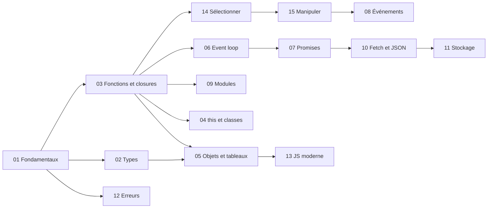

# 🗂️ JavaScript

> [!abstract] Pourquoi ce domaine
> Le langage du web : TypeScript, Angular, Vue et Node reposent entièrement sur lui. Les bases solides ici évitent des mois de confusion ensuite.

> [!tip] Le but
> Pas « j'ai lu les notes JavaScript », mais : **« donne-moi un problème JavaScript nouveau et laisse-moi le résoudre »**. Méthode : [[Methode-du-coach|Méthode du coach]].

← [[Accueil]] · [[Roadmap-12-mois|Roadmap 12 mois]]

---

## Carte du domaine

### 1. Connaissances fondamentales
Ce sans quoi rien ne tient.
- Variables (`const`, `let`), conditions, boucles, fonctions → [[JS-01-Fondamentaux|Fondamentaux]]
- Les types, `===` et `??` → [[JS-02-Types-Coercition-Egalite|Types et coercition]]

### 2. Concepts indispensables
Ce que tu utiliseras tous les jours dans CinéTrack.
- Une fonction est une valeur, les closures → [[JS-03-Fonctions-Scope-Closures|Fonctions et closures]]
- Transformer des listes (`map`, `filter`, `find`, `reduce`) sans modifier l'original → [[JS-05-Objets-Tableaux-Methodes|Objets et tableaux]]
- Attendre un résultat (`async` / `await`) → [[JS-07-Promises-Async-Await|Promises et async / await]]
- Appeler une API, lire du JSON → [[JS-10-Fetch-JSON-HTTP|Fetch et JSON]]

### 3. Concepts intermédiaires
- Trouver, modifier la page et réagir aux événements → [[JS-14-Selectionner-Elements-DOM|Sélectionner]], [[JS-15-Manipuler-le-DOM|Manipuler]], [[JS-08-DOM-Evenements|Événements]]
- Découper en fichiers → [[JS-09-Modules-ESM|Modules]]
- Gérer les erreurs et enquêter → [[JS-12-Erreurs-Debug-DevTools|Erreurs et DevTools]]
- Garder des données dans le navigateur → [[JS-11-Stockage-Navigateur|Stockage]]

### 4. Concepts avancés
- `this`, classes et prototypes → [[JS-04-this-Prototypes-Classes|this et prototypes]]
- L'ordre d'exécution réel → [[JS-06-Event-Loop|Event loop]]
- L'aide-mémoire des écritures modernes → [[JS-13-JavaScript-Moderne-ES2015-2025|JavaScript moderne]]

### 5. Compétences pratiques
Ce que tu dois savoir **faire**, pas seulement connaître :
- appeler une API, vérifier la réponse et gérer l'erreur ;
- transformer la réponse (filtrer, trier, regrouper) pour l'afficher ;
- réagir à un clic ou à l'envoi d'un formulaire ;
- trouver un bug avec la console, l'onglet Network et un point d'arrêt ;
- découper son code en modules.

### 6. Erreurs et confusions fréquentes

| Confusion | La bonne idée | Note |
|---|---|---|
| `==` / `===` | toujours `===` | [[JS-02-Types-Coercition-Egalite\|Types]] |
| `\|\|` / `??` | `??` pour une valeur par défaut | [[JS-02-Types-Coercition-Egalite\|Types]] |
| `f` / `f()` | sans parenthèses = la fonction, avec = son résultat | [[JS-03-Fonctions-Scope-Closures\|Fonctions]] |
| closure = copie | closure = **lien** vers la variable | [[JS-03-Fonctions-Scope-Closures\|Fonctions]] |
| `this` = l'objet où la méthode est écrite | `this` = qui **appelle** | [[JS-04-this-Prototypes-Classes\|this]] |
| `find` / `filter` | un élément (ou `undefined`) / un tableau | [[JS-05-Objets-Tableaux-Methodes\|Tableaux]] |
| `sort` / `toSorted` | `sort` modifie l'original | [[JS-05-Objets-Tableaux-Methodes\|Tableaux]] |
| `setTimeout(f, 0)` = maintenant | = dès que tout le reste est fini | [[JS-06-Event-Loop\|Event loop]] |
| `fetch` lève une erreur sur 404 | non : il faut tester `res.ok` | [[JS-10-Fetch-JSON-HTTP\|Fetch]] |
| `querySelectorAll` = tableau | c'est une `NodeList` | [[JS-14-Selectionner-Elements-DOM\|Sélectionner]] |
| `innerHTML` / `textContent` | `textContent` pour toute donnée | [[JS-15-Manipuler-le-DOM\|Manipuler]] |

### 7. Prérequis
- Les bases du HTML et des sélecteurs CSS → [[HTML-01-Structure-Semantique|Structure HTML]], [[CSS-01-Selecteurs-Cascade-Specificite|Sélecteurs CSS]]
- Lancer une commande dans un terminal → [[OUT-01-Terminal-Bash|Terminal]]
- Utile en parallèle : [[TG-02-Memoire-Valeur-Reference|valeur et référence]], [[TG-04-Synchrone-vs-Asynchrone|synchrone et asynchrone]]

### 8. Ce que tu peux ignorer au début
- `var` (à reconnaître dans du vieux code, jamais à écrire) ;
- le détail des prototypes ;
- `Symbol`, `BigInt`, les générateurs, `Proxy` ;
- IndexedDB ;
- `require` / `module.exports` (l'ancienne syntaxe de Node) ;
- les chaînes `.then()` (à savoir lire, pas à écrire).

## Les dépendances

Une flèche signifie « à comprendre avant ».



## Ordre conseillé

Dans l'ordre des dépendances, pas des numéros :

1. [[JS-01-Fondamentaux|Fondamentaux JavaScript]] — Fondamental
2. [[JS-02-Types-Coercition-Egalite|Types et Coercition JavaScript]] — Fondamental
3. [[JS-03-Fonctions-Scope-Closures|Fonctions Scope et Closures JavaScript]] — Fondamental
4. [[JS-05-Objets-Tableaux-Methodes|Objets et Tableaux JavaScript]] — Fondamental
5. [[JS-14-Selectionner-Elements-DOM|Sélectionner des Éléments du DOM]] — Fondamental
6. [[JS-15-Manipuler-le-DOM|Manipuler le DOM]] — Fondamental
7. [[JS-08-DOM-Evenements|DOM et Événements JavaScript]] — Fondamental
8. [[JS-12-Erreurs-Debug-DevTools|Gestion des Erreurs et DevTools]] — Fondamental
9. [[JS-09-Modules-ESM|Modules ES JavaScript]] — Fondamental
10. [[JS-06-Event-Loop|Event Loop JavaScript]] — Intermédiaire
11. [[JS-07-Promises-Async-Await|Promises et Async Await JavaScript]] — Fondamental
12. [[JS-10-Fetch-JSON-HTTP|Fetch API et JSON]] — Fondamental
13. [[JS-11-Stockage-Navigateur|Stockage Navigateur]] — Fondamental
14. [[JS-04-this-Prototypes-Classes|this et Prototypes JavaScript]] — Intermédiaire
15. [[JS-13-JavaScript-Moderne-ES2015-2025|JavaScript Moderne ES2015+]] — Intermédiaire (aide-mémoire, à consulter)

## Comment travailler une note

1. **Lire** l'encadré « En bref », puis te poser les [[Methode-du-coach#Les 7 questions|7 questions]].
2. **Lire** les exemples, le « Pourquoi ça marche » et le contre-exemple.
3. **Fermer la note** et répondre à « Vérifie sans tes notes ».
4. **Faire les exercices** : seul d'abord, puis indice 1, indice 2, solution. Refaire ensuite sans regarder.
5. **Faire le transfert** : le vrai test de compréhension.
6. **L'utiliser dans [[02_Projects/CinéTrack|CinéTrack]]**.
7. **Cocher** « Je maîtrise quand… » seulement quand les 6 cases sont vraies, puis passer le statut à 🟢.
8. **Revenir** sur la note à J+1, J+3, J+7 et J+21 : refaire « Vérifie sans tes notes » et le transfert, de mémoire.

---

## Progression

```dataview
TABLE WITHOUT ID file.link AS "Note", level AS "Niveau", status AS "Statut"
FROM "03-Langage/JavaScript"
WHERE type = "knowledge"
SORT file.name ASC
```
