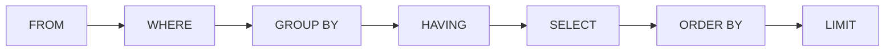

# Fondamentaux SQL SELECT

> [!abstract] Introduction
> SQL est le langage standard pour interroger les bases relationnelles ; `SELECT` lit des données dans des tables organisées en lignes et colonnes.

> [!warning]- Prérequis
> [[BDD-01-Fondamentaux-SGBD|Fondamentaux des Bases de Données]]

---

## Théorie

> [!question]- C'est quoi ?
> ```sql
> SELECT titre, annee
> FROM films
> WHERE annee >= 2010
> ORDER BY annee DESC;
> ```

> [!example]- Analogie
> Une table est un tableur ; `SELECT` est une demande précise au documentaliste : « donne-moi ces colonnes, de ces lignes, dans cet ordre ».

> [!question]- Pourquoi l'utiliser ?
> Même avec un ORM, tu devras lire le SQL généré, déboguer une requête lente, écrire un reporting ou analyser des données en production.

> [!question]- Comment ça marche ?
> Ordre d'ÉCRITURE : `SELECT … FROM … WHERE … GROUP BY … HAVING … ORDER BY … LIMIT`.
> Ordre d'EXÉCUTION logique : `FROM → WHERE → GROUP BY → HAVING → SELECT → ORDER BY → LIMIT` (d'où l'impossibilité d'utiliser un alias du SELECT dans le WHERE).
> - `SELECT *` : toutes les colonnes (à éviter dans le code)
> - Alias : `SELECT titre AS nom`
> - `DISTINCT` : dédoublonner
> - Expressions : `SELECT prix * 1.2 AS prix_ttc`

> [!question]- Quand l'utiliser ?
> Toute lecture de données relationnelles.

> [!danger]- Quand NE PAS l'utiliser / Limites
> SQL est déclaratif : on dit QUOI, le moteur choisit COMMENT (plan d'exécution). Sans index, une requête simple peut devenir lente sur des millions de lignes.

### Schéma



---

## Vocabulaire

| Terme | Définition en une ligne |
|-------|--------------------------|
| Table | Ensemble de lignes de même structure |
| Ligne (tuple) | Un enregistrement |
| Colonne | Un attribut typé |
| Requête | Instruction SQL |
| SGBD | Logiciel de gestion de base de données |

---

## Points clés

- SQL est déclaratif
- Ordre d'exécution ≠ ordre d'écriture
- Éviter `SELECT *` en production
- `NULL` n'est égal à rien, même pas à `NULL`

---

## Pièges courants

> [!bug]- Erreurs fréquentes
> - `WHERE colonne = NULL` → toujours faux, utiliser `IS NULL`
> - Utiliser un alias du SELECT dans le WHERE

---

## Exemple minimal

```sql
SELECT id, titre, annee, duree / 60 AS heures
FROM films
WHERE realisateur IS NOT NULL
ORDER BY titre
LIMIT 10;
```

> [!note] Ce que j'en retiens
> Colonnes explicites, filtre NULL correct, tri et limite : une requête propre.

---

## Pour aller plus loin (niveau senior)

> [!tip]- Ce qui distingue un dev expérimenté
> - Lire un plan d'exécution (`EXPLAIN ANALYZE`)

---

## Connexions

**Arbre théorique :**
- Sujet parent → [[SQL]]
- Sous-sujets → [[SQL-02-Filtrer-Trier-Paginer|Filtrer Trier et Paginer en SQL]], [[SQL-03-Jointures|Jointures SQL]]
- À comparer avec → (—)

**Pratique :**
- Extrait de code → [[04_Snippets/sql-01-fondamentaux-select]]
- Projet → [[02_Projects/CinéTrack-API]]

---

## Auto-vérification

> [!check]- Est-ce que je maîtrise vraiment ?
> - Pourquoi ne peut-on pas utiliser un alias du SELECT dans le WHERE ?

> [!faq]- Questions d'entretien
> - Quel est l'ordre d'exécution logique d'une requête SQL ?

---

## Tâches

- [ ] #task Installer PostgreSQL en Docker et faire les exercices de pgexercises.com (section Basic)
- [ ] #task Mettre à jour `status` une fois maîtrisé

---

## Notes brutes

- ?
