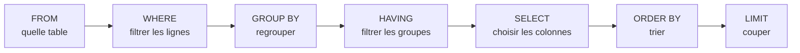

# Fondamentaux SQL et SELECT

> [!abstract] En bref
> **SQL** est le langage pour parler à une base de données relationnelle (PostgreSQL). Les données sont rangées dans des **tables** (comme des feuilles de tableur), et on les lit avec `SELECT`. Même avec Prisma, tu dois savoir lire et écrire du SQL : pour déboguer, pour comprendre ce que Prisma exécute, et pour les requêtes complexes.

## Une table = un tableau

Table `movies` :

| id | title | release_year | rating |
|---|---|---|---|
| 27205 | Inception | 2010 | 8.4 |
| 438631 | Dune | 2021 | 7.8 |
| 949 | Heat | 1995 | 7.9 |

- Une **ligne** = un enregistrement (un film).
- Une **colonne** = une information (le titre).
- La **clé primaire** (`id`) identifie chaque ligne de façon unique.

## Lire avec `SELECT`

```sql
SELECT title, release_year      -- quelles colonnes
FROM movies                     -- quelle table
WHERE release_year >= 2000      -- quelles lignes
ORDER BY rating DESC            -- dans quel ordre
LIMIT 10;                       -- combien
```

Résultat : les titres et années des films sortis depuis 2000, du mieux noté au moins bien noté, 10 maximum.

```sql
SELECT * FROM movies;                              -- toutes les colonnes (à éviter dans le code)
SELECT title AS titre FROM movies;                 -- renommer une colonne
SELECT DISTINCT release_year FROM movies;          -- sans doublons
SELECT title, rating * 10 AS note_sur_100 FROM movies;   -- calculer
```

## L'ordre d'écriture et l'ordre d'exécution

On écrit dans cet ordre : `SELECT … FROM … WHERE … GROUP BY … HAVING … ORDER BY … LIMIT`.

Mais la base **exécute** dans cet ordre :



C'est pour ça qu'on ne peut pas utiliser dans le `WHERE` un alias créé dans le `SELECT` : il n'existe pas encore.

## S'entraîner

- **pgexercises.com** : exercices progressifs en PostgreSQL.
- **`npx prisma studio`** ou **DBeaver** / l'outil base de données d'IntelliJ : pour voir tes tables et lancer des requêtes.
- En local : `docker run -p 5432:5432 -e POSTGRES_PASSWORD=pg -d postgres:17` puis `psql`.

## La suite

[[SQL-02-Filtrer-Trier-Paginer|Filtrer, trier, paginer]] → [[SQL-03-Jointures|Jointures]] → [[SQL-04-Agregation-GROUP-BY|Regroupements]] → [[SQL-06-INSERT-UPDATE-DELETE|Modifier les données]].

## Pièges

- **`SELECT *` dans le code** : tu ramènes des colonnes inutiles (et parfois sensibles). Liste les colonnes.
- **Oublier le `;`** en fin de requête dans `psql`.
- **Les textes entre apostrophes simples** : `'Dune'`. Les guillemets doubles `"…"` servent aux **noms** de colonnes ou de tables.
