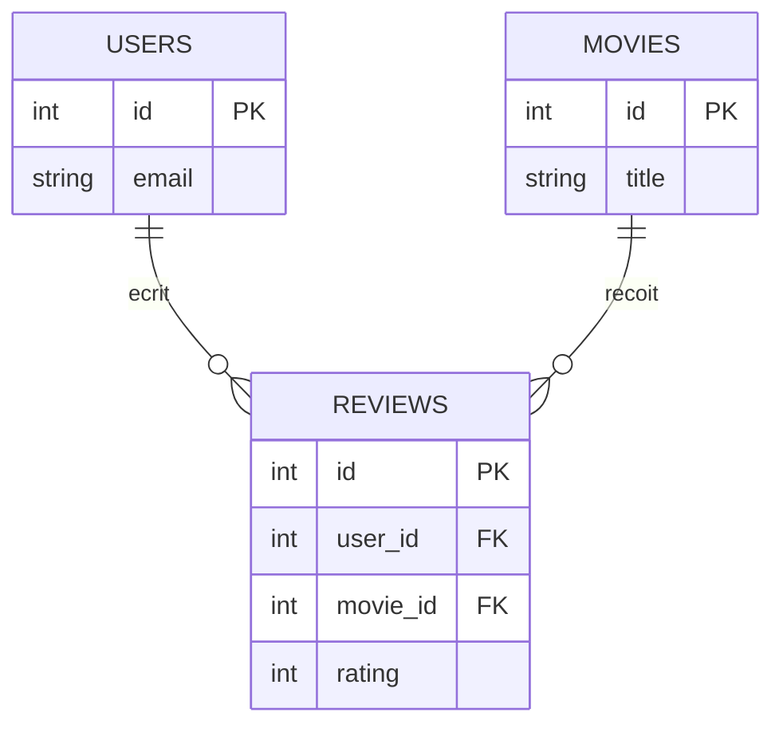

# Jointures SQL

> [!abstract] En bref
> Les données sont réparties dans plusieurs tables : les critiques d'un côté, les utilisateurs de l'autre. Une **jointure** (`JOIN`) les **assemble** grâce à une colonne commune, pour obtenir par exemple « chaque critique avec l'e-mail de son auteur ». C'est ce que fait `include` en Prisma.

## Les tables de CinéTrack



`reviews.user_id` pointe vers `users.id` : c'est une **clé étrangère**.

## `INNER JOIN` : seulement ce qui correspond des deux côtés

```sql
SELECT r.rating, r.comment, u.email, m.title
FROM reviews r
JOIN users u  ON u.id = r.user_id
JOIN movies m ON m.id = r.movie_id
WHERE m.id = 27205
ORDER BY r.created_at DESC;
```

`r`, `u`, `m` sont des **alias** : des surnoms courts pour les tables. `JOIN` tout court = `INNER JOIN`.

## `LEFT JOIN` : tout ce qui est à gauche, même sans correspondance

Tous les films, **y compris ceux sans critique** :

```sql
SELECT m.title, COUNT(r.id) AS nb_critiques
FROM movies m
LEFT JOIN reviews r ON r.movie_id = m.id
GROUP BY m.id, m.title;
```

Pour un film sans critique, les colonnes de `r` valent `NULL` et `COUNT(r.id)` donne 0.

## Les jointures en image

| Jointure | Garde |
|---|---|
| `INNER JOIN` | seulement les lignes qui ont une correspondance des **deux** côtés |
| `LEFT JOIN` | **toutes** les lignes de la table de gauche, avec `NULL` si pas de correspondance |
| `RIGHT JOIN` | l'inverse (rare : on préfère inverser les tables et faire un `LEFT`) |
| `FULL JOIN` | tout des deux côtés (rare) |

## Trouver ce qui manque

Les films qu'aucun utilisateur n'a mis en favori :

```sql
SELECT m.title
FROM movies m
LEFT JOIN favorites f ON f.movie_id = m.id
WHERE f.movie_id IS NULL;
```

## Relation plusieurs-à-plusieurs

Un utilisateur a plusieurs films favoris, un film est le favori de plusieurs utilisateurs : on passe par une **table de liaison** (`favorites` avec `user_id` et `movie_id`).

```sql
SELECT m.title
FROM favorites f
JOIN movies m ON m.id = f.movie_id
WHERE f.user_id = 42;
```

Comment concevoir ces tables : [[BDD-02-Modelisation-Normalisation|Modélisation]].

## Pièges

- **Oublier la condition `ON`** : chaque ligne est combinée avec **toutes** les autres (des millions de lignes).
- **Un `WHERE` sur la table de droite après un `LEFT JOIN`** (`WHERE r.rating > 5`) : il supprime les lignes `NULL` et transforme la jointure en `INNER`. Mets la condition dans le `ON`.
- **Une jointure lente** : vérifie qu'il y a un **index** sur la clé étrangère (voir [[BDD-04-Indexation-Performance|Index]]).
