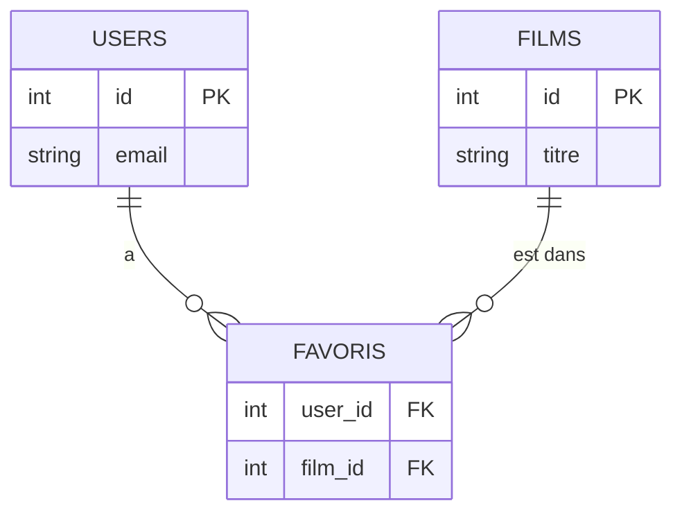

# Jointures SQL

> [!abstract] Introduction
> Une jointure combine des lignes de plusieurs tables liées par une clé ; c'est ainsi qu'on reconstitue une information répartie (utilisateur + favoris + films).

> [!warning]- Prérequis
> [[SQL-02-Filtrer-Trier-Paginer|Filtrer Trier et Paginer en SQL]]

---

## Théorie

> [!question]- C'est quoi ?
> ```sql
> SELECT u.email, f.titre
> FROM users u
> JOIN favoris fav ON fav.user_id = u.id
> JOIN films f ON f.id = fav.film_id
> WHERE u.id = 1;
> ```

> [!example]- Analogie
> Deux fichiers Excel (clients, commandes) reliés par le numéro client : la jointure est le RECHERCHEV qui assemble les deux.

> [!question]- Pourquoi l'utiliser ?
> Les données sont normalisées (pas de duplication) ; les jointures les réassemblent pour l'affichage.

> [!question]- Comment ça marche ?
> | Type | Garde… |
> |---|---|
> | `INNER JOIN` | seulement les lignes qui correspondent des deux côtés |
> | `LEFT JOIN` | toutes les lignes de gauche, NULL si pas de correspondance |
> | `RIGHT JOIN` | l'inverse (rare) |
> | `FULL JOIN` | tout, des deux côtés |
> | `CROSS JOIN` | produit cartésien |

> [!question]- Quand l'utiliser ?
> LEFT JOIN pour « tous les films, avec leur nombre de favoris (même 0) » ; INNER JOIN pour « les films qui ont au moins un favori ».

> [!danger]- Quand NE PAS l'utiliser / Limites
> Joindre des tables volumineuses sans index sur les clés étrangères = requêtes très lentes.

### Schéma



---

## Vocabulaire

| Terme | Définition en une ligne |
|-------|--------------------------|
| Clé primaire (PK) | Identifiant unique d'une ligne |
| Clé étrangère (FK) | Colonne référant la PK d'une autre table |
| Table d'association | Table qui relie deux tables en N-N |
| Produit cartésien | Toutes les combinaisons de lignes |

---

## Points clés

- INNER = intersection, LEFT = tout à gauche
- Toujours indexer les FK
- Alias de tables courts et explicites
- Une relation N-N passe par une table d'association

---

## Pièges courants

> [!bug]- Erreurs fréquentes
> - Filtrer une table de droite dans le WHERE après un LEFT JOIN → transforme en INNER JOIN (mettre la condition dans le ON)
> - Jointure oubliée → produit cartésien énorme

---

## Exemple minimal

```sql
SELECT f.titre, COUNT(fav.user_id) AS nb_favoris
FROM films f
LEFT JOIN favoris fav ON fav.film_id = f.id
GROUP BY f.id, f.titre
ORDER BY nb_favoris DESC;
```

> [!note] Ce que j'en retiens
> LEFT JOIN + COUNT(colonne de droite) compte 0 pour les films sans favori.

---

## Pour aller plus loin (niveau senior)

> [!tip]- Ce qui distingue un dev expérimenté
> - Comprendre les algorithmes de jointure (nested loop, hash, merge) dans EXPLAIN

---

## Connexions

**Arbre théorique :**
- Sujet parent → [[SQL]]
- Sous-sujets → (aucun pour l'instant)
- À comparer avec → (—)

**Pratique :**
- Extrait de code → [[04_Snippets/sql-03-jointures]]
- Projet → [[02_Projects/CinéTrack-API]]

---

## Auto-vérification

> [!check]- Est-ce que je maîtrise vraiment ?
> - Quelle différence entre INNER et LEFT JOIN ?

> [!faq]- Questions d'entretien
> - Écrivez une requête listant les utilisateurs sans aucun favori.

---

## Tâches

- [ ] #task Faire la section Joins de pgexercises.com
- [ ] #task Mettre à jour `status` une fois maîtrisé

---

## Notes brutes

- ?
