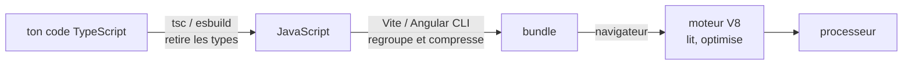

# Comment fonctionne un programme

> [!abstract] En bref
> Le processeur ne comprend que des instructions très simples en binaire. Entre le code que tu écris et ce qu'il exécute, des outils **traduisent**. Comprendre cette chaîne explique beaucoup de choses du quotidien : pourquoi TypeScript a une étape de build, pourquoi les types **disparaissent** à l'exécution, ce que fait vraiment `ng build` ou `npm run build`.

## Les façons de traduire

| Méthode | Image | Langages |
|---|---|---|
| **Compilé** | traduire tout le livre avant de le publier | C, Rust, Go |
| **Interprété** | un interprète traduit phrase par phrase pendant le discours | Bash, Python |
| **Machine virtuelle** | traduit vers une langue intermédiaire, lue par une machine virtuelle | Java (JVM), C# |
| **JIT** (*just in time*) | l'interprète prépare à l'avance la traduction des phrases qui reviennent souvent | JavaScript (moteur V8) |
| **Transpilé** | traduit vers un autre langage du même niveau | **TypeScript → JavaScript** |

## Le chemin de ton code TypeScript



```ts
// Ce que tu écris
function greet(name: string): string {
  return `Bonjour ${name}`;
}
```

```js
// Ce que le navigateur reçoit : plus aucun type
function greet(name) {
  return `Bonjour ${name}`;
}
```

## La conséquence la plus importante

Les types TypeScript sont vérifiés **pendant que tu codes**, puis **effacés**. À l'exécution, ils n'existent plus.

```ts
const movie = (await response.json()) as Movie;   // TypeScript te croit sur parole
movie.title.toUpperCase();                        // plante si l'API a renvoyé autre chose
```

Les données qui viennent de l'extérieur (API, formulaire, fichier) doivent donc être **vérifiées à l'exécution** : voir [[TS-19-Validation-Runtime-Zod|Zod]].

## Le « runtime » : là où tourne le code

Le même JavaScript peut tourner dans deux environnements, qui ne proposent pas les mêmes outils :

| Runtime | Fournit | Ne fournit pas |
|---|---|---|
| **Navigateur** | le DOM (`document`), `localStorage`, `fetch` | l'accès aux fichiers de l'ordinateur |
| **Node.js** | les fichiers, le réseau, les variables d'environnement | `document`, `window` |

C'est pour ça que `document` est « undefined » dans un script Node, ou côté serveur.

## Ce que fait un build front

1. **Transpiler** TypeScript en JavaScript.
2. **Regrouper** tous les fichiers en quelques-uns (*bundle*).
3. **Retirer le code inutilisé** (*tree-shaking*).
4. **Compresser** (noms raccourcis, espaces retirés : *minification*).
5. Générer des **source maps** : elles permettent de voir ton vrai code dans les outils de débogage.

## Pièges

- **Croire que TypeScript protège à l'exécution** : il ne vérifie rien une fois le code lancé.
- **Utiliser `document` ou `window` côté serveur** (Node, rendu serveur) : ils n'existent pas.
