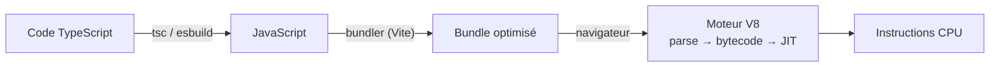

# Comment fonctionne un programme

> [!abstract] Introduction
> Un programme est une suite d'instructions qu'un processeur exécute ; entre le code que tu écris et ce que la machine comprend, il y a un compilateur, un interpréteur ou un moteur JIT.

---

## Théorie

> [!question]- C'est quoi ?
> - **Compilé** (C, Rust, Go) : traduit entièrement en code machine avant exécution
> - **Interprété** (Python historique, Bash) : lu et exécuté ligne par ligne
> - **Bytecode + VM** (Java, C#) : compilé vers un code intermédiaire exécuté par une machine virtuelle (JVM, CLR)
> - **JIT** (JavaScript V8, Java HotSpot) : compile à la volée les parties souvent exécutées
> - **Transpilé** (TypeScript → JavaScript) : traduit vers un autre langage de même niveau

> [!example]- Analogie
> Compiler, c'est traduire un livre entier avant de le publier ; interpréter, c'est un interprète qui traduit phrase par phrase pendant un discours ; le JIT, c'est un interprète qui, remarquant qu'une phrase revient souvent, en prépare une traduction toute faite.

> [!question]- Pourquoi l'utiliser ?
> Comprendre pourquoi TypeScript a une étape de build, pourquoi une erreur de type n'existe plus à l'exécution, pourquoi Java a besoin d'une JVM, et ce que fait réellement `ng build`.

> [!question]- Comment ça marche ?
> Cycle général : code source → analyse (lexer/parser → arbre syntaxique AST) → vérifications → génération de code → exécution.
> Le processeur exécute des instructions simples ; le système d'exploitation gère la mémoire, les fichiers, le réseau et les processus.

### Schéma



---

## Vocabulaire

| Terme | Définition en une ligne |
|-------|--------------------------|
| Compilateur | Traduit un programme avant son exécution |
| Interpréteur | Exécute le code source directement |
| AST | Arbre syntaxique représentant le code |
| Runtime | Environnement d'exécution (Node, navigateur, JVM) |
| Processus | Programme en cours d'exécution avec sa mémoire |

---

## Points clés

- TypeScript est transpilé : les types n'existent plus au runtime
- JS est exécuté par un moteur JIT (V8)
- Un « runtime » fournit les APIs (DOM dans le navigateur, fichiers dans Node)
- Les linters, formateurs et compilateurs travaillent tous sur l'AST

---

## Pièges courants

> [!bug]- Erreurs fréquentes
> - Croire qu'une vérification de type TS protège à l'exécution (données d'API)

---

## Exemple minimal

```bash
npx tsc film.ts        # produit film.js sans les types
node film.js           # V8 exécute le JavaScript
```

> [!note] Ce que j'en retiens
> Le code qui tourne n'est jamais exactement celui que j'écris : il est transformé par des outils.

---

## Pour aller plus loin (niveau senior)

> [!tip]- Ce qui distingue un dev expérimenté
> - Savoir expliquer ce que fait un bundler (graphe de dépendances, tree-shaking, minification, source maps)
> - Utiliser AST Explorer pour comprendre ESLint/codemods

---

## Connexions

**Arbre théorique :**
- Sujet parent → [[Théorie Générale]]
- Sous-sujets → [[TG-02-Memoire-Valeur-Reference|Mémoire Valeur et Référence]], [[TG-03-Typage-Statique-Dynamique|Typage Statique et Dynamique]]
- À comparer avec → (—)

**Pratique :**
- Extrait de code → [[04_Snippets/tg-01-comment-fonctionne-un-programme]]
- Projet → [[02_Projects/CinéTrack]]

---

## Auto-vérification

> [!check]- Est-ce que je maîtrise vraiment ?
> - Pourquoi dit-on que TypeScript « disparaît » à l'exécution ?

> [!faq]- Questions d'entretien
> - Différence entre langage compilé et interprété ?

---

## Tâches

- [ ] #task Compiler un fichier TS à la main et lire le JS produit
- [ ] #task Mettre à jour `status` une fois maîtrisé

---

## Notes brutes

- ?
