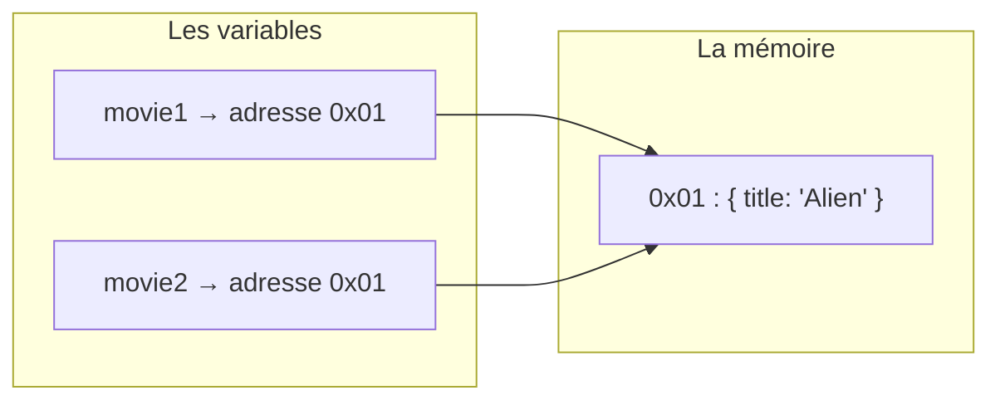

# Mémoire Valeur et Référence

> [!abstract] En bref
> Une variable contient soit une **valeur** (un nombre, un texte…), soit une **adresse** vers un objet rangé ailleurs en mémoire. Copier une valeur crée un **double**. Copier une adresse donne **deux chemins vers le même objet** : modifier l'un modifie « l'autre ». Cette différence explique une grande partie des bugs d'affichage en Angular et en Vue.

## L'image

- Une **valeur**, c'est un billet que tu photocopies : chacun a le sien.
- Une **référence**, c'est l'adresse d'une maison écrite sur un papier : copier le papier ne copie pas la maison. Les deux papiers mènent **à la même maison**.

```ts
// Valeurs (nombre, texte, booléen) : copie indépendante
let a = 5;
let b = a;
b = 6;
console.log(a);   // 5

// Objets et tableaux : même objet
const movie1 = { title: 'Dune' };
const movie2 = movie1;
movie2.title = 'Alien';
console.log(movie1.title);   // 'Alien' !
```



| Type | Copié par |
|---|---|
| `number`, `string`, `boolean`, `null`, `undefined` | **valeur** |
| objets, tableaux, fonctions, `Map`, `Set`, `Date` | **référence** |

## Comparer deux objets

```ts
{ id: 1 } === { id: 1 }   // false : deux objets différents, même s'ils se ressemblent
movie1 === movie2         // true : même adresse
```

`===` compare les **adresses**, pas le contenu.

## Pourquoi c'est crucial dans les frameworks

Angular (`OnPush`, signals) et Vue repèrent souvent un changement **en regardant si l'adresse a changé**. Si tu modifies l'objet sans changer son adresse, l'écran peut ne pas se mettre à jour.

```ts
// ❌ on modifie le tableau existant : même adresse
this.movies().push(newMovie);

// ✅ on crée un nouveau tableau : nouvelle adresse, le changement est détecté
this.movies.update((list) => [...list, newMovie]);

// ✅ pareil pour un objet
this.movie.update((m) => ({ ...m, rating: 5 }));
```

Créer une copie plutôt que modifier s'appelle l'**immutabilité**.

## Le ménage automatique

JavaScript libère tout seul la mémoire d'un objet quand **plus aucune variable** ne pointe vers lui (le *garbage collector*).

Une **fuite mémoire**, c'est un objet qui reste pointé alors qu'on ne s'en sert plus :
- un abonnement RxJS jamais arrêté ;
- un `addEventListener` jamais retiré ;
- un `setInterval` jamais arrêté ;
- un tableau global qui grossit sans fin.

## Pièges

- **Modifier un objet reçu en `input()`** : tu modifies celui du parent, sans que l'écran le sache.
- **Une fonction qui modifie l'objet qu'on lui passe** sans le dire.
- **Une copie « superficielle »** : `{ ...movie }` copie le premier niveau, mais `movie.genres` reste partagé. Pour tout copier : `structuredClone(movie)`.
