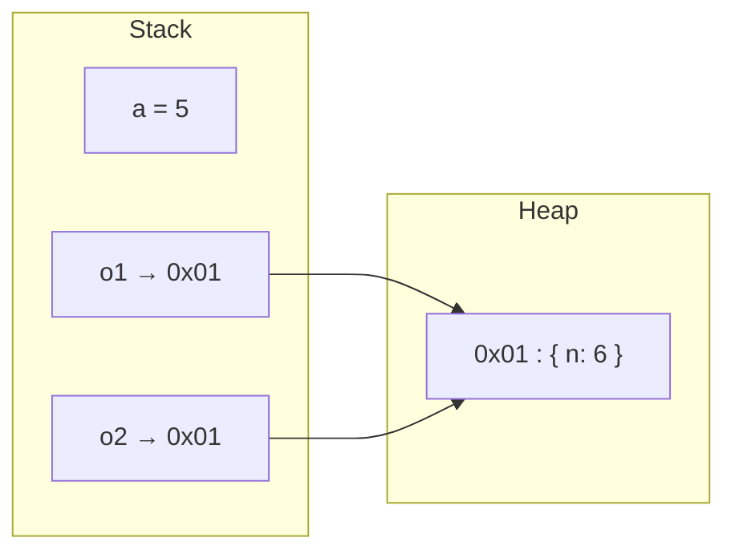

# Mémoire Valeur et Référence

> [!abstract] Introduction
> Une variable contient soit une valeur (primitifs), soit une référence vers un objet en mémoire ; cette distinction explique la mutation, l'immutabilité, `OnPush` Angular et la réactivité Vue.

> [!warning]- Prérequis
> [[TG-01-Comment-fonctionne-un-programme|Comment fonctionne un programme]]

---

## Théorie

> [!question]- C'est quoi ?
> - **Stack (pile)** : appels de fonctions, variables locales, valeurs simples — rapide, libérée automatiquement
> - **Heap (tas)** : objets, tableaux — alloués dynamiquement, nettoyés par le **garbage collector** quand plus aucune référence ne pointe vers eux
> ```javascript
> let a = 5; let b = a; b = 6;          // a vaut toujours 5 (copie de valeur)
> const o1 = { n: 5 }; const o2 = o1;
> o2.n = 6;                              // o1.n vaut 6 ! (même objet)
> ```

> [!example]- Analogie
> Une valeur est un billet de banque qu'on photocopie : chacun a le sien. Une référence est l'adresse d'une maison écrite sur un papier : copier le papier ne copie pas la maison, les deux papiers mènent à la même maison.

> [!question]- Pourquoi l'utiliser ?
> Les frameworks détectent les changements en comparant des références : muter un objet sans changer sa référence peut passer inaperçu (OnPush, `computed`, sélecteurs NgRx).

> [!question]- Comment ça marche ?
> Muter = modifier l'objet existant (`tab.push`, `obj.x = 1`). Immutabilité = créer un nouvel objet (`[...tab, x]`, `{...obj, x: 1}`).
> Fuites mémoire : un objet reste référencé (listener non retiré, abonnement RxJS actif, cache global, closure) → le GC ne peut pas le libérer.

### Schéma



---

## Vocabulaire

| Terme | Définition en une ligne |
|-------|--------------------------|
| Stack | Mémoire des appels et valeurs locales |
| Heap | Mémoire des objets dynamiques |
| Garbage collector | Libère les objets plus référencés |
| Mutation | Modification d'un objet existant |
| Fuite mémoire | Mémoire jamais libérée car encore référencée |

---

## Points clés

- Primitifs copiés par valeur, objets par référence
- Comparer deux objets avec `===` compare les références
- Immutabilité = nouvelle référence à chaque changement
- Désabonner/retirer les listeners pour éviter les fuites

---

## Pièges courants

> [!bug]- Erreurs fréquentes
> - Modifier un `@Input` objet en OnPush → pas de rafraîchissement
> - Passer un objet à une fonction qui le mute à ton insu

---

## Exemple minimal

```typescript
// ❌ mutation : même référence
this.films.push(nouveau);
// ✅ immuable : nouvelle référence, détectée par OnPush/signals
this.films = [...this.films, nouveau];
filmsSignal.update(l => [...l, nouveau]);
```

> [!note] Ce que j'en retiens
> Une nouvelle référence = un changement visible par le framework.

---

## Pour aller plus loin (niveau senior)

> [!tip]- Ce qui distingue un dev expérimenté
> - Utiliser l'onglet Memory (heap snapshot) pour trouver une fuite
> - Comprendre `WeakMap`/`WeakRef`

---

## Connexions

**Arbre théorique :**
- Sujet parent → [[Théorie Générale]]
- Sous-sujets → (aucun pour l'instant)
- À comparer avec → (—)

**Pratique :**
- Extrait de code → [[04_Snippets/tg-02-memoire-valeur-reference]]
- Projet → [[02_Projects/CinéTrack]]

---

## Auto-vérification

> [!check]- Est-ce que je maîtrise vraiment ?
> - Pourquoi `o1.n` change-t-il quand on modifie `o2.n` ?

> [!faq]- Questions d'entretien
> - Qu'est-ce qu'une fuite mémoire en front ? Exemples ?

---

## Tâches

- [ ] #task Faire un heap snapshot avant/après navigation dans une SPA
- [ ] #task Mettre à jour `status` une fois maîtrisé

---

## Notes brutes

- ?
